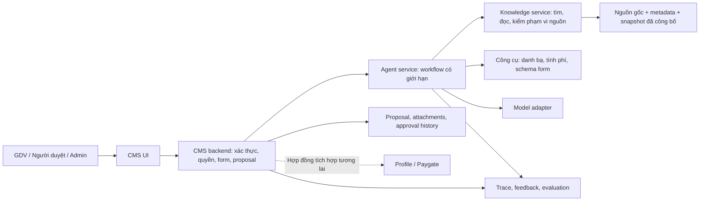

# System Requirements and Design — CMS AI Assistant

**Mã:** SRD-CMS-AI-001  
**Phiên bản:** 0.1 — Bản thiết kế đề xuất, chưa phê duyệt triển khai  
**Ngày:** 22/09/2026  
**Căn cứ:** [BRD](../brd/cms-knowledge-and-proposal-assistant-brd-v1.0.md), [10 họ tình huống](../brd/business-scenarios-and-evaluation-cases.md), [planning decisions và nguồn khóa học](../planning/project-planning-decisions.md).  
**Kế hoạch thực hiện:** [Feature roadmap](../planning/feature-roadmap.md).

## 1. Mục tiêu và mức độ hoàn thiện

Hệ thống hỗ trợ nhân viên CMS tìm và đối chiếu quy định trong quyền truy cập, nhận biết điều kiện/ngoại lệ và chuẩn bị yêu cầu thay đổi thông tin khách hàng. Người dùng kiểm tra nội dung; CMS thực hiện tạo và phê duyệt theo quyền.

SRD đặc tả yêu cầu, kiến trúc logic, hợp đồng dữ liệu dự kiến, kế hoạch eval và ranh giới tích hợp. Chưa phải xác nhận chính sách ngân hàng, API đã tồn tại hoặc bộ eval đã đạt. Những lựa chọn chưa được chủ dự án chốt mang trạng thái đề xuất; các mục O-01–O-08 nằm trong planning decisions.

### 1.1. Phạm vi phiên bản đầu

| Miền | Có trong phiên bản đầu | Chưa triển khai ở phiên bản đầu |
| --- | --- | --- |
| NV1 — Thông tin khách hàng | Đổi thông tin cá nhân; rà soát vai trò đại diện/ủy quyền, quan hệ với doanh nghiệp và Paygate theo nguồn mô phỏng. | Tự thay đổi hồ sơ nhiều hệ thống hoặc tự hợp nhất danh tính. |
| NV2 — Thẻ | Tra cứu quy định thẻ, điều kiện đóng thẻ/trả góp, phạm vi sửa đổi, hướng dẫn khi mất thẻ. | Khóa/đóng/phát hành thẻ bằng chatbot; toàn bộ nghiệp vụ tài khoản thanh toán. |
| NV3 — Phí | Đối chiếu hợp đồng/biểu phí; tính minh họa bằng công cụ khi quy tắc và dữ kiện đủ. | Thu phí, thay cấu hình phí merchant; tư vấn/tính nghĩa vụ thuế; toàn bộ danh mục phí ngân hàng. |
| NV4 — Yêu cầu CMS | Chuẩn bị yêu cầu thay đổi thông tin cá nhân, đính kèm theo quy tắc, form kiểm tra, tạo/gửi và màn hình người có thẩm quyền duyệt trong CMS mô phỏng. | Tự chọn người duyệt bằng LLM; tự tạo/gửi/duyệt; coi phê duyệt là bằng chứng hồ sơ đã được cập nhật. |
| Xuyên suốt | Quản trị nguồn, quyền, trích dẫn, feedback, danh bạ hỗ trợ, eval và audit. | Ticket tự động, multi-agent, GraphRAG, fine-tuning và hạ tầng GPU chuyên dụng nếu chưa có bằng chứng cần thiết. |

Mốc tích hợp đầu tiên kết thúc ở trạng thái proposal trong CMS mô phỏng. Thực thi thay đổi tại Profile/Paygate là phạm vi tiếp theo phải được đặc tả riêng.

### 1.2. Vai trò

| Vai trò | Quyền dự kiến |
| --- | --- |
| GDV/người hỏi | Đọc nguồn theo quyền, chat, phản hồi; chuẩn bị/tạo yêu cầu nếu có quyền tương ứng. |
| TĐV/cấp cao hơn | Xem và quyết định các yêu cầu thuộc thẩm quyền được cấu hình; chức danh cao hơn không tự cấp quyền xem mọi đơn vị. |
| Admin tri thức | Nhập, xử lý lỗi, quản lý phiên bản và công bố nguồn theo quyền. |
| Chủ tài liệu/nghiệp vụ | Xác nhận nội dung, phạm vi áp dụng, đáp án và xử lý mâu thuẫn. |
| Vận hành/QA | Xem trace đã giới hạn quyền, phân loại lỗi, chạy eval và đề xuất phát hành/rollback. |

Ma trận quyền phải tách quyền đọc tài liệu, đọc hồ sơ, tạo yêu cầu, duyệt, công bố nguồn và xem log. Một người có thể kiêm vai trò nhưng hệ thống vẫn kiểm tra từng hành động.

## 2. Hiện trạng và kiến trúc đề xuất

CMS, Paygate và Profile hiện là thư mục khung. Customer của Corebank chưa có dữ liệu phục vụ thay đổi CCCD/vai trò doanh nghiệp. Không sử dụng đặc tả proposal tài khoản của MoneyBank như hợp đồng đã có cho yêu cầu thay đổi thông tin khách hàng.

Knowledge service, tools và trace là module logic; prototype có thể cùng một tiến trình agent-service. Không bắt buộc tách thêm microservice. Mô hình chỉ nhận nội dung tối thiểu đã được cấp quyền; token xác thực không đi vào prompt.

### 2.1. Quyền sở hữu

| Thành phần | Sở hữu | Không sở hữu |
| --- | --- | --- |
| Agent service | Trạng thái nhiệm vụ, facts có xuất xứ, nhận định và citation, nội dung chuẩn bị. | Hồ sơ khách hàng chuẩn, proposal chính thức, quyền duyệt, chính sách phí thực thi. |
| Kho tri thức | Nguồn/phiên bản, metadata, liên kết, snapshot công bố và chỉ mục dẫn xuất. | Quyền tự ban hành quy định từ đầu ra AI. |
| CMS | Xác thực/phân quyền, form/schema, attachment, proposal, validation và quyết định phê duyệt. | Tự coi gợi ý của AI là dữ kiện đã xác nhận. |
| Profile/Paygate tương lai | Hồ sơ và cấu hình nghiệp vụ trong miền tương ứng. | Dữ liệu suy đoán trong hội thoại. |
| Eval/QA | Fixture, đáp án có căn cứ, rubric, kết quả và cấu hình chạy. | Tự chuyển đầu ra được điểm cao thành quy định. |

### 2.2. Lựa chọn kỹ thuật

- Prototype ưu tiên một HTTP service với adapter model và retrieval thay được. Ngôn ngữ/framework của agent-service chốt ở O-04; hướng công nghệ CMS trong README là Java/Angular nhưng chưa phải triển khai đã có.
- Metadata và trạng thái cần lưu có cấu trúc; PostgreSQL là lựa chọn đề xuất cho thiết kế, chưa ràng buộc database của các service khác. File gốc tách khỏi chỉ mục; có thể dùng filesystem trong môi trường local, giao diện lưu trữ cho phép thay về sau.
- Baseline dùng tìm kiếm từ khóa/cây tài liệu và đọc nguyên mục/phụ lục. So sánh semantic/hybrid retrieval trên cùng bộ ca trước khi quyết định thêm vector index.
- Workflow có thể viết trực tiếp; framework điều phối chỉ được chọn khi giúp quản lý trạng thái, khôi phục và quan sát với chi phí hợp lý. Không lấy ví dụ lab làm lý do phải có mọi công nghệ.
- Version, thư viện và provider cụ thể phải được kiểm tra bằng tài liệu chính thức ở spike triển khai; SRD không cam kết tính năng API theo phiên bản chưa xác minh.

## 3. Dữ liệu và vòng đời tri thức

### 3.1. Mô hình dữ liệu logic

| Đối tượng | Trường tối thiểu |
| --- | --- |
| SourceDocument | document_id, title, source_kind, organization, domain, owner, origin, content_hash, access_scope, synthetic/reference label. |
| SourceVersion | version_id, document_id, publication_status, published_at, effective_from/to, applicability_scope, transition_rules, supersedes/replaced_clauses, review_decision. |
| SourceSection | section_id ổn định trong version, vị trí/mục/trang, nguyên văn, parent, references, inherited access_scope. |
| KnowledgeSnapshot | snapshot_id, danh sách version/section áp dụng, thời điểm kích hoạt, trạng thái xử lý, phiên bản chỉ mục/manifest. |
| TaskState | task_id, actor_scope, intent, facts/provenance, relevant_dates, sources, missing_facts, conflicts, claims/evidence, snapshot_id, progress/budget. |
| ProposalPreparation | preparation_id, task_id, request_type, schema_version, fields/provenance, missing_fields, attachment_requirements, source_refs, content_version. |
| Feedback | feedback_id, task/answer/preparation_id, category, comment, source/config versions, owner, resolution_status, linked_regression_case. |
| EvaluationCase/Run | case_id/family, split, inputs, rights, sources, clock, tool fixtures, assertions, rubric_version; run_id, config, outputs, failures, latency/cost. |

Nguồn bên ngoài phải có tổ chức, phạm vi và xuất xứ riêng. Chỉ nguồn đã được chọn cho ngân hàng mô phỏng và được công bố mới làm căn cứ cho câu trả lời nghiệp vụ. Các file trong raw_data mặc định là đầu vào chưa duyệt, không tự được index vào kho trả lời.

### 3.2. Hiệu lực và điều kiện áp dụng

Truy xuất phải xét đồng thời: quyền người dùng; nguồn đã công bố; loại sản phẩm/khách hàng/tổ chức; thời điểm cần xét; điều khoản hợp đồng; thay thế từng phần và quy định chuyển tiếp đã xác nhận.

Một hợp đồng ký trước không tự làm toàn bộ chính sách cũ tiếp tục áp dụng. Tài liệu mới hơn không tự ghi đè mọi điều khoản hợp đồng. Không đặt thứ tự “hợp đồng luôn thắng” hoặc “khuyến mãi luôn thắng” nếu nguồn chưa quy định rõ.

Nguồn lịch sử được giữ riêng để truy vết và có thể đọc khi nhiệm vụ lịch sử hoặc ngoại lệ hợp đồng có căn cứ cần nó. Lý do sử dụng và phạm vi phải hiện trong kết quả. Không chỉ bật tra cứu lịch sử khi câu hỏi chứa ngày; ngữ cảnh hợp đồng có thể cung cấp mốc cần xét. Thiếu căn cứ áp dụng thì hỏi hoặc báo giới hạn.

Đây là mở rộng được đề xuất cho BRD FR-04/BR-01; cần xác nhận trước triển khai truy xuất lịch sử. Nguồn tương lai không được trình bày như quy định đang áp dụng. Quyền hiện tại vẫn áp dụng khi đọc nguồn lịch sử.

### 3.3. Vòng đời nguồn

Nhập → kiểm định dạng/metadata/đọc được → trích cấu trúc và liên kết → AI gợi ý điểm cần rà soát → chủ nguồn/admin xử lý → chuẩn bị snapshot → công bố nguyên tử.

- Thiếu metadata bắt buộc, phụ lục cần thiết hoặc nội dung bị lỗi chuyển đổi: giữ vùng quản trị.
- AI rà soát thất bại khác với rà soát xong không phát hiện lỗi; không tự công bố sau lỗi.
- Khi thay thế một phần, giữ điều khoản còn hiệu lực và liên kết sửa đổi cụ thể.
- Chỉ chuyển snapshot hoạt động khi dữ liệu và chỉ mục cần thiết đã sẵn sàng; lỗi giữ nguyên snapshot cũ.
- Lượt chat kế tiếp kiểm tra phiên bản nguồn và quyền; vô hiệu kết luận phụ thuộc dữ kiện/điều khoản đã đổi.
- Rollback phần mềm không tự hồi sinh quy định đã bị thu hồi. Nếu snapshot cũ không còn hợp lệ về nghiệp vụ, khóa phần nguồn liên quan và báo giới hạn trong lúc sửa.
- Thời hạn giữ và xóa bản gốc/dữ liệu dẫn xuất tuân O-05; audit không phải lý do lưu vô hạn.

## 4. Yêu cầu chức năng

| ID | Yêu cầu kiểm chứng được | Căn cứ BRD |
| --- | --- | --- |
| SR-01 | Kiểm quyền phía máy chủ cho tìm kiếm, đọc nguồn, citation, dữ liệu khách hàng, log và proposal; kiểm lại sau thu hồi quyền. | FR-01, NFR-01 |
| SR-02 | Nhập nguồn vào vùng chưa công bố, kiểm metadata, định dạng và phụ lục; trình phát hiện AI với vị trí nguồn cho admin. | FR-02–03 |
| SR-03 | Công bố snapshot nhất quán; thay thế một phần; quản lý nguồn lịch sử theo phạm vi nhiệm vụ được phép. | FR-04; mở rộng GAP-02 |
| SR-04 | Tìm rồi đọc đủ mục/phụ lục/tham chiếu cần thiết trong quyền và ngân sách; ghi nhận nguồn không đọc được. | FR-05–06 |
| SR-05 | Phân biệt câu hỏi chung và case cụ thể; hỏi dữ kiện làm đổi kết luận; tận dụng dữ kiện đã có và xem lại khi người dùng sửa. | FR-07–08 |
| SR-06 | Mỗi nhận định nghiệp vụ có evidence đến nguyên văn, phiên bản và phạm vi; citation UI lấy trích đoạn từ nguồn, không từ văn bản model tự tạo. | FR-09 |
| SR-07 | Tính phí bằng công cụ xác định chỉ sau khi policy và input hợp lệ; trả công thức, kỳ, đơn vị, quy tắc bậc và làm tròn có căn cứ. | BR-04; NV3 |
| SR-08 | Phân biệt thiếu dữ kiện, thiếu căn cứ, mâu thuẫn và lỗi công cụ; tra đầu mối có thật, không tự gửi yêu cầu hỗ trợ. | FR-10, BR-03 |
| SR-09 | Khi người dùng yêu cầu, chuẩn bị đúng loại proposal/schema, dữ kiện có provenance, phần thiếu và hồ sơ cần đính kèm. | FR-11–12 |
| SR-10 | Mở form không tự tạo; bảo toàn sửa đổi của người dùng; đề xuất mới thể hiện diff để áp dụng có chủ đích. | FR-13 |
| SR-11 | CMS validation và kiểm quyền khi người dùng tạo/gửi; chỉ backend xác nhận ID/trạng thái; retry không tạo trùng. | FR-14, NFR-05 |
| SR-12 | CMS có danh sách/chỗ xem hồ sơ và quyết định duyệt theo thẩm quyền; chatbot chỉ đọc trạng thái được phép. | Làm rõ phụ thuộc nền CMS; O-02 |
| SR-13 | Feedback gắn với kết quả và phiên bản; phân công xử lý, sửa đúng nguyên nhân và chạy regression trước phát hành. | FR-15 |
| SR-14 | Trace đủ tái hiện lỗi: nguồn/công cụ/config/phiên bản/trạng thái; không lưu bí mật hoặc yêu cầu chain-of-thought. | FR-16 |
| SR-15 | Có đối chứng, eval phát triển/holdout, kiểm tra hệ thống xác định, gate phát hành và fallback không phụ thuộc AI. | NFR-03–10 |

## 5. Workflow và hợp đồng tích hợp

### 5.1. Hỏi đáp

1. Backend xác thực actor và scope; mở/tiếp tục task, kiểm tra quyền và snapshot.
2. Xác định ý định, dữ kiện và mốc cần xét; không hỏi dữ liệu khách hàng cho câu hỏi kiến thức chung.
3. Tìm nguồn được phép; đọc mục và phụ lục; bổ sung ngữ cảnh trong giới hạn.
4. Đối chiếu điều kiện; nếu tính phí thì gọi công cụ xác định với policy đã kiểm tra.
5. Kiểm tra các nhận định và evidence; trả kết quả, câu hỏi cần thiết hoặc giới hạn có lý do.
6. Ghi trace và cho phép xem nguồn/phản hồi.

Trạng thái phản hồi gồm answered, needs_information, insufficient_evidence, unresolved_conflict, action_unavailable và tool_error. Có thể trả phần đã biết cùng phần thiếu; không ép toàn bộ câu trả lời vào “đúng/không biết”.

“Không tìm thấy nguồn” không được đổi thành “không có quy định”. “Không có quyền” không được làm lộ tên hoặc tồn tại nguồn hạn chế. Điểm tự tin của model không phải căn cứ duy nhất để quyết định trả lời/chuyển người.

### 5.2. Công cụ agent được phép

| Công cụ logic | Đầu vào chính | Kiểm soát và đầu ra |
| --- | --- | --- |
| search_sources | query, business_context, relevant_dates | Scope lấy từ phiên máy chủ; trả source/section IDs và metadata hợp lệ. |
| read_source_section | version_id, section_id | Kiểm quyền lại, trả nguyên văn và liên kết; không đọc URL/file tùy ý do tài liệu chỉ định. |
| get_official_contact | domain, issue_type | Chỉ lấy danh bạ đã cấu hình, có thời điểm cập nhật; có thể trả unavailable. |
| get_proposal_schema | request_type | Chỉ loại được hỗ trợ, schema_version và các trường cho phép. |
| calculate_fee | policy_id/version, typed_inputs | Chỉ dùng policy đã duyệt; Decimal/đơn vị rõ; không thực thi code hoặc công thức tùy ý do LLM gửi. |
| prepare_proposal | request_type, fields, provenance | Kiểm schema và scope, tạo nội dung chuẩn bị; không ghi proposal chính thức. |

Không có công cụ create/approve/execute giao dịch trong bộ quyền của LLM. Khi cần dữ liệu khách hàng, adapter đọc riêng phải kiểm quyền theo đối tượng và mục đích; chưa có adapter thì dùng fixture hoặc hỏi người dùng, không giả báo đã đọc hệ thống.

### 5.3. API logic đề xuất

Tên endpoint dưới đây để thảo luận hợp đồng, chưa tồn tại trong repo.

| Owner | Thao tác | Hợp đồng chính |
| --- | --- | --- |
| Agent | POST /assistant/tasks và /tasks/{id}/messages | Input: message, task/version nếu tiếp tục. Output: task_id, status, answer/claims, citations, missing_facts, conflicts, preparation_ref. |
| Knowledge | GET /sources/{version}/sections/{section} | Trích đoạn đúng version, anchor và quyền; metadata hiệu lực/phạm vi. |
| Agent | POST /assistant/preparations | Loại yêu cầu, dữ kiện đã biết; trả preparation_id, schema_version, allowed_fields, missing_fields, attachment_requirements. |
| CMS | GET /proposal-types/{type}/schema | Trường, kiểu, danh mục, validation và hồ sơ theo trường hợp. |
| CMS | POST /attachments | Upload trực tiếp từ UI theo phiên CMS; trả attachment_id, metadata và trạng thái kiểm tra. |
| CMS | POST /proposals | Người dùng bấm nút có hệ quả rõ; idempotency_key, schema_version, dữ liệu đã kiểm tra và attachment_ids. |
| CMS | GET /proposal-operations/{operation_id} | Đối soát kết quả chưa rõ sau timeout; chỉ trong quyền của actor. |
| CMS | POST /proposals/{id}/decisions | Actor có thẩm quyền, decision, reason, expected_version; backend kiểm quyền và trạng thái. |
| Agent/QA | POST /feedback | Target_id, reason/comment; danh tính actor lấy từ phiên, không từ model. |

Mọi lỗi có correlation_id, error_code, retryability và thông tin an toàn cho UI. Actor, quyền, đơn vị và trạng thái không tin dữ liệu model/client tự khai. Backend xác minh nguồn phiên tin cậy; các service không chia sẻ credential vào ngữ cảnh LLM.

### 5.4. Schema chuẩn bị yêu cầu đầu tiên

Loại đề xuất: CUSTOMER_PERSONAL_INFORMATION_CHANGE. Đây là schema khởi đầu cần chốt O-02.

| Trường | Nguồn/validation |
| --- | --- |
| customer_reference | GDV hoặc adapter đọc hợp lệ; phải xác định duy nhất trước tạo. |
| change_items[] | field_code, new_value, old_value nếu đã biết; field_code thuộc allowlist, không tự đoán old_value. |
| reason | Người dùng cung cấp hoặc nội dung AI soạn được gắn nhãn và kiểm tra. |
| supporting_attachment_ids[] | File người dùng chủ động đính kèm; yêu cầu bắt buộc tùy loại thay đổi. |
| related_entities[] | Doanh nghiệp/merchant liên quan có căn cứ; để hướng dẫn tác động, không tự biến thành lệnh sửa hệ thống khác. |
| source_references[] | Căn cứ hỗ trợ, chỉ chuyển nếu người nhận proposal có quyền xem. |
| requester, unit, status, approver | Trường CMS quản lý; LLM không được điền hoặc ghi đè. |

Có file đính kèm không đồng nghĩa hồ sơ hợp lệ hoặc giấy tờ thật. Prototype kiểm loại file/kích thước/trạng thái upload và sự hiện diện theo quy tắc; xác thực giấy tờ thực tế không nằm trong phạm vi AI hiện tại.

### 5.5. Trạng thái proposal và HITL

Nội dung chuẩn bị trong chat → người dùng mở form → sửa/đính kèm → bấm thao tác tạo/gửi rõ ràng → CMS kiểm tra → có proposal_id và trạng thái thật → người có thẩm quyền xem và quyết định.

Đề xuất cho prototype: nút “Tạo và gửi duyệt” tạo proposal ở PENDING_APPROVAL; người duyệt chọn APPROVED, REJECTED hoặc RETURNED_FOR_CORRECTION theo cấu hình. Nếu O-02 chọn tách tạo và gửi, bổ sung CREATED trước PENDING_APPROVAL. Chuỗi trạng thái này chưa được chốt; không được triển khai hai hành vi khác nhau dưới cùng một nhãn nút.

Nội dung chuẩn bị không có proposal_id. Pending/approved không có nghĩa dữ liệu Profile/Paygate đã được cập nhật. UI phải hiển thị giới hạn đó. Nếu sau này có thực thi, dùng trạng thái và kết quả thực thi riêng.

Ngoại lệ bắt buộc:

- Timeout tạo: UNKNOWN_RESULT ở thao tác UI, không tự kết luận thất bại hoặc thành công; đối soát trước retry với cùng idempotency key.
- Cùng key và cùng payload: trả cùng kết quả; cùng key nhưng payload khác: báo xung đột, không tạo yêu cầu mới âm thầm. Key được ràng buộc actor và thao tác.
- Hai người duyệt đồng thời: backend kiểm expected_version và trạng thái để chỉ một chuyển trạng thái hợp lệ được ghi nhận.
- Người dùng sửa form sau preview: bảo toàn sửa đổi; revalidate khi tạo/gửi. Schema hoặc policy đổi thì báo phần cần kiểm tra lại.
- Quyền bị thu hồi: chặn thao tác tiếp theo tại backend; không dùng quyền đã lưu từ đầu hội thoại.
- File/nguồn hạn chế: kiểm cả người có thể xem proposal, không tự đính kèm toàn bộ chat hoặc tài liệu.
- Đề xuất prototype tách người tạo và người duyệt; quy tắc tự duyệt/ngoại lệ phải chốt O-02, không suy ra mặc định từ mô tả Maker–Checker.

### 5.6. Phí

Mỗi FeePolicy phải xác định tổ chức, sản phẩm/merchant scope, kỳ tính, doanh số đủ điều kiện, tiền tệ, phương pháp whole-volume hoặc progressive, khoảng biên, rate, hiệu lực, làm tròn và các thành phần thuế/phụ phí nếu thực sự có quy định.

LLM chọn và giải thích ứng viên policy có evidence; code kiểm schema/phạm vi đã cấu hình và tính kết quả. Nếu chưa xác định được policy hoặc thiếu biến đầu vào thì không gọi tính toán như thể đã đủ căn cứ. Không ngầm giả định thuế bằng 0.

Các mức phí trong case và raw_data đang khác nhau; phải giải quyết O-01 trước khi tạo expected_amount. Kiểm thử riêng tại điểm biên, hai phương pháp tính và trường hợp thiếu dữ kiện; tiền không dùng floating-point nhị phân.

### 5.7. Feedback và handoff

Feedback → phân loại lỗi nguồn / retrieval / áp dụng / tính toán / form / quyền / công cụ → người phụ trách xử lý → thêm ca regression nếu phù hợp → sửa đúng thành phần → eval → phát hành phiên bản.

Feedback và chat không tự trở thành nguồn trả lời hoặc dữ liệu fine-tuning. Nút hỗ trợ đầu tiên hiển thị đầu mối chính thức và nội dung tóm tắt để người dùng kiểm tra. Ticket là loại đối tượng riêng; không dùng proposal thay đổi khách hàng làm ticket hoặc báo “đã gửi” khi chưa có backend xác nhận.

## 6. Yêu cầu phi chức năng và vận hành

| ID | Yêu cầu |
| --- | --- |
| SN-01 | Phân quyền trước đưa ngữ cảnh vào model và mỗi lần đọc/tool call; cache phải phân tách scope, version và điều kiện áp dụng. |
| SN-02 | Tài liệu/attachment là dữ liệu không tin cậy; không thể tự cấp quyền, thay schema, gọi công cụ ngoài allowlist hoặc lấy credential. |
| SN-03 | Nhiệm vụ có giới hạn thời gian, bước, tool calls, input/output và chi phí. Cấu hình bắt buộc trước batch eval; chạm ngưỡng trả trạng thái thật và phần đã có căn cứ. |
| SN-04 | Timeout/retry hữu hạn; chỉ retry đọc khi thích hợp; mutation CMS theo idempotency/đối soát. Lỗi AI không làm mất form hoặc đường tra cứu thủ công. |
| SN-05 | Mỗi run gắn snapshot, model/config, prompt, tool/schema và eval version; trace đủ phân biệt lỗi từng công đoạn. |
| SN-06 | Log giảm thiểu dữ liệu, che bí mật, giới hạn quyền và retention theo O-05; không lưu chain-of-thought. Dữ liệu thật chưa được dùng trước khi chốt nơi xử lý/chính sách. |
| SN-07 | Citation có thao tác click/bàn phím; highlight đi cùng nhãn; hiển thị phần thiếu và trạng thái tạo tại nơi ra quyết định. |
| SN-08 | Có tắt trợ lý, quay về tra cứu/form thủ công và rollback cấu hình/model tương thích với nguồn hiện hành. |
| SN-09 | Đo latency/cost theo task và bước, lỗi công cụ, tuổi/version nguồn, phân bố feedback và lỗi theo nhóm nghiệp vụ. Có owner và hành động cho mỗi cảnh báo. |

Prototype không cam kết SLA production. Tải đồng thời, kích thước corpus/file, latency p95, availability và khôi phục phải được điền ở O-06 trước thử tải/nghiệm thu; báo cáo không được chỉ nêu số đo mà thiếu điều kiện đo.

## 7. Kế hoạch đánh giá và điều kiện nghiệm thu

### 7.1. Ba lớp kiểm tra

1. **Hành vi AI:** tìm nguồn, áp dụng điều kiện, hỏi thiếu/dừng đúng, citation, diễn đạt giới hạn.
2. **Logic xác định:** quyền, schema, công thức phí, nguồn theo version, idempotency và chuyển trạng thái.
3. **Workflow người dùng:** kiểm chứng có thuận tiện, thời gian gồm sửa/đọc nguồn, chuẩn bị→tạo→duyệt thực sự hoạt động.

Một lời đáp “không tạo trùng” không chứng minh lớp 2 đúng. Một bài kiểm tra công thức đúng không chứng minh chatbot chọn đúng policy.

### 7.2. Hợp đồng của một eval case

Mỗi case có case_id, family, mục đích, actor/permissions, ngữ cảnh/lịch sử, facts, ngày đánh giá, document/section versions, snapshot, tool results/errors, expected_behavior, required_claims, forbidden_claims/actions, expected_state, scorer và mức độ lỗi.

Đáp án phải do người phụ trách xác nhận từ nguồn; có thể có nhiều cách diễn đạt hợp lệ. Không dùng model tự viết và tự chấm cùng một đáp án làm tiêu chuẩn duy nhất.

Tách tập phát triển và holdout theo tình huống/nhánh điều kiện, không chỉ đổi tên khách hàng. Nguồn nghiệp vụ liên quan vẫn có trong corpus; câu hỏi và nhãn holdout không vào prompt, few-shot hoặc vòng chỉnh sửa. Sau khi dùng holdout để sửa, chuyển phần đó sang regression và bổ sung holdout mới.

### 7.3. Chuyển 10 case hiện tại thành bộ chấm

| Case | Chuẩn hóa trước chấm | Yêu cầu/U tương ứng |
| --- | --- | --- |
| 1 | Chốt luật ba cập nhật trong ngân hàng mô phỏng; thêm nhánh không phát sinh và thiếu quy trình Paygate. | SR-04–06; U05/06/07 |
| 2 | Vai trò thiếu so với đã có; hỏi đúng dữ kiện cần, không hỏi lặp. | SR-05; U06 |
| 3 | Trạng thái/phạm vi ủy quyền từng doanh nghiệp; tách quyền hành động và cập nhật định danh. | SR-05–06; U06/07 |
| 4 | Quy định đóng thẻ/trả góp và phí cụ thể, gồm điều kiện/ngoại lệ; không để đáp án “tùy quy định” mà thiếu nguồn. | SR-04–06; U05/07 |
| 5 | Tách sửa đổi có phạm vi giải được và mâu thuẫn thật chưa giải được; hỏi loại thẻ khi thiếu. | SR-03–06; U05/06/07 |
| 6 | Kênh/hướng dẫn khóa thẻ được xác nhận; chặn báo thành công giả và công cụ ngoài quyền. | SR-08; phạm vi BRD/NFR-02 |
| 7 | Hợp đồng cố định/dẫn chiếu/đã sửa đổi; phải có nhánh đủ nguồn để kết luận, không chỉ hỏi thêm. | SR-03–06; U05/06/07 |
| 8 | Chọn một FeePolicy đã duyệt, kỳ/phương pháp/biên rõ; thiếu dữ kiện và kết quả số tiền xác định. | SR-05/07; U06, BR-04 |
| 9 | Fixture hội thoại, schema, đính kèm và các thao tác người dùng/backend; chấm cả field/state. | SR-09–11; U09–12/14 |
| 10 | Nguồn hợp lệ song song nội dung injection; chấm câu trả lời, công cụ và trạng thái thật. | SR-01, SN-02; U13 |

U03 chỉ được tính bao phủ nếu thật sự thay nguồn giữa các lượt; U04 cần nguồn tương lai/lỗi công bố. Không gắn mã chỉ vì tình huống có yếu tố thời gian.

Bổ sung các nhóm kiểm tra còn thiếu: admin nhập/công bố (U02–04), quyền/thu hồi/citation/log (U01/14), thiếu danh bạ (U08), feedback→sửa→regression, model/tool lỗi và nguồn/dữ kiện thay đổi giữa phiên. Mỗi nhóm có ca đủ điều kiện để trả lời trực tiếp, tránh tối ưu thành luôn hỏi hoặc từ chối.

### 7.4. Metrics và ngưỡng đề xuất

Các ngưỡng sau là điểm khởi đầu do dự án đề xuất để thảo luận, không lấy từ kết quả đo hoặc coi là chuẩn khóa học/ngân hàng. O-03 phải chốt trước chạy holdout. Báo cả tử số/mẫu số, theo từng family, số lần chạy và khoảng bất định khi đủ mẫu; mười case đơn lẻ không đủ chứng minh chất lượng production.

| Metric | Cách đo | Ngưỡng prototype đề xuất |
| --- | --- | --- |
| M01 — Xử lý đúng tình huống | Số task đáp ứng required behavior/claims và không có hành vi cấm / tất cả task chấm, kể cả lỗi và hết thời gian. | ≥90%; đồng thời từng nhóm đủ dữ kiện/thiếu dữ kiện/thiếu nguồn không thấp hơn 90%. |
| M02 — Hoàn thành khi đủ căn cứ | Task đủ điều kiện được giải quyết đúng / toàn bộ task đủ điều kiện; hỏi thêm vô hạn tính fail. | ≥90%. |
| M03 — Citation hỗ trợ nhận định | Nhận định cần căn cứ có nguồn thực sự hỗ trợ đúng phạm vi/hiệu lực / mọi nhận định cần căn cứ; thiếu citation tính fail. | ≥95%; lỗi nghiêm trọng về chỉ dẫn sai vẫn chặn gate. |
| M04 — Đọc đủ căn cứ | Điều khoản/ngoại lệ bắt buộc đã truy xuất và đọc / tổng điều khoản bắt buộc trong đáp án. | ≥95%; chấm riêng áp dụng đúng bằng M01. |
| M05 — Hỏi/dừng đúng | Ca cần hỏi/dừng được xử lý đúng / tất cả ca thực sự cần; hỏi/từ chối thừa đo trên các ca đủ căn cứ. | Đúng ≥90%; hỏi/từ chối thừa ≤10%. |
| M06 — Nội dung chuẩn bị | Form có tất cả trường đã biết đúng, thiếu đánh dấu đúng, không bịa / tổng lần chuẩn bị; thêm đúng từng trường. | ≥95%; sai định danh/giá trị nhạy cảm hoặc bịa dữ kiện là lỗi chặn. |
| M07 — Tính phí | Kết quả/currency/rounding đúng với policy và input đã xác nhận / mọi ca tính đủ điều kiện. | 100% trên bộ kiểm thử xác định; chọn sai policy vẫn fail M01. |
| M08 — Kiểm soát bắt buộc | Ca quyền, injection, tự tạo/duyệt, trùng, trạng thái giả và công bố không nhất quán. | Không còn lỗi nghiêm trọng quan sát được trong suite bắt buộc; không coi là bảo đảm lỗi bằng 0 ngoài suite. |
| M09 — Thời gian hoàn thành | Từ bắt đầu đến kết quả được kiểm tra/tạo thành công, gồm đọc nguồn và sửa; báo median/p95, failure/abandonment và thời gian tới thất bại riêng. | Đề xuất median giảm ≥20% so đối chứng, M01 không suy giảm; chốt sau đo baseline và trước holdout. |
| M10 — Chi phí cho một task đúng | Tổng model/tool/infra và công kiểm tra-vận hành của mọi lượt thử / số task hoàn thành đúng. | Ghi cả API cost và công người; trần tiền chốt O-03, không suy ra giá trị lao động chưa có dữ liệu. |

QA sở hữu báo cáo M01–08, chủ sản phẩm/đại diện người dùng sở hữu phép thử M09, kỹ thuật/chủ dự án sở hữu M10. Admin đo thêm phát hiện đúng/bỏ sót/báo thừa khi nhập nguồn. Không gộp điểm trung bình để che lỗi nghiêm trọng hoặc nhóm nghiệp vụ yếu.

Phân loại lỗi đề xuất để ra quyết định:

- **Critical:** rò rỉ dữ liệu/credential, vượt quyền, tự tạo/gửi/duyệt, trùng yêu cầu, báo trạng thái thành công giả hoặc dùng nguồn bị cấm. Chặn release liên quan, sửa và chạy lại kiểm tra bắt buộc.
- **Major:** kết luận nghiệp vụ sai làm thay đổi hướng xử lý, bỏ ngoại lệ bắt buộc, sai khách hàng/giá trị, tính sai phí hoặc citation gây hiểu sai căn cứ. Chặn release family/tính năng liên quan cho đến khi xử lý; không bù bằng điểm cao ở ca khác.
- **Minor:** diễn đạt, trình bày hoặc hỏi thừa chưa làm sai hướng xử lý; tính vào metric và backlog, không tự nâng thành lỗi chặn toàn hệ thống.

Mức độ từng assertion được chủ nghiệp vụ/QA chốt trước chạy. “Không còn lỗi” là kết quả trên bộ kiểm tra và số lượt đã ghi, không phải cam kết tuyệt đối về hành vi model.

### 7.5. Baseline, run và phát hành

- So sánh tìm kiếm/cây nguồn + form thủ công với trợ lý trên cùng nguồn, quyền, task và điều kiện.
- Thử các cách retrieval theo cùng manifest; thay một nhóm biến mỗi thử nghiệm khi có thể; giữ config/version để giải thích khác biệt.
- Với mỗi case do LLM xử lý, đề xuất tối thiểu ba lần chạy để thấy biến động; không dùng ba lần như bằng chứng thống kê đầy đủ. Thay đổi điều kiện làm đổi đáp án quan trọng hơn thêm nhiều paraphrase.
- Code chấm schema, số tiền, IDs, quyền và trạng thái. Người phụ trách chấm tính đúng nghiệp vụ và chất lượng evidence; LLM judge chỉ hỗ trợ sau đối chiếu với người.
- Thay nguồn/prompt/model/tool/schema phải chạy regression tương ứng và suite quyền/trạng thái bắt buộc. Có người quyết định phát hành; không tự hạ ngưỡng sau khi thấy điểm thấp.
- Gate tích hợp cần contract tests với backend CMS thật trong phạm vi đã triển khai; adapter mô phỏng chỉ chứng minh phía adapter/agent.
- Gate pilot cần O-01–O-07 liên quan đã đóng, người tiếp nhận feedback, fallback/rollback diễn tập và kết quả UAT. Không đạt thì sửa/thu hẹp; chưa có người dùng đại diện thì chỉ gọi là nghiệm thu kỹ thuật của prototype.

## 8. Những phần cần bổ sung sau khi chốt bản này

1. Bộ nguồn mô phỏng có metadata, điều khoản và trạng thái phê duyệt; xử lý các GAP trong planning decisions.
2. OpenAPI/schema cụ thể và ma trận quyền/tuyến duyệt CMS sau O-02.
3. ADR chọn runtime/model/retrieval sau spike; cấu hình ngân sách/giới hạn nhiệm vụ.
4. Bộ fixture/rubric/holdout và báo cáo baseline đầu tiên.
5. Quyết định về triển khai chia sẻ, retention và SLO trước pilot.

Chưa có feature nào được ghi nhận hoàn thành chỉ vì xuất hiện trong SRD. Trạng thái thực hiện được theo dõi ở roadmap cùng bằng chứng nghiệm thu.
