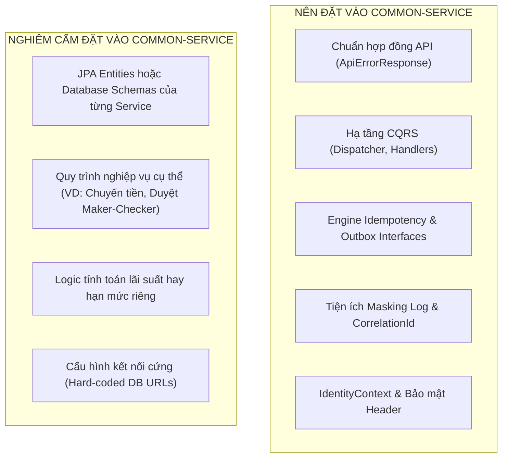

# Business Requirements Document (BRD) — Common Service
**Dự án:** Simulation Bank Platform  
**Phân hệ:** Thư viện Nền tảng Dùng chung (`common-service`)  
**Phiên bản:** 1.0.0  
**Ngày ban hành:** 2026-10-08  
**Trạng thái:** Chính thức  

---

## 1. Giới thiệu & Bối cảnh Nghiệp vụ

### 1.1. Bối cảnh
Khi phát triển hệ sinh thái ngân hàng số phân tán với nhiều microservices độc lập (`corebank`, `money-bank`, `cms`, `profile-service`, `paygate`, `notification-service`), việc các đội ngũ kỹ thuật tự ý triển khai các tiện ích nền tảng (cross-cutting concerns) theo cách riêng của mình sẽ dẫn đến các rủi ro hệ thống nghiêm trọng:
1. **Thiếu chuẩn hóa phản hồi lỗi (Inconsistent Error Envelopes):** Mỗi service trả về một cấu trúc JSON lỗi khác nhau (service thì trả `message`, service trả `errorMessage`, service trả `error_description`), làm các client (Mobile/Web) phải viết nhiều bộ parse lỗi phức tạp.
2. **Nguy cơ đứt gãy vết lỗi (Broken Traceability):** Không thống nhất cơ chế sinh và lan truyền mã `Correlation ID`, dẫn đến việc không thể liên kết hành trình của request khi có sự cố giao dịch.
3. **Lặp lại mã nguồn & Rủi ro sai sót bảo mật (Duplication & Security Bugs):** Mỗi service tự viết lại logic kiểm tra trùng lệnh (Idempotency), băm dữ liệu (Canonical Request Hashing), xử lý Outbox Pattern hay che giấu dữ liệu nhạy cảm (Data Masking) trong log.
4. **Hiểm họa tạo ra "Distributed Monolith":** Nếu đưa logic nghiệp vụ riêng hoặc Database Entity vào một thư viện dùng chung, bất kỳ thay đổi nhỏ nào cũng sẽ ép toàn bộ hệ sinh thái phải rebuild và deploy lại đồng loạt.

Phân hệ **`common-service`** được xây dựng nhằm đóng vai trò là **Thư viện Nền tảng Kỹ thuật Dùng chung (Shared Kernel / Technical Foundation Library)**, cung cấp các chuẩn giao tiếp, cơ chế bảo vệ giao dịch và hạ tầng CQRS/Outbox/Idempotency thống nhất cho toàn bộ ngân hàng.

### 1.2. Mục tiêu Nghiệp vụ (Business Objectives)
- **BG-CS-01 (Chuẩn hóa Hợp đồng Phản hồi Lỗi Toàn Ngân hàng):** Định nghĩa cấu trúc lỗi chuẩn duy nhất theo RFC-7807 (`ApiErrorResponse`) với mã lỗi phân loại rõ ràng (Domain, Validation, Security, System, Infrastructure).
- **BG-CS-02 (Bảo vệ Tính Toàn vẹn Giao dịch - Idempotency Framework):** Cung cấp khung chống xử lý trùng lặp lệnh (Idempotency Engine) chuẩn hóa dựa trên băm chuẩn tắc (Canonical Hashing SHA-256) cho tất cả các service tài chính.
- **BG-CS-03 (Chống Mất mát Sự kiện - Transactional Outbox Engine):** Cung cấp các giao diện (interfaces) và cơ chế lưu trữ Outbox thống nhất để bảo đảm nguyên lý At-Least-Once Delivery khi đẩy sự kiện sang Kafka.
- **BG-CS-04 (Chuẩn hóa Khung Xử lý CQRS & Pipeline):** Cung cấp hạ tầng điều phối `Dispatcher` phân tách rõ ràng Command và Query, hỗ trợ cắm các hành vi cắt ngang (Pipeline Behaviors: Logging, Tracing, Idempotency, Validation).
- **BG-CS-05 (Kiểm soát Ranh giới Ngăn chặn Distributed Monolith):** Thiết lập ranh giới kỹ thuật nghiêm ngặt: Tuyệt đối không chứa Database Entity cụ thể, không chứa Business Rules riêng của bất kỳ service nào.

---

## 2. Phạm vi Nghiệp vụ (Scope)

### 2.1. Trong phạm vi (In-Scope)
- **Hạ tầng CQRS & Dispatcher (`com.hieu.common.cqrs`):**
  - Giao diện `Command`, `CommandHandler`, `Query`, `QueryHandler`.
  - Bộ điều phối `Dispatcher` tự động quét và định tuyến lệnh tới đúng Handler trong Spring Context.
  - Hỗ trợ cơ chế `PipelineBehavior` (Middleware/Interceptors).
- **Khung Chống Trùng Lệnh Idempotency (`com.hieu.common.idempotency`):**
  - Annotation `@IdempotentCommand`.
  - Thuật toán băm chuẩn tắc request payload `CanonicalRequestHasher` (SHA-256).
  - Quản lý vòng đời bản ghi `IdempotencyRecord` (`PROCESSING`, `SUCCESS`, `FAILED`).
- **Khung Transactional Outbox (`com.hieu.common.outbox`):**
  - Giao diện và mô hình dữ liệu `OutboxEvent`, `OutboxMessage`.
  - Bộ ghi `OutboxRecorder` và cơ chế điều phối `OutboxDispatcher`.
- **Chuẩn hóa Lỗi & Ngoại lệ (`com.hieu.common.exception`):**
  - Đối tượng phản hồi chuẩn `ApiErrorResponse` tương thích RFC-7807.
  - Bảng mã lỗi `ErrorCode` và nhóm phân loại `ErrorCategory`.
  - `GlobalExceptionHandler` bắt và chuyển đổi ngoại lệ tự động.
- **Bảo mật & Ngữ cảnh Định danh (`com.hieu.common.security`):**
  - Đối tượng `IdentityContext` chứa thông tin user, roles, correlation ID trích xuất từ Request Header và Token.
  - Bộ phân giải `IdentityContextResolver`.
- **Quan sát & Vận hành (`com.hieu.common.observability`):**
  - `CorrelationIdFilter` quản lý MDC logging context.
  - Bộ tiện ích che giấu thông tin nhạy cảm `Masking` (ẩn số thẻ, CCCD trong log).

### 2.2. Ngoài phạm vi (Out-of-Scope)
- **Không có Runtime độc lập:** `common-service` chỉ là file JAR thư viện (Library Dependency), không chạy server hay mở port mạng.
- **Không sở hữu Cơ sở Dữ liệu riêng:** Không chứa DataSource hay Flyway migration riêng.
- **Không chứa Business Domain Entities:** Không chứa các Entity như `Account`, `Customer`, `Proposal` (mỗi service tự quản lý model của mình).

---

## 3. Các Bên Liên Quan & Tác nhân (Stakeholders & Consumers)

| Phân hệ tích hợp | Lợi ích khi sử dụng `common-service` |
|---|---|
| **Corebank (`corebank`)** | Sử dụng hạ tầng CQRS, Outbox pattern và Idempotency để bảo vệ sổ cái. |
| **Money Bank (`money-bank`)** | Sử dụng `IdempotencyBehavior`, `GlobalExceptionHandler` và `ApiErrorResponse`. |
| **CMS Backend (`cms`)** | Sử dụng `IdentityContext`, `Masking` và chuẩn hóa lỗi API. |
| **Profile Service & Paygate** | Sử dụng Correlation ID filter, Outbox engine và chuẩn hóa mã lỗi. |
| **Mobile & Web Frontend Teams** | Nhận format lỗi và Correlation ID đồng nhất trên 100% các API của ngân hàng. |

---

## 4. Nguyên tắc Thiết kế & Ranh giới Kỹ thuật (Design Principles & Boundaries)

---

## 5. Đặc tả Yêu cầu Chức năng (Functional Requirements - FR)

### 5.1. Nhóm Chuẩn hóa Lỗi (Error Standardization)
- **FR-CS-01 (Cấu trúc Lỗi Toàn cục):**
  - Mọi lỗi phát sinh phải serialize thành `ApiErrorResponse` gồm: `timestamp`, `status`, `errorCategory`, `errorCode`, `message`, `correlationId`, `details`.
- **FR-CS-02 (Phân loại Lỗi - Error Categorization):**
  - Hỗ trợ các danh mục: `VALIDATION`, `BUSINESS`, `SECURITY`, `RESOURCE_NOT_FOUND`, `SYSTEM`, `DEPENDENCY`.

### 5.2. Nhóm Idempotency Framework
- **FR-CS-03 (Băm chuẩn tắc Request):**
  - Chuẩn hóa payload (loại bỏ khoảng trắng thừa, sắp xếp key JSON theo thứ tự alphabet) trước khi băm SHA-256 để đảm bảo cùng nội dung luôn ra cùng một chuỗi hash.
- **FR-CS-04 (Kiểm soát Xung đột Trùng lặp):**
  - Nếu cùng 1 `Idempotency-Key` nhưng gửi payload khác: Tung ngoại lệ `IdempotencyConflictException` (HTTP 422).

### 5.3. Nhóm Quan sát & Truy vết (Observability)
- **FR-CS-05 (Correlation ID Propagation):**
  - Đảm bảo mọi dòng log ghi ra trong quá trình xử lý request đều tự động đính kèm `correlationId` vào MDC (Mapped Diagnostic Context).
- **FR-CS-06 (Masking Log Thông minh):**
  - Cung cấp hàm tiện ích tự động che giấu số thẻ tín dụng (chỉ hiện 6 đầu - 4 cuối), số CCCD và mật khẩu khi in ra file log.

---

## 6. Yêu cầu Phi Chức năng (Non-Functional Requirements - NFR)

- **NFR-CS-01 (Zero Performance Overhead):** Việc đi qua các Pipeline Behavior của CQRS và Idempotency phải xử lý cực nhanh (thời gian tính toán CPU $< 1\text{ ms}$).
- **NFR-CS-02 (Tương thích Ngược - Semantic Versioning):** Thư viện tuân thủ chuẩn `MAJOR.MINOR.PATCH`. Tuyệt đối không tạo breaking changes trên các class lõi mà không nâng version Major.
- **NFR-CS-03 (Độ bao phủ Kiểm thử - Test Coverage):** Thư viện dùng chung phải đạt độ bao phủ kiểm thử đơn vị (Unit Test Coverage) tối thiểu **$90\%$** trước khi phát hành phiên bản mới.

---

## 7. Tiêu chí Nghiệm thu (Acceptance Criteria)

| Mã AC | Tiêu chí nghiệm thu | Kết quả mong đợi |
|---|---|---|
| **AC-CS-01** | Bất kỳ Controller nào ném `BusinessException` hoặc `MethodArgumentNotValidException`. | `GlobalExceptionHandler` bắt và trả về JSON chuẩn `ApiErrorResponse` với HTTP status tương ứng. |
| **AC-CS-02** | Command có gắn `@IdempotentCommand` nhận 2 request đồng thời cùng key. | 1 request thực thi, request còn lại được chặn với mã lỗi xung đột hoặc chờ kết quả. |
| **AC-CS-03** | In log thông tin thẻ ngân hàng qua tiện ích `Masking.maskCardNumber("9704220110020030")`. | Chuỗi log in ra dạng `970422******0030`, không để lộ thông tin thẻ. |
