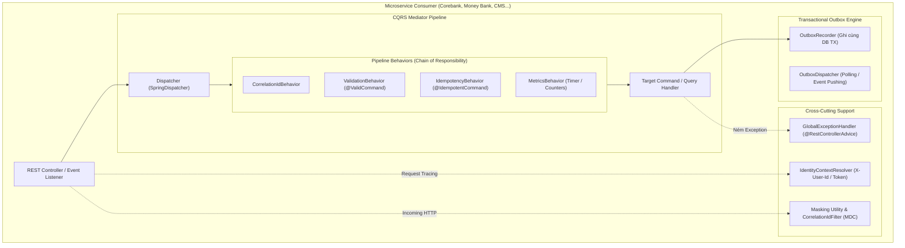
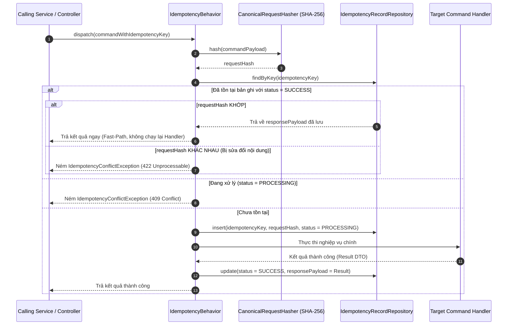

# High-Level Design (HLD) — Common Service
**Dự án:** Simulation Bank Platform  
**Phân hệ:** Thư viện Nền tảng Dùng chung (`common-service`)  
**Phiên bản:** 1.0.0  
**Ngày ban hành:** 2026-10-08  
**Trạng thái:** Chính thức  

---

## 1. Giới thiệu & Triết lý Thiết kế Kiến trúc

### 1.1. Mục đích Tài liệu
Tài liệu HLD (High-Level Design) này mô tả kiến trúc tổng thể của **`common-service`** — thư viện dùng chung đóng vai trò là **Shared Kernel** cho toàn bộ hệ sinh thái Simulation Bank Platform. Tài liệu xác định ranh giới kiến trúc, các mẫu thiết kế (design patterns), cơ chế điều phối CQRS Pipeline, hạ tầng chống trùng lệnh Idempotency và chuẩn hóa ngoại lệ toàn ngân hàng.

### 1.2. Triết lý Thiết kế & Ranh giới Kiến trúc (Architecture Principles)
- **Shared Kernel — Không phải Distributed Monolith:** Thư viện chỉ cung cấp các tiện ích kỹ thuật nền tảng, hợp đồng dữ liệu chuẩn (data contracts) và giao diện trừu tượng (interfaces). Tuyệt đối **không** chia sẻ Domain Entities, JPA Repositories hoặc Business Logic cụ thể giữa các microservices.
- **Zero Runtime & Zero Infrastructure:** Thư viện được đóng gói dưới dạng tệp `JAR`, không có tiến trình chạy độc lập, không chiếm port mạng và không trực tiếp khởi tạo kết nối CSDL riêng.
- **Convention over Configuration:** Cung cấp sẵn cơ chế cấu hình tự động (Spring Auto-Configuration) để các microservices chỉ cần khai báo dependency là kích hoạt được toàn bộ bộ lọc lỗi, bảo mật và truy vết.

---

## 2. Bức tranh Kiến trúc Tổng thể (Architecture Layout)



---

## 3. Các Phân hệ Thành phần (Core Subsystems)

### 3.1. Phân hệ CQRS & Pipeline Dispatcher (`cqrs`)
Áp dụng **Mediator Pattern** và **Chain of Responsibility Pattern**:
- **Dispatcher:** Nhận đối tượng `Command<R>` hoặc `Query<R>`, tự động tìm kiếm bean triển khai tương ứng (`CommandHandler<C, R>` hoặc `QueryHandler<Q, R>`) trong Spring ApplicationContext.
- **Pipeline Behaviors:** Cho phép đóng gói các logic bổ trợ (cross-cutting) xung quanh Handler mà không làm bẩn code nghiệp vụ:
  ```text
  Client Request 
    └── Dispatcher.dispatch(command)
          └── CorrelationIdBehavior
                └── ValidationBehavior
                      └── IdempotencyBehavior
                            └── TargetCommandHandler.handle(command)
  ```

---

### 3.2. Phân hệ Idempotency Engine (`idempotency`)
Bảo vệ giao dịch tài chính trước lỗi trùng lặp khi client retry:



---

### 3.3. Phân hệ Transactional Outbox Engine (`outbox`)
Đảm bảo xuất dữ liệu ra Kafka theo nguyên tắc At-Least-Once Delivery:
- Định nghĩa các interface trừu tượng:
  - `OutboxRecorder`: Được gọi bên trong Transaction của nghiệp vụ chính để insert bản ghi `OutboxMessage` vào bảng CSDL cục bộ của service.
  - `OutboxDispatcher`: Background scheduler định kỳ đọc các message `PENDING` và đẩy sang Kafka broker.

---

### 3.4. Phân hệ Chuẩn hóa Lỗi & Ngoại lệ (`exception`)
Toàn bộ lỗi nghiệp vụ và hạ tầng trong ngân hàng được chuẩn hóa theo chuẩn quốc tế RFC-7807:

```json
{
  "timestamp": "2026-10-08T10:30:00Z",
  "status": 422,
  "errorCategory": "BUSINESS",
  "errorCode": "INSUFFICIENT_FUNDS",
  "message": "Số dư khả dụng không đủ để thực hiện giao dịch",
  "path": "/api/v1/transfers",
  "correlationId": "c8a402f1-678e-49b8-a764-8390b14f8819",
  "details": []
}
```

- **Phân cấp Ngoại lệ (Exception Hierarchy):**
  - `CommonException` (Base Runtime Exception)
    - `InvalidRequestException` (HTTP 400 - Dữ liệu không hợp lệ)
    - `AuthenticationRequiredException` (HTTP 401 - Chưa xác thực)
    - `BusinessException` (HTTP 422 - Vi phạm quy tắc tài chính)
    - `IdempotencyConflictException` (HTTP 409 / 422 - Xung đột trùng lặp)
    - `DependencyUnavailableException` (HTTP 503 - Dịch vụ phụ thuộc bị sập)

---

### 3.5. Phân hệ Bảo mật & Quan sát (`security` & `observability`)
- **`IdentityContext`:** Đọc các header `X-User-Id`, `X-User-Roles`, `X-Correlation-Id` do API Gateway gắn vào để cung cấp ngữ cảnh người dùng tức thời cho luồng xử lý.
- **`CorrelationIdFilter`:** Đăng ký MDC (Mapped Diagnostic Context) để mọi log in ra tự động chứa trường `correlationId`.
- **`Masking`:** Cung cấp các regex mask an toàn cho:
  - Số thẻ ngân hàng: Giữ 6 số BIN đầu và 4 số cuối (`970422******0030`).
  - Số CCCD/Hộ chiếu: Giữ 3 số đầu và 3 số cuối (`079***123`).
  - Số điện thoại: Giữ 3 số đầu và 3 số cuối (`090***789`).

---

## 4. Quy tắc Kiểm soát Ranh giới (Boundary Enforcement)

| Thành phần | Thuộc về `common-service` | Thuộc về Microservice Riêng |
|---|---|---|
| **API Envelope & Error DTO** | ✅ Có (`ApiErrorResponse`) | ❌ Không tự định nghĩa lại |
| **CQRS Core Interfaces** | ✅ Có (`Dispatcher`, `Command`) | ❌ Chỉ implement handlers cụ thể |
| **Idempotency Algorithms** | ✅ Có (`CanonicalRequestHasher`) | ❌ Không tự viết băm lặp lại |
| **Database Entities (JPA)** | ❌ Tuyệt đối KHÔNG | ✅ Tự quản lý trong từng service |
| **Database Migrations (Flyway)** | ❌ Tuyệt đối KHÔNG | ✅ Tự quản lý script DB riêng |
| **Nghiệp vụ Chuyển tiền / Mở TK** | ❌ Tuyệt đối KHÔNG | ✅ Nằm trong Money Bank / Corebank |

---

## 5. Quản lý Phiên bản & Kiểm thử (Release & Versioning)

- **Semantic Versioning (SemVer 2.0.0):**
  - `MAJOR`: Thay đổi phá vỡ tương thích (Breaking Change) trong interface/DTO.
  - `MINOR`: Bổ sung tính năng mới, annotation mới, tương thích ngược hoàn toàn.
  - `PATCH`: Sửa lỗi, tối ưu hiệu năng không đổi chữ ký hàm.
- **Tiêu chuẩn Kiểm thử:**
  - 100% các class tiện ích (`CanonicalRequestHasher`, `Masking`) phải có Unit Test phủ toàn bộ các trường hợp biên (Null, Empty, Malformed JSON, Special Characters).
