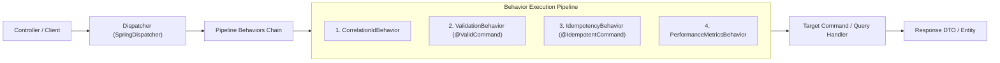
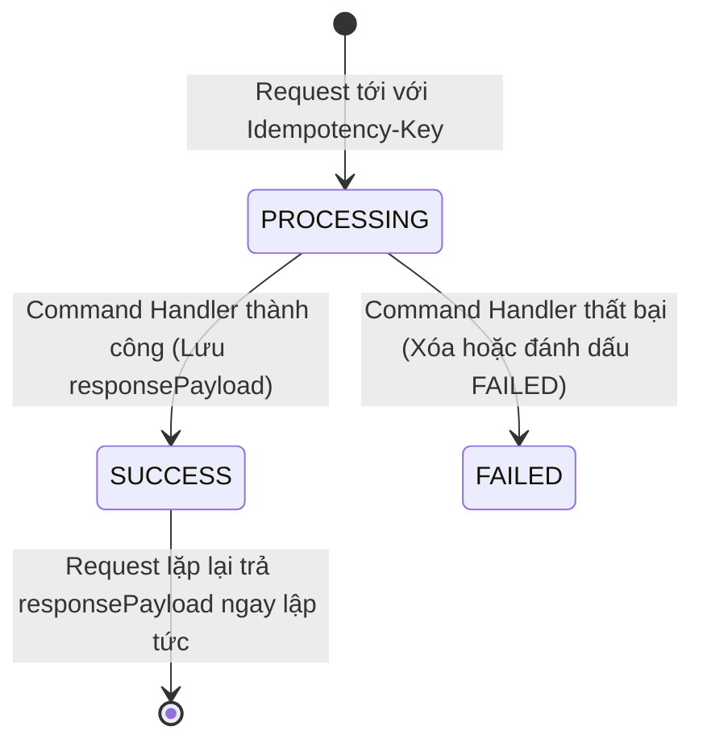

# System Requirements Document (SRD) — Common Service
**Dự án:** Simulation Bank Platform  
**Phân hệ:** Thư viện Nền tảng Dùng chung (`common-service`)  
**Phiên bản:** 1.0.0  
**Ngày ban hành:** 2026-10-08  
**Trạng thái:** Chính thức  
**Tham chiếu:** `common-service/docs/brd.md`, `common-service/docs/hld.md`

---

## 1. Tổng quan Kỹ thuật & Cấu trúc Thư viện

### 1.1. Bản chất Kỹ thuật (Library Characteristics)
`common-service` là thư viện mã nguồn đóng gói dưới dạng tệp **Maven JAR (`com.hieu:common-service:0.0.1-SNAPSHOT`)**.
- Không có class chứa `main()`, không có Spring Boot application launcher độc lập.
- Không chứa file cấu hình `application.yaml` cố định môi trường.
- Tự động cấu hình (Spring Boot Auto-configuration) các Bean dùng chung khi một microservice khai báo dependency trong `pom.xml`.

### 1.2. Tech Stack Cốt lõi
- **Ngôn ngữ:** Java 21 LTS / Java 25
- **Dependencies chính:**
  - `spring-boot-starter-web` (Spring MVC / Exception Handling)
  - `spring-boot-starter-security` (Security Context & JWT Claims)
  - `jackson-databind` (JSON Serialization & Canonical Hashing)
  - `slf4j-api` (MDC Logging & Masking)
  - `jakarta.validation-api` (Validation Annotations)

### 1.3. Cấu trúc Package Chi tiết

```text
com.hieu.common/
├── annotation/          # @IdempotentCommand, @ValidCommand, @CommandHandler
├── cqrs/                # Dispatcher, Command, Query, Handlers, PipelineBehavior
├── exception/           # ApiErrorResponse, ErrorCode, ErrorCategory, GlobalExceptionHandler
├── idempotency/         # IdempotencyService, CanonicalRequestHasher, IdempotencyRecord
├── observability/       # CorrelationIdFilter, LogFields, Masking
├── outbox/              # OutboxMessage, OutboxRecorder, OutboxDispatcher, OutboxEvent
├── security/            # IdentityContext, IdentityContextResolver, JwtAudienceValidator
└── util/                # TimeConfig, JacksonUtils
```

---

## 2. Đặc tả Thành phần Hạ tầng (Core Framework Specifications)

### 2.1. Phân hệ CQRS & Pipeline Dispatcher (`com.hieu.common.cqrs`)
Mô hình triển khai Mediator Pattern phân tách Command và Query:



#### Core Interfaces
- **`Dispatcher`:**
  ```java
  public interface Dispatcher {
      <R> R dispatch(Command<R> command);
      <R> R dispatch(Query<R> query);
  }
  ```
- **`PipelineBehavior<T, R>`:** Cho phép chèn các hành vi xử lý trước (pre) và sau (post) của mỗi Command/Query một cách trong suốt:
  ```java
  public interface PipelineBehavior<T, R> {
      R handle(T request, RequestHandlerDelegate<R> next);
  }
  ```

---

### 2.2. Khung Chống Trùng Lệnh Idempotency (`com.hieu.common.idempotency`)

#### Thuật toán Băm Chuẩn tắc (Canonical Request Hashing)
Để chống trường hợp client gửi cùng một `Idempotency-Key` nhưng nội dung JSON bị sửa đổi (đổi số tiền, đổi số tài khoản):
1. **Lược bỏ khoảng trắng và chuẩn hóa:** Đọc chuỗi JSON đầu vào, parse thành Jackson `JsonNode`.
2. **Sắp xếp các thuộc tính (Sorted Keys):** Đảm bảo thứ tự key alphabet không làm thay đổi giá trị băm.
3. **Sinh mã SHA-256:**
   $$\text{requestHash} = \text{Hex}(\text{SHA-256}(\text{CanonicalJSON}))$$

#### Vòng đời Trạng thái `IdempotencyRecord`


---

### 2.3. Khung Transactional Outbox Pattern (`com.hieu.common.outbox`)

Cung cấp các hợp đồng trừu tượng (Abstract Contracts) để các service ghi nhận sự kiện vào CSDL cục bộ trong cùng transaction:
- **`OutboxMessage`:**
  - `id`: UUID chuỗi
  - `aggregateType`: Tên Aggregate (VD: `Account`, `TransferProposal`)
  - `aggregateId`: Khóa của Aggregate (VD: Số tài khoản)
  - `eventType`: Tên sự kiện (VD: `TransferCompletedEvent`)
  - `payload`: Chuỗi JSON chi tiết
  - `status`: `PENDING`, `SENT`, `FAILED`
- **`OutboxRecorder`:** Service interface chịu trách nhiệm ghi bản ghi ra bảng outbox.

---

### 2.4. Chuẩn hóa Lỗi & Ngoại lệ (`com.hieu.common.exception`)

#### Cấu trúc Phản hồi Chuẩn RFC-7807 (`ApiErrorResponse`)
```java
public record ApiErrorResponse(
    Instant timestamp,
    int status,
    ErrorCategory errorCategory,
    String errorCode,
    String message,
    String path,
    String correlationId,
    List<ValidationErrorItem> details
) {}
```

#### Bảng Phân loại Mã Lỗi Chuẩn (`ErrorCode` & `ErrorCategory`)
| ErrorCategory | Ví dụ ErrorCode | HTTP Status tương ứng |
|---|---|---|
| `VALIDATION` | `INVALID_PAYLOAD`, `MISSING_REQUIRED_FIELD` | `400 Bad Request` |
| `SECURITY` | `AUTHENTICATION_REQUIRED`, `ACCESS_DENIED` | `401 Unauthorized` / `403 Forbidden` |
| `RESOURCE_NOT_FOUND` | `ACCOUNT_NOT_FOUND`, `CUSTOMER_NOT_FOUND` | `404 Not Found` |
| `BUSINESS` | `INSUFFICIENT_FUNDS`, `PROPOSAL_EXPIRED` | `422 Unprocessable Entity` |
| `IDEMPOTENCY` | `IDEMPOTENCY_CONFLICT`, `OPERATION_IN_PROGRESS` | `409 Conflict` |
| `DEPENDENCY` | `COREBANK_UNAVAILABLE`, `KAFKA_DISPATCH_FAILED` | `503 Service Unavailable` |

---

### 2.5. Bảo mật & Quan sát (`com.hieu.common.security` & `observability`)

#### `IdentityContext`
Tự động lấy thông tin người dùng từ request headers do API Gateway chuyển tiếp:
```java
public record IdentityContext(
    String userId,
    String username,
    List<String> roles,
    String correlationId,
    String clientIp
) {}
```

#### Tiện ích Che giấu Dữ liệu Nhạy cảm (`Masking.java`)
- `Masking.maskCardNumber(cardNumber)`: `970422******0030` (Giữ 6 số đầu - 4 số cuối).
- `Masking.maskPhoneNumber(phone)`: `098***321` (Giữ 3 số đầu - 3 số cuối).
- `Masking.maskNationalId(id)`: `012***901` (Giữ 3 số đầu - 3 số cuối).

---

## 3. Hướng dẫn Tích hợp vào Microservices (Integration Guide)

### 3.1. Khai báo Dependency trong `pom.xml` của Service
```xml
<dependency>
    <groupId>com.hieu</groupId>
    <artifactId>common-service</artifactId>
    <version>0.0.1-SNAPSHOT</version>
</dependency>
```

### 3.2. Đăng ký Bean & Scan Packages
Trong file cấu hình Application của service đích:
```java
@SpringBootApplication
@ComponentScan(basePackages = {"com.hieu.common", "com.hieu.targetservice"})
public class TargetServiceApplication {
    public static void main(String[] args) {
        SpringApplication.run(TargetServiceApplication.class, args);
    }
}
```
Sau khi khai báo, các cơ chế `GlobalExceptionHandler`, `CorrelationIdFilter`, và `Dispatcher` sẽ tự động kích hoạt mà không cần viết thêm mã nguồn boilerplate.
