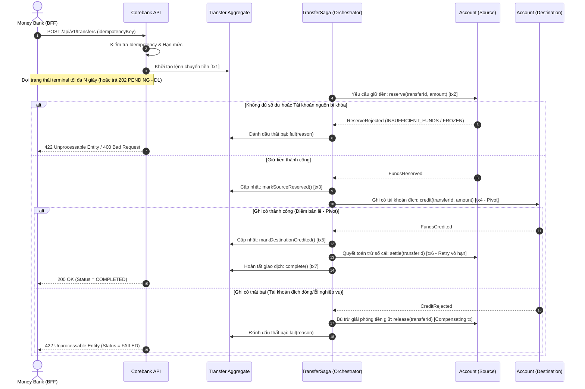

# Business Requirements Document (BRD) — Corebank Service
**Dự án:** Simulation Bank Platform  
**Phân hệ:** Sổ cái Ngân hàng Trung tâm (`corebank`)  
**Phiên bản:** 1.1.0  
**Ngày cập nhật:** 2026-10-10  
**Trạng thái:** Chính thức
---

## 1. Giới thiệu & Bối cảnh Nghiệp vụ

### 1.1. Bối cảnh
Trong hệ thống tài chính - ngân hàng, Core Banking là "trái tim" và là nguồn chân lý duy nhất (Single Source of Truth) lưu giữ số dư, lịch sử giao dịch và quyền sở hữu tài sản của khách hàng. Mọi thao tác thanh toán, gửi tiền, rút tiền, cấp tín dụng từ các dịch vụ vệ tinh (Mobile Banking, Web Banking, Payment Gateway, ATM, POS) cuối cùng đều phải được phản ánh và quyết toán tại sổ cái ngân hàng lõi.

Phân hệ `corebank` trong **Simulation Bank Platform** được xây dựng nhằm mô phỏng nghiệp vụ Sổ cái Kép (Double-Entry General Ledger) chuẩn mực của ngành ngân hàng, giải quyết triệt để hai bài toán cốt lõi:
1. **Tính toàn vẹn dữ liệu tuyệt đối (Zero Data Loss & Absolute Data Integrity):** Không để thất thoát bất kỳ một xu nào, mọi biến động số dư phải tuân thủ nghiêm ngặt nguyên lý kế toán kép và tính chất ACID.
2. **Kiểm soát xử lý đồng thời (Concurrency Control):** Ngăn chặn triệt để rủi ro tiêu vượt số dư (Double Spending) và xung đột ghi đè dữ liệu (Race Condition) khi có nhiều giao dịch cùng tác động lên một tài khoản tại cùng một mili-giây.

### 1.2. Mục tiêu Nghiệp vụ (Business Objectives)
- **BG-CB-01 (Quản lý Sổ cái chuẩn mực):** Vận hành sổ cái tài khoản và giao dịch bất biến, hỗ trợ đối soát (Reconciliation) tự động.
- **BG-CB-02 (Bảo vệ Số dư & Chống Double-Spending):** Đảm bảo không bao giờ xảy ra tình trạng số dư bị âm ngoài hạn mức cho phép hoặc ghi trùng lệnh trừ tiền.
- **BG-CB-03 (Quản lý Khách hàng & Tài khoản):** Cung cấp các nghiệp vụ mở hồ sơ khách hàng (Customer CIF), mở tài khoản thanh toán đa tiền tệ, phát hành thẻ ngân hàng.
- **BG-CB-04 (Quyết toán Giao dịch Tức thời & Nhất quán Cuối cùng):** Thực thi chuyển tiền nội bộ an toàn qua điều phối Saga 2 pha: Giữ tiền (Funds Reserved) và Quyết toán/Bù trừ (Settle / Compensate), đảm bảo nguyên tắc 1 transaction chỉ cập nhật 1 aggregate và sẵn sàng tách microservice.
- **BG-CB-05 (Truy vết & Kiểm toán 100%):** Lưu vết toàn bộ sự kiện tài chính dưới dạng chuỗi sự kiện append-only (Event Sourcing) không thể chỉnh sửa hay xóa bỏ.

---

## 2. Phạm vi Nghiệp vụ (Scope)

### 2.1. Trong phạm vi (In-Scope)
- **Quản lý Hồ sơ Khách hàng (Customer Profile):**
  - Khởi tạo hồ sơ khách hàng với mã định danh duy nhất (CIF - Customer Information File).
  - Tra cứu thông tin khách hàng theo CIF.
- **Quản lý Tài khoản Thanh toán (Demand Deposit Account - DDA):**
  - Mở tài khoản thanh toán liên kết với CIF.
  - Quản lý trạng thái tài khoản: `ACTIVE` (Hoạt động), `LOCKED` (Tạm khóa), `CLOSED` (Đã đóng).
  - Tra cứu số dư thực tế (Actual Balance) và số dư khả dụng (Available Balance).
- **Quản lý Thẻ Ngân hàng (Bank Card):**
  - Phát hành thẻ ghi nợ/thẻ ảo liên kết với tài khoản thanh toán.
  - Quản lý trạng thái thẻ: `ACTIVE`, `BLOCKED`, `EXPIRED`.
- **Nghiệp vụ Chuyển tiền & Quyết toán (Fund Transfers & Ledger Entries):**
  - Chuyển tiền nội bộ giữa 2 tài khoản thanh toán.
  - Hỗ trợ Nạp tiền (Deposit) và Rút tiền (Withdraw).
  - Ghi nhận bút toán Sổ cái kép (Debit/Credit).
  - Tra cứu lịch sử giao dịch chi tiết theo tài khoản.
- **Cơ chế An toàn Nghiệp vụ:**
  - Idempotency kiểm soát trùng lặp giao dịch dựa trên khóa duy nhất (`idempotencyKey`).
  - Ghi nhận Outbox Event phục vụ truyền thông tin bất đồng bộ sang Kafka.

### 2.2. Ngoài phạm vi (Out-of-Scope)
- Không cung cấp giao diện người dùng trực tiếp cho khách hàng (việc này do `money-bank` và `cms` đảm nhiệm).
- Không mở route ra Internet/API Gateway (chỉ phục vụ các service nội bộ qua Private Network).
- Chưa bao gồm nghiệp vụ tính lãi suất cuối ngày (End of Day - EoD) và thấu chi (Overdraft) trong Phase 1.
- Chưa bao gồm nghiệp vụ chuyển tiền liên ngân hàng (Napas/Citad) trực tiếp trong Corebank (xử lý qua Paygate adapter).

---

## 3. Các Bên Liên Quan & Tác nhân (Stakeholders & Actors)

| Tác nhân | Vai trò trong hệ thống | Tương tác chính với Corebank |
|---|---|---|
| **Money Bank (`money-bank`)** | Service ngân hàng số (BFF) | Gọi Corebank để truy vấn số dư, kiểm tra tài khoản nhận, và gửi lệnh chuyển tiền khi khách hàng xác nhận giao dịch. |
| **Profile Service (`profile-service`)** | Dịch vụ định danh khách hàng | Yêu cầu tạo mới Customer CIF và liên kết tài khoản sau khi hoàn tất onboarding. |
| **CMS Backend (`cms`)** | Dịch vụ quản trị Back-office | Tra cứu dữ liệu sổ cái, yêu cầu khóa/mở tài khoản sau khi Maker-Checker phê duyệt. |
| **Paygate (`paygate`)** | Cổng thanh toán | Gửi yêu cầu hạch toán thu hộ/chi hộ vào tài khoản thanh toán của Merchant hoặc đối tác. |
| **Internal Auditor / Kế toán viên** | Thanh tra & Giám sát tài chính | Đối soát số liệu sổ cái, kiểm tra tính cân đối Nợ/Có của toàn bộ hệ thống. |

---

## 4. Quy trình Nghiệp vụ Cốt lõi (Core Business Workflows)

### 4.1. Quy trình Chuyển tiền Nội bộ (Internal Transfer Workflow — Saga Orchestration)

Quy trình chuyển tiền nội bộ được hiện thực hóa theo mô hình **Saga Orchestration** (điều phối qua `TransferSaga`), tuân thủ nghiêm ngặt nguyên tắc **1 transaction chỉ cập nhật 1 Aggregate**:

### 4.2. Quy tắc Sổ cái Kép (Double-Entry Bookkeeping Rule)
Mọi biến động số dư phải tuân thủ công thức kế toán:
$$\sum \text{Debit (Nợ)} = \sum \text{Credit (Có)}$$

- **Khi Khách hàng A chuyển tiền cho Khách hàng B:**
  - Ghi Nợ (Debit) Tài khoản A: Số dư giảm số tiền $X$.
  - Ghi Có (Credit) Tài khoản B: Số dư tăng số tiền $X$.
  - Chênh lệch tổng thể = 0.
- **Khi Khách hàng Nạp tiền mặt (Deposit):**
  - Ghi Nợ (Debit) Tài khoản Tiền mặt tại quỹ của Ngân hàng (Vốn/Tài sản).
  - Ghi Có (Credit) Tài khoản Khách hàng (Nợ phải trả của Ngân hàng).

### 4.3. Quản lý Trạng thái Tài khoản & Giao dịch
- **Vòng đời Tài khoản (Account Status Lifecycle):**
  - `ACTIVE`: Cho phép nạp tiền, rút tiền, nhận tiền và chuyển tiền.
  - `LOCKED`: Bị khóa do nghi ngờ gian lận hoặc theo yêu cầu từ CMS. Chặn toàn bộ lệnh ghi Nợ (Debit), cho phép ghi Có (Credit tùy cấu hình).
  - `CLOSED`: Tài khoản đã thanh lý số dư về 0 và chấm dứt hoạt động. Chặn mọi giao dịch phát sinh.
- **Trạng thái Giao dịch (Transaction Status Lifecycle):**
  - `PENDING`: Đang tiếp nhận xử lý.
  - `RESERVED`: Đã tạm giữ tiền của tài khoản nguồn thành công.
  - `COMPLETED`: Quyết toán thành công cho cả 2 bên.
  - `FAILED`: Giao dịch thất bại (hoàn trả tiền đã tạm giữ nếu có).

---

## 5. Đặc tả Yêu cầu Chức năng (Functional Requirements - FR)

### 5.1. Nhóm Quản lý Khách hàng & Định danh (Customer Management)
- **FR-CB-01 (Tạo hồ sơ khách hàng):**
  - Nhận yêu cầu tạo khách hàng mới với Họ tên, Số CCCD/Hộ chiếu, Số điện thoại, Email.
  - Tự động sinh mã CIF (Customer Information File) theo định dạng chuẩn 8 chữ số duy nhất.
  - Không cho phép trùng số CCCD/Hộ chiếu đối với khách hàng đang hoạt động.
- **FR-CB-02 (Tra cứu hồ sơ khách hàng):**
  - Cho phép tra cứu thông tin khách hàng qua mã CIF.

### 5.2. Nhóm Quản lý Tài khoản (Account Management)
- **FR-CB-03 (Mở tài khoản thanh toán):**
  - Mở tài khoản thanh toán mới liên kết với một CIF hợp lệ.
  - Hỗ trợ loại tiền tệ (mặc định: `VND`).
  - Khởi tạo số dư ban đầu (`balance = 0`, `available_balance = 0`), trạng thái `ACTIVE`.
- **FR-CB-04 (Truy vấn số dư):**
  - Trả về chi tiết: Số tài khoản, Loại tiền tệ, Số dư thực tế (`actualBalance`), Số dư khả dụng (`availableBalance`), Số tiền đang bị phong tỏa/tạm giữ (`holdBalance = actualBalance - availableBalance`).
- **FR-CB-05 (Khóa / Mở khóa tài khoản):**
  - Chuyển đổi trạng thái tài khoản giữa `ACTIVE` và `LOCKED` dựa trên yêu cầu từ CMS có quyền hạn hợp lệ.

### 5.3. Nhóm Quản lý Thẻ (Card Management)
- **FR-CB-06 (Phát hành thẻ):**
  - Phát hành thẻ thanh toán ảo/vật lý gắn với một tài khoản thanh toán đang hoạt động.
  - Sinh số thẻ chuẩn mô phỏng (BIN 16 chữ số), ngày hết hạn, mã CVV mã hóa.
- **FR-CB-07 (Khóa / Kích hoạt thẻ):**
  - Thay đổi trạng thái thẻ: `ACTIVE`, `BLOCKED`, `EXPIRED`.

### 5.4. Nhóm Chuyển tiền & Sổ cái (Transfer & Ledger)
- **FR-CB-08 (Chuyển tiền nội bộ qua Saga):**
  - Tiếp nhận lệnh chuyển tiền từ tài khoản nguồn sang tài khoản đích trong cùng hệ thống Corebank.
  - Kiểm tra điều kiện: Tài khoản nguồn và đích tồn tại, trạng thái `ACTIVE`, cùng loại tiền tệ, tài khoản nguồn có `availableBalance >= amount`.
  - Thực thi điều phối qua Saga Orchestration: Mỗi bước là một transaction độc lập trên một Aggregate duy nhất (`Transfer`, `Account`). Giữ tiền tài khoản nguồn (`reserve`), ghi có tài khoản đích (`credit` - Pivot transaction), và quyết toán trừ sổ cái (`settle`). Tự động bù trừ giải phóng tiền (`release`) nếu bước ghi có thất bại trước điểm pivot.
- **FR-CB-09 (Xử lý Idempotency & Tự bảo vệ Sổ cái):**
  - Mọi yêu cầu chuyển tiền bắt buộc có header/trường `idempotencyKey`.
  - Sinh mã giao dịch duy nhất tất định `transferId = UUID v3(sourceAccountId + ":" + idempotencyKey)`.
  - Nếu key đã tồn tại và thông tin yêu cầu trùng khớp: trả về kết quả trước đó mà không thực thi lại trừ tiền (idempotent replay).
  - Nếu key đã tồn tại nhưng thông tin yêu cầu bị thay đổi (khác số tiền, tài khoản nhận, tiền tệ): trả về lỗi xung đột `409 Conflict`.
  - Mọi thao tác Aggregate nội bộ (`reserve`, `credit`, `settle`, `release`) phải mang tính idempotent theo `transferId`.
- **FR-CB-10 (Truy vấn lịch sử giao dịch):**
  - Cung cấp danh sách các bút toán đã hạch toán của một tài khoản theo thứ tự thời gian giảm dần, hỗ trợ phân trang.

---

## 6. Yêu cầu Phi Chức năng (Non-Functional Requirements - NFR)

### 6.1. Hiệu năng & Khả năng Mở rộng (Performance & Scalability)
- **NFR-CB-01 (Throughput):** Hệ thống phải đáp ứng tối thiểu **1,000 TPS** (Transactions Per Second) ghi sổ cái trong điều kiện chịu tải đỉnh.
- **NFR-CB-02 (Latency SLA):**
  - Thao tác ghi lệnh chuyển tiền (Write/Command): Thời gian phản hồi P95 $\le 100\text{ ms}$, P99 $\le 250\text{ ms}$.
  - Thao tác đọc số dư và lịch sử (Read/Query): Thời gian phản hồi P95 $\le 20\text{ ms}$, P99 $\le 50\text{ ms}$.
- **NFR-CB-09 (Phân tách Vật lý Ghi/Đọc & Tự động Co giãn Bất đối xứng — K8s CQRS):**
  - Hệ thống áp dụng chiến lược phân tách vật lý ở hạ tầng Kubernetes thành 2 deployment độc lập:
    - `corebank-command` (Ghi): Kết nối Primary Write Master DB, duy trì cố định 2–3 Pods nhằm kiểm soát và bảo toàn connection pool cho Master DB.
    - `corebank-query` (Đọc): Kết nối Read Replica DB, cấu hình Horizontal Pod Autoscaler (HPA) tự động co giãn từ 3 đến 20 Pods dựa trên CPU và lưu lượng truy vấn sao kê/số dư.
  - Sử dụng Spring Profile (`command`, `query`, `all`) định nghĩa qua hằng số `ProfileConstants` để kích hoạt đúng Controller/Handler trên từng Pod, tuyệt đối không nạp mã lệnh ghi vào Pod Đọc để bảo vệ Read Replica.
- **NFR-CB-10 (Độ trễ Giới hạn & Chuyển giao Bất đồng bộ Mềm dẻo — Bounded Latency & Async Fallback):**
  - Endpoint `POST /transfers` duy trì cơ chế chờ đồng bộ tối đa $N$ giây (mặc định $\le 3\text{s}$, cấu hình phù hợp với timeout của dịch vụ gọi BFF) để phản hồi trạng thái kết thúc (`COMPLETED` hoặc `FAILED`).
  - Nếu quá thời hạn $N$ giây mà Saga chưa hoàn tất, API bắt buộc chuyển giao mềm dẻo bằng mã HTTP `202 Accepted` kèm `status=PENDING` và `transferId`, giải phóng kết nối cho client trong khi Saga tiếp tục xử lý ngầm trong nền.

### 6.2. Toàn vẹn Dữ liệu, Độ tin cậy & Khả năng Tự phục hồi (Data Integrity, Reliability & Resilience)
- **NFR-CB-03 (Bảo toàn Dữ liệu Tuyệt đối & Append-Only Event Store):**
  - Tuyệt đối không cho phép mất mát bất kỳ sự kiện tài chính nào (Zero Data Loss) trong mọi tình huống sự cố mạng, sập nguồn hoặc restart dịch vụ.
  - Mọi biến động số dư và trạng thái tài khoản đều được lưu trữ vĩnh viễn dưới dạng sự kiện bất biến (Append-Only) trong bảng `domain_events`.
- **NFR-CB-04 (Chống Double Spending & Kiểm soát Đồng thời Mức Aggregate):**
  - Tuân thủ nguyên tắc: Mỗi database transaction chỉ được phép cập nhật duy nhất 1 Aggregate.
  - Sử dụng Optimistic Locking dựa trên trường `version` của Aggregate kết hợp các thao tác idempotent theo `transferId` (`reserve`, `credit`, `settle`, `release`).
  - Khi xảy ra xung đột version do nhiều giao dịch đồng thời tác động lên cùng một tài khoản, hệ thống tự động retry với backoff an toàn (tối đa N lần), ngăn chặn triệt để tình trạng tiêu vượt số dư hoặc số dư khả dụng bị âm.
- **NFR-CB-05 (Availability SLA):**
  - Tính sẵn sàng của dịch vụ Corebank đạt tối thiểu **99.99%** Uptime hàng năm.
- **NFR-CB-11 (Độ bền & Khả năng Tự phục hồi của Saga — Saga Durability & Self-Healing):**
  - Điều phối chuyển tiền liên-aggregate thông qua Saga Orchestration (`TransferSaga`) phải đảm bảo độ bền vững tuyệt đối:
    - **Điểm bản lề (Pivot Transaction):** Khi thao tác ghi có (`credit`) vào tài khoản nhận thành công, giao dịch bắt buộc chỉ đi tiến (forward retry vô hạn bước `settle` tài khoản nguồn kèm cảnh báo), tuyệt đối không bù trừ ngược để tránh mất tiền.
    - **Bù trừ tự động (Compensating Transaction):** Nếu thao tác ghi có bị từ chối do vi phạm quy tắc nghiệp vụ, Saga tự động kích hoạt lệnh `release` giải phóng khoản tiền đang hold tại tài khoản nguồn.
    - **Tự phục hồi sau sự cố (Self-Healing Job):** Tiến trình nền `SagaRecoveryJob` định kỳ quét các giao dịch ở trạng thái non-terminal vượt quá ngưỡng thời gian chờ (`timeout`) để kích hoạt lại bước kế tiếp an toàn, bảo đảm không có giao dịch nào bị treo vô hạn kể cả khi Pod bị crash giữa chừng.
- **NFR-CB-12 (Tự bảo vệ Sổ cái & Idempotency Độc lập Phía Corebank):**
  - Corebank tự chịu trách nhiệm chống trùng lặp giao dịch mà không phụ thuộc vào BFF/Client:
    - Mã định danh giao dịch `transferId` được sinh tất định: `transferId = UUID v3(sourceAccountId + ":" + idempotencyKey)`.
    - Trùng `idempotencyKey` + cùng nội dung yêu cầu: Trả về kết quả trước đó trong $\le 50\text{ ms}$, không sinh thêm sự kiện hay biến động số dư mới.
    - Trùng `idempotencyKey` + khác nội dung yêu cầu (sai lệch số tiền, tài khoản nhận, tiền tệ): Bắt buộc từ chối và phản hồi lỗi xung đột nghiệp vụ `409 Conflict`.
- **NFR-CB-13 (Loại trừ Hoàn toàn Rủi ro từ Độ trễ Bản sao — Zero Replication Lag Impact):**
  - 100% các quyết định nghiệp vụ tài chính, thẩm định số dư khả dụng, hold tiền và ghi nhận sự kiện chuyển tiền bắt buộc thực thi trực tiếp trên Write Master DB.
  - Độ trễ sao chép dữ liệu (Replication Lag) giữa Write Master DB và Read Replica DB tuyệt đối không được phép gây sai lệch hoặc ảnh hưởng đến tính đúng đắn của sổ cái.
- **NFR-CB-14 (Cô lập Lỗi & Bảo toàn Tài nguyên Giao dịch — Fault & Resource Isolation):**
  - Sự cố quá tải do các truy vấn báo cáo/sao kê lịch sử nặng, cạn kiệt bộ nhớ hoặc crash Pod ở phân hệ Đọc (`corebank-query`) hoàn toàn bị cô lập, không ảnh hưởng đến tính sẵn sàng và hiệu năng của phân hệ Ghi (`corebank-command`).

### 6.3. Kiến trúc, Ranh giới Module & Tính Độc lập Domain (Architectural Fitness & Modularity)
- **NFR-CB-15 (Ranh giới Bounded Context & Tính Thuần khiết của Domain — Domain Purity & ArchUnit):**
  - Lớp `domain` của mọi Bounded Context (`account`, `transfer`, `card`, `customer`, `access`) phải giữ trạng thái thuần khiết 100%, không phụ thuộc vào bất kỳ framework kỹ thuật nào (không import Spring, JPA/Hibernate, Jackson, hay `common-service`).
  - Giao tiếp giữa các Bounded Context chỉ được phép thông qua Application Ports/APIs và Events; cấm tham chiếu chéo Entity Domain hoặc truy vấn trực tiếp bảng của Bounded Context khác.
  - Tham chiếu giữa các Aggregate Root khác nhau chỉ thực hiện bằng ID (`AccountId`, `TransferId`, `CustomerId`), không sử dụng quan hệ đối tượng ORM (`@ManyToOne`).
  - Toàn bộ các quy tắc ranh giới này bắt buộc được kiểm chứng tự động bằng công cụ kiểm thử kiến trúc (ArchUnit) trong pipeline CI/CD, ngăn chặn mọi mã nguồn vi phạm ranh giới.
- **NFR-CB-16 (Phân định Rạch ròi Domain Event vs Integration Event):**
  - Tách biệt rõ ràng giữa Sự kiện Domain nội bộ (Domain Events lưu tại `domain_events`, phục vụ khôi phục trạng thái Aggregate) và Sự kiện Tích hợp (Integration Events đẩy ra ngoài qua Transactional Outbox sang Kafka):
    - Không rò rỉ payload thô của Domain Event ra hệ thống bên ngoài.
    - Integration Event phải tuân thủ hợp đồng dữ liệu ổn định, tường minh và có gắn kèm số phiên bản schema (`schemaVersion`).
- **NFR-CB-17 (Tính Toàn vẹn của Snapshot Trạng thái — Complete State Snapshotting):**
  - Bản snapshot của Aggregate Root phải serialize đầy đủ 100% trạng thái hoạt động (bao gồm cả danh sách các khoản giữ tiền `holds` đang hiệu lực, danh sách `creditedTransfers`), đảm bảo việc tái tạo Aggregate từ snapshot kết hợp với các event mới luôn chính xác, không làm thất thoát trạng thái nghiệp vụ.

### 6.4. Bảo mật, Kiểm toán & Tuân thủ Pháp lý (Security, Auditability & Compliance)
- **NFR-CB-06 (Mạng Nội bộ Cách ly — Network Isolation):**
  - `corebank` chỉ tiếp nhận request từ dải mạng nội bộ (Internal K8s Service / Private VPC / Service Mesh), không cấp quyền truy cập công khai từ bên ngoài Internet.
- **NFR-CB-07 (RBAC & Phân quyền Dịch vụ Chặt chẽ):**
  - Áp dụng phân quyền chặt chẽ với `@CoreBankAuthorization` kiểm tra quyền theo vai trò dịch vụ gọi đến (`ROLE_SERVICE_MONEYBANK`, `ROLE_SERVICE_CMS`, `ROLE_SERVICE_PROFILE`).
- **NFR-CB-08 (Audit Trail & Không thể Chối bỏ):**
  - Mọi sự kiện phát sinh trên sổ cái đều được ghi nhận vào Event Store dưới dạng bản ghi bất biến (Immutable Events) kèm định danh thời gian chính xác và actor/service khởi tạo, phục vụ kiểm toán độc lập 100%.
- **NFR-CB-20 (Tuân thủ Bảo vệ Dữ liệu Cá nhân Nhạy cảm — Nghị định 13/2023/NĐ-CP):**
  - Tuân thủ phân loại dữ liệu ngân hàng (thông tin định danh, số tài khoản, tiền gửi, số dư, lịch sử giao dịch) là **Dữ liệu cá nhân nhạy cảm** (Khoản 4 Điều 2):
    - **Che mờ Dữ liệu (Data Masking) khi trả về người dùng và API:** Số CCCD/Hộ chiếu chỉ hiển thị dạng `012345****01`; số thẻ ngân hàng (PAN) chỉ hiển thị BIN và 4 số cuối dạng `4111-22XX-XXXX-3344`; tuyệt đối **KHÔNG lưu trữ dạng plain text và KHÔNG trả về mã bí mật CVV/PIN** trong bất kỳ response DTO nào.
    - **Tối thiểu hóa Dữ liệu (Data Minimization - Điều 3):** API chỉ trả về các trường dữ liệu thực sự cần thiết cho mục đích nghiệp vụ; response của API chuyển tiền `POST /transfers` tuyệt đối không phơi bày số dư của tài khoản người nhận.
    - **Chống rò rỉ Dữ liệu trên Nhật ký (Zero Data Leakage in Logs - Điều 26):** Tuyệt đối cấm in plain text số thẻ đầy đủ, CVV, CCCD, mật khẩu/PIN, số dư chi tiết của khách hàng vào Log files, MDC context hay distributed tracing traces.
- **NFR-CB-21 (Tuân thủ Hệ thống Thông tin Quản lý & An toàn Dữ liệu Sổ cái — Thông tư 13/2018/TT-NHNN):**
  - Tuân thủ quy định về Hệ thống thông tin quản lý (MIS) và quản trị rủi ro CNTT (Điều 50, 51, 52, 53):
    - **Tính toàn vẹn và hợp lệ của dữ liệu (Data Integrity):** Thiết lập cơ chế kiểm soát dữ liệu đầu vào (Input validation), xử lý kiểm toán kép và dữ liệu đầu ra; bảo đảm dữ liệu sổ cái phản ánh chính xác, đầy đủ và tức thời mọi biến động tài chính.
    - **An toàn cơ chế trao đổi thông tin:** Toàn bộ dữ liệu trao đổi giữa Corebank và các service nội bộ (`money-bank`, `cms`, `paygate`) phải được xác thực danh tính qua mTLS / JWT Service Token và mã hóa đường truyền nhằm chống giả mạo hoặc can thiệp trên đường truyền mạng nội bộ.
    - **Tính liên tục & Sao lưu phục hồi:** Cơ sở dữ liệu Event Store và Projection Views phải thiết lập cơ chế sao lưu tự động (Daily backup + WAL archiving) phục vụ kịch bản khôi phục sau thảm họa (Disaster Recovery).

### 6.5. Vận hành, Khả năng Quan sát & Vòng đời Ứng dụng (Observability & Container Lifecycle)
- **NFR-CB-18 (Khả năng Quan sát Chuyên biệt cho Saga & Xử lý Đồng thời — Saga Observability & Real-time Alerting):**
  - Hệ thống phải xuất bản các số liệu đo lường chi tiết (Micrometer/Prometheus) phục vụ giám sát vận hành:
    - `corebank_saga_step_total{step, status}`: Đếm số lượng và trạng thái các bước thực thi saga.
    - `corebank_saga_stuck_total`: Đếm số lượng giao dịch bị kẹt ở trạng thái non-terminal quá ngưỡng thời gian.
    - `corebank_concurrency_retries_total`: Đếm số lần retry do xung đột phiên bản Optimistic Lock.
  - Thiết lập cảnh báo thời gian thực (Alerting) tức thì khi có giao dịch bị treo quá ngưỡng thời gian $T_{\text{stuck}}$ hoặc khi bước quyết toán (`settle`) sau điểm pivot retry thất bại liên tục.
- **NFR-CB-19 (Tắt Dịch vụ Mềm dẻo & Tối ưu Tài nguyên Container — Graceful Shutdown & Container Lifecycle):**
  - Container ứng dụng phải tiếp nhận và xử lý tín hiệu `SIGTERM` từ Kubernetes orchestration để thực hiện Graceful Shutdown:
    - Hoàn tất các transaction và saga step đang dở dang trước khi dừng hoàn toàn.
    - Giải phóng an toàn các connection pool của HikariCP.
    - Tối ưu hóa JVM cho môi trường container (`-XX:+UseContainerSupport -XX:MaxRAMPercentage=75.0`).

---

## 7. Tiêu chí Nghiệm thu (Acceptance Criteria)

| Mã AC | Tiêu chí kiểm thử nghiệm thu | Trạng thái đạt |
|---|---|---|
| **AC-CB-01** | Tạo khách hàng mới sinh mã CIF chuẩn 8 số duy nhất; không cho tạo trùng CCCD. | PASS |
| **AC-CB-02** | Chuyển tiền thành công giữa 2 tài khoản: Số dư người gửi giảm đúng bằng số tiền, số dư người nhận tăng đúng bằng số tiền, sinh mã giao dịch duy nhất. | PASS |
| **AC-CB-03** | Bắn đồng thời 50 request chuyển tiền từ cùng 1 tài khoản với số dư chỉ đủ cho 1 giao dịch: Duy nhất 1 giao dịch thành công, 49 giao dịch còn lại báo lỗi thiếu số dư, không bị âm tiền. | PASS |
| **AC-CB-04** | Gửi lại cùng 1 `idempotencyKey` với payload giống hệt: Hệ thống trả về kết quả cũ trong 50ms, không phát sinh bút toán mới. | PASS |
| **AC-CB-05** | Tài khoản bị `LOCKED`: Mọi lệnh chuyển tiền từ tài khoản này lập tức bị từ chối với mã lỗi phù hợp. | PASS |
| **AC-CB-06** | **Tự phục hồi Saga sau sự cố:** Giả lập tắt Pod bất ngờ khi giao dịch đang ở bước `DESTINATION_CREDITED` (đã ghi có nhưng chưa kịp `settle` tài khoản nguồn): `SagaRecoveryJob` tự động phát hiện và tiếp tục xử lý lệnh chuyển tiền đến trạng thái cuối cùng (`COMPLETED`), số dư sổ cái và khả dụng của tài khoản nguồn được quyết toán chính xác, không thất thoát tiền. | PASS |
| **AC-CB-07** | **Phát hiện Xung đột Idempotency khi sai lệch thông tin:** Gửi lại cùng `idempotencyKey` nhưng thay đổi số tiền hoặc tài khoản đích: Hệ thống phản hồi ngay lập tức lỗi `409 Conflict`, không thực thi trừ tiền và không làm sai lệch giao dịch trước đó. | PASS |
| **AC-CB-08** | **Phân tách & Cô lập tải Ghi/Đọc:** Bắn tải đọc liên tục 5,000 QPS vào cụm `corebank-query`: Pod Query tự động scale theo HPA; cụm `corebank-command` vẫn đáp ứng SLA ghi lệnh chuyển tiền P95 $\le 100\text{ ms}$, connection pool của Master DB không bị cạn kiệt. | PASS |
| **AC-CB-09** | **Chuyển giao Asynchronous mềm dẻo khi quá timeout:** Giả lập độ trễ mạng khiến điều phối saga vượt quá $N$ giây (ngưỡng timeout cấu hình): API `POST /transfers` phản hồi HTTP `202 Accepted` kèm `status=PENDING` và `transferId`; lệnh chuyển tiền tiếp tục hoàn tất ngầm trong nền đạt `COMPLETED`. | PASS |
| **AC-CB-10** | **Kiểm chứng Ranh giới Kiến trúc ArchUnit:** Chạy bộ kiểm thử kiến trúc ArchUnit trong CI/CD: Xác nhận 100% package `domain` không có phụ thuộc hạ tầng (Spring, JPA, Jackson), không có Bounded Context nào vi phạm import chéo domain của nhau. | PASS |
| **AC-CB-11** | **Che mờ Dữ liệu & Tuân thủ Bảo vệ Dữ liệu:** Gọi API truy vấn khách hàng, thẻ và chuyển tiền: Số CCCD được mask `012345****01`, số thẻ được mask `4111-22XX-XXXX-3344`, response chuyển tiền không chứa số dư tài khoản nhận; log hệ thống không chứa mã CVV/CCCD/PIN plain text. | PASS |
