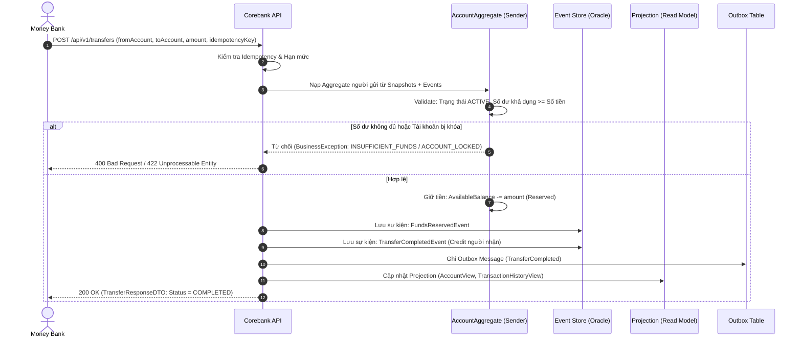

# Business Requirements Document (BRD) — Corebank Service
**Dự án:** Simulation Bank Platform  
**Phân hệ:** Sổ cái Ngân hàng Trung tâm (`corebank`)  
**Phiên bản:** 1.0.0  
**Ngày ban hành:** 2026-10-08  
**Trạng thái:** Chính thức  

---

## 1. Giới thiệu & Bối cảnh Nghiệp vụ

### 1.1. Bối cảnh
Trong hệ thống tài chính - ngân hàng, Core Banking là "trái tim" và là nguồn chân lý duy nhất (Single Source of Truth) lưu giữ số dư, lịch sử giao dịch và quyền sở hữu tài sản của khách hàng. Mọi thao tác thanh toán, gửi tiền, rút tiền, cấp tín dụng từ các dịch vụ vệ tinh (Mobile Banking, Web Banking, Payment Gateway, ATM, POS) cuối cùng đều phải được phản ánh và quyết toán tại sổ cái ngân hàng lõi.

Phân hệ `corebank` trong **Simulation Bank Platform** được xây dựng nhằm mô phỏng nghiệp vụ Sổ cái Kép (Double-Entry General Ledger) chuẩn mực của ngành ngân hàng, giải quyết triệt để hai bài toán cốt lõi:
1. **Tính toàn vẹn dữ liệu tuyệt đối (Zero Data Loss & Absolute Data Integrity):** Không để thất thoát bất kỳ một xu nào, mọi biến động số dư phải tuân thủ nghiêm ngặt nguyên lý kế toán kép và tính chất ACID.
2. **Kiểm soát xử lý đồng thời (Concurrency Control):** Ngăn chặn triệt để rủi ro tiêu vượt số dư (Double Spending) và xung đột ghi đè dữ liệu (Race Condition) khi có nhiều giao dịch cùng tác động lên một tài khoản tại cùng một mili-giây.

### 1.2. Mục tiêu Nghiệp vụ (Business Objectives)
- **BG-CB-01 (Quản lý Sổ cái chuẩn mực):** Vận hành sổ cái tài khoản và giao dịch bất biến, hỗ trợ đối soát (Reconciliation) tự động.
- **BG-CB-02 (Bảo vệ Số dư & Chống Double-Spending):** Đảm bảo không bao giờ xảy ra tình trạng số dư bị âm ngoài hạn mức cho phép hoặc ghi trùng lệnh trừ tiền.
- **BG-CB-03 (Quản lý Khách hàng & Tài khoản):** Cung cấp các nghiệp vụ mở hồ sơ khách hàng (Customer CIF), mở tài khoản thanh toán đa tiền tệ, phát hành thẻ ngân hàng.
- **BG-CB-04 (Quyết toán Giao dịch Tức thời):** Thực thi chuyển tiền nội bộ nguyên tử (Atomic Internal Transfer) theo quy trình 2 pha: Giữ tiền (Funds Reserved) và Quyết toán (Transfer Completed/Failed).
- **BG-CB-05 (Truy vết & Kiểm toán 100%):** Lưu vết toàn bộ sự kiện tài chính dưới dạng chuỗi sự kiện append-only (Event Sourcing) không thể chỉnh sửa hay xóa bỏ.

---

## 2. Phạm vi Nghiệp vụ (Scope)

### 2.1. Trong phạm vi (In-Scope)
- **Quản lý Hồ sơ Khách hàng (Customer Profile):**
  - Khởi tạo hồ sơ khách hàng với mã định danh duy nhất (CIF - Customer Information File).
  - Tra cứu thông tin khách hàng theo CIF.
- **Quản lý Tài khoản Thanh toán (Demand Deposit Account - DDA):**
  - Mở tài khoản thanh toán liên kết với CIF.
  - Quản lý trạng thái tài khoản: `ACTIVE` (Hoạt động), `LOCKED` (Tạm khóa), `CLOSED` (Đã đóng).
  - Tra cứu số dư thực tế (Actual Balance) và số dư khả dụng (Available Balance).
- **Quản lý Thẻ Ngân hàng (Bank Card):**
  - Phát hành thẻ ghi nợ/thẻ ảo liên kết với tài khoản thanh toán.
  - Quản lý trạng thái thẻ: `ACTIVE`, `BLOCKED`, `EXPIRED`.
- **Nghiệp vụ Chuyển tiền & Quyết toán (Fund Transfers & Ledger Entries):**
  - Chuyển tiền nội bộ giữa 2 tài khoản thanh toán.
  - Hỗ trợ Nạp tiền (Deposit) và Rút tiền (Withdraw).
  - Ghi nhận bút toán Sổ cái kép (Debit/Credit).
  - Tra cứu lịch sử giao dịch chi tiết theo tài khoản.
- **Cơ chế An toàn Nghiệp vụ:**
  - Idempotency kiểm soát trùng lặp giao dịch dựa trên khóa duy nhất (`idempotencyKey`).
  - Ghi nhận Outbox Event phục vụ truyền thông tin bất đồng bộ sang Kafka.

### 2.2. Ngoài phạm vi (Out-of-Scope)
- Không cung cấp giao diện người dùng trực tiếp cho khách hàng (việc này do `money-bank` và `cms` đảm nhiệm).
- Không mở route ra Internet/API Gateway (chỉ phục vụ các service nội bộ qua Private Network).
- Chưa bao gồm nghiệp vụ tính lãi suất cuối ngày (End of Day - EoD) và thấu chi (Overdraft) trong Phase 1.
- Chưa bao gồm nghiệp vụ chuyển tiền liên ngân hàng (Napas/Citad) trực tiếp trong Corebank (xử lý qua Paygate adapter).

---

## 3. Các Bên Liên Quan & Tác nhân (Stakeholders & Actors)

| Tác nhân | Vai trò trong hệ thống | Tương tác chính với Corebank |
|---|---|---|
| **Money Bank (`money-bank`)** | Service ngân hàng số (BFF) | Gọi Corebank để truy vấn số dư, kiểm tra tài khoản nhận, và gửi lệnh chuyển tiền khi khách hàng xác nhận giao dịch. |
| **Profile Service (`profile-service`)** | Dịch vụ định danh khách hàng | Yêu cầu tạo mới Customer CIF và liên kết tài khoản sau khi hoàn tất onboarding. |
| **CMS Backend (`cms`)** | Dịch vụ quản trị Back-office | Tra cứu dữ liệu sổ cái, yêu cầu khóa/mở tài khoản sau khi Maker-Checker phê duyệt. |
| **Paygate (`paygate`)** | Cổng thanh toán | Gửi yêu cầu hạch toán thu hộ/chi hộ vào tài khoản thanh toán của Merchant hoặc đối tác. |
| **Internal Auditor / Kế toán viên** | Thanh tra & Giám sát tài chính | Đối soát số liệu sổ cái, kiểm tra tính cân đối Nợ/Có của toàn bộ hệ thống. |

---

## 4. Quy trình Nghiệp vụ Cốt lõi (Core Business Workflows)

### 4.1. Quy trình Chuyển tiền Nội bộ (Internal Transfer Workflow)

### 4.2. Quy tắc Sổ cái Kép (Double-Entry Bookkeeping Rule)
Mọi biến động số dư phải tuân thủ công thức kế toán:
$$\sum \text{Debit (Nợ)} = \sum \text{Credit (Có)}$$

- **Khi Khách hàng A chuyển tiền cho Khách hàng B:**
  - Ghi Nợ (Debit) Tài khoản A: Số dư giảm số tiền $X$.
  - Ghi Có (Credit) Tài khoản B: Số dư tăng số tiền $X$.
  - Chênh lệch tổng thể = 0.
- **Khi Khách hàng Nạp tiền mặt (Deposit):**
  - Ghi Nợ (Debit) Tài khoản Tiền mặt tại quỹ của Ngân hàng (Vốn/Tài sản).
  - Ghi Có (Credit) Tài khoản Khách hàng (Nợ phải trả của Ngân hàng).

### 4.3. Quản lý Trạng thái Tài khoản & Giao dịch
- **Vòng đời Tài khoản (Account Status Lifecycle):**
  - `ACTIVE`: Cho phép nạp tiền, rút tiền, nhận tiền và chuyển tiền.
  - `LOCKED`: Bị khóa do nghi ngờ gian lận hoặc theo yêu cầu từ CMS. Chặn toàn bộ lệnh ghi Nợ (Debit), cho phép ghi Có (Credit tùy cấu hình).
  - `CLOSED`: Tài khoản đã thanh lý số dư về 0 và chấm dứt hoạt động. Chặn mọi giao dịch phát sinh.
- **Trạng thái Giao dịch (Transaction Status Lifecycle):**
  - `PENDING`: Đang tiếp nhận xử lý.
  - `RESERVED`: Đã tạm giữ tiền của tài khoản nguồn thành công.
  - `COMPLETED`: Quyết toán thành công cho cả 2 bên.
  - `FAILED`: Giao dịch thất bại (hoàn trả tiền đã tạm giữ nếu có).

---

## 5. Đặc tả Yêu cầu Chức năng (Functional Requirements - FR)

### 5.1. Nhóm Quản lý Khách hàng & Định danh (Customer Management)
- **FR-CB-01 (Tạo hồ sơ khách hàng):**
  - Nhận yêu cầu tạo khách hàng mới với Họ tên, Số CCCD/Hộ chiếu, Số điện thoại, Email.
  - Tự động sinh mã CIF (Customer Information File) theo định dạng chuẩn 8 chữ số duy nhất.
  - Không cho phép trùng số CCCD/Hộ chiếu đối với khách hàng đang hoạt động.
- **FR-CB-02 (Tra cứu hồ sơ khách hàng):**
  - Cho phép tra cứu thông tin khách hàng qua mã CIF.

### 5.2. Nhóm Quản lý Tài khoản (Account Management)
- **FR-CB-03 (Mở tài khoản thanh toán):**
  - Mở tài khoản thanh toán mới liên kết với một CIF hợp lệ.
  - Hỗ trợ loại tiền tệ (mặc định: `VND`).
  - Khởi tạo số dư ban đầu (`balance = 0`, `available_balance = 0`), trạng thái `ACTIVE`.
- **FR-CB-04 (Truy vấn số dư):**
  - Trả về chi tiết: Số tài khoản, Loại tiền tệ, Số dư thực tế (`actualBalance`), Số dư khả dụng (`availableBalance`), Số tiền đang bị phong tỏa/tạm giữ (`holdBalance = actualBalance - availableBalance`).
- **FR-CB-05 (Khóa / Mở khóa tài khoản):**
  - Chuyển đổi trạng thái tài khoản giữa `ACTIVE` và `LOCKED` dựa trên yêu cầu từ CMS có quyền hạn hợp lệ.

### 5.3. Nhóm Quản lý Thẻ (Card Management)
- **FR-CB-06 (Phát hành thẻ):**
  - Phát hành thẻ thanh toán ảo/vật lý gắn với một tài khoản thanh toán đang hoạt động.
  - Sinh số thẻ chuẩn mô phỏng (BIN 16 chữ số), ngày hết hạn, mã CVV mã hóa.
- **FR-CB-07 (Khóa / Kích hoạt thẻ):**
  - Thay đổi trạng thái thẻ: `ACTIVE`, `BLOCKED`, `EXPIRED`.

### 5.4. Nhóm Chuyển tiền & Sổ cái (Transfer & Ledger)
- **FR-CB-08 (Chuyển tiền nội bộ nguyên tử):**
  - Tiếp nhận lệnh chuyển tiền từ tài khoản nguồn sang tài khoản đích trong cùng hệ thống Corebank.
  - Kiểm tra điều kiện: Tài khoản nguồn và đích tồn tại, trạng thái `ACTIVE`, cùng loại tiền tệ, tài khoản nguồn có `availableBalance >= amount`.
  - Thực thi ghi nợ/ghi có trong cùng một transaction CSDL nguyên tử (ACID).
- **FR-CB-09 (Xử lý Idempotency):**
  - Mọi yêu cầu chuyển tiền bắt buộc có header/trường `idempotencyKey`.
  - Nếu key đã tồn tại và đã xử lý thành công: trả về kết quả trước đó mà không thực thi lại trừ tiền.
  - Nếu key đang trong quá trình xử lý: trả lỗi `409 Conflict` (Giao dịch đang được xử lý).
- **FR-CB-10 (Truy vấn lịch sử giao dịch):**
  - Cung cấp danh sách các bút toán đã hạch toán của một tài khoản theo thứ tự thời gian giảm dần, hỗ trợ phân trang.

---

## 6. Yêu cầu Phi Chức năng (Non-Functional Requirements - NFR)

### 6.1. Hiệu năng & Khả năng Xử lý (Performance & Scale)
- **NFR-CB-01 (Throughput):** Hệ thống phải đáp ứng tối thiểu **1,000 TPS** (Transactions Per Second) ghi sổ cái trong điều kiện chịu tải đỉnh.
- **NFR-CB-02 (Latency SLA):**
  - Thao tác ghi lệnh chuyển tiền (Write/Command): Thời gian phản hồi P95 $\le 100\text{ ms}$, P99 $\le 250\text{ ms}$.
  - Thao tác đọc số dư và lịch sử (Read/Query): Thời gian phản hồi P95 $\le 20\text{ ms}$, P99 $\le 50\text{ ms}$.

### 6.2. Toàn vẹn Dữ liệu & Tính Sẵn sàng (Data Integrity & Reliability)
- **NFR-CB-03 (Zero Data Loss):** Tuyệt đối không cho phép mất mát dữ liệu tài chính trong bất kỳ tình huống sự cố mạng hay sập nguồn máy chủ.
- **NFR-CB-04 (Chống Double Spending):** Áp dụng cơ chế khóa ở mức CSDL (Optimistic Locking với trường version và Pessimistic row-lock khi hạch toán) đảm bảo không có race condition.
- **NFR-CB-05 (Availability SLA):** Tính sẵn sàng của dịch vụ đạt tối thiểu **99.99%** Uptime.

### 6.3. Bảo mật & Kiểm toán (Security & Auditability)
- **NFR-CB-06 (Mạng Nội bộ Cách ly):** `corebank` chỉ tiếp nhận request từ dải mạng nội bộ (Internal K8s Service / Private VPC), không cấp quyền truy cập công khai từ bên ngoài.
- **NFR-CB-07 (RBAC & Phân quyền):** Áp dụng phân quyền chặt chẽ với `@CoreBankAuthorization` kiểm tra quyền theo vai trò dịch vụ gọi đến.
- **NFR-CB-08 (Audit Trail):** Mọi sự kiện phát sinh trên sổ cái đều được ghi nhận vào Event Store dưới dạng bản ghi bất biến (Immutable Events).

---

## 7. Tiêu chí Nghiệm thu (Acceptance Criteria)

| Mã AC | Tiêu chí kiểm thử nghiệm thu | Trạng thái đạt |
|---|---|---|
| **AC-CB-01** | Tạo khách hàng mới sinh mã CIF chuẩn 8 số duy nhất; không cho tạo trùng CCCD. | PASS |
| **AC-CB-02** | Chuyển tiền thành công giữa 2 tài khoản: Số dư người gửi giảm đúng bằng số tiền, số dư người nhận tăng đúng bằng số tiền, sinh mã giao dịch duy nhất. | PASS |
| **AC-CB-03** | Bắn đồng thời 50 request chuyển tiền từ cùng 1 tài khoản với số dư chỉ đủ cho 1 giao dịch: Duy nhất 1 giao dịch thành công, 49 giao dịch còn lại báo lỗi thiếu số dư, không bị âm tiền. | PASS |
| **AC-CB-04** | Gửi lại cùng 1 `idempotencyKey` với payload giống hệt: Hệ thống trả về kết quả cũ trong 50ms, không phát sinh bút toán mới. | PASS |
| **AC-CB-05** | Tài khoản bị `LOCKED`: Mọi lệnh chuyển tiền từ tài khoản này lập tức bị từ chối với mã lỗi phù hợp. | PASS |
