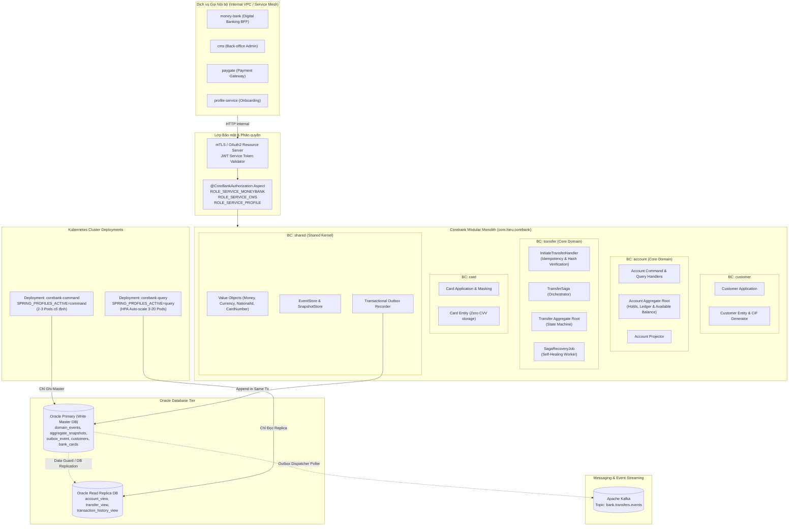
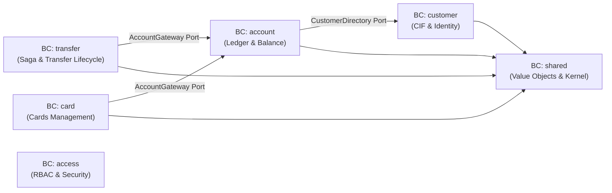
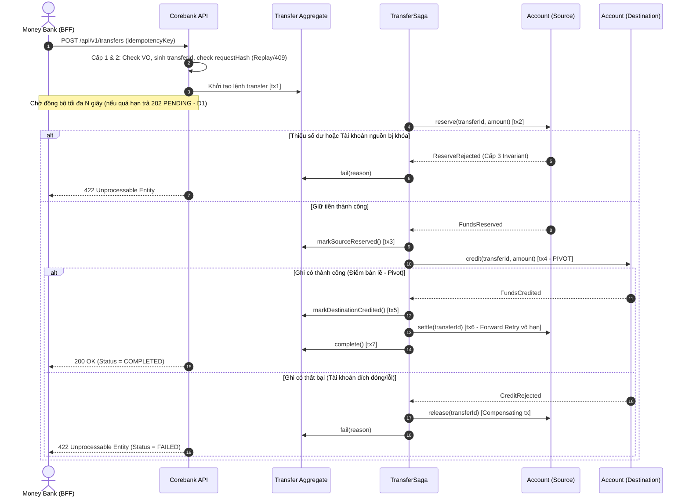
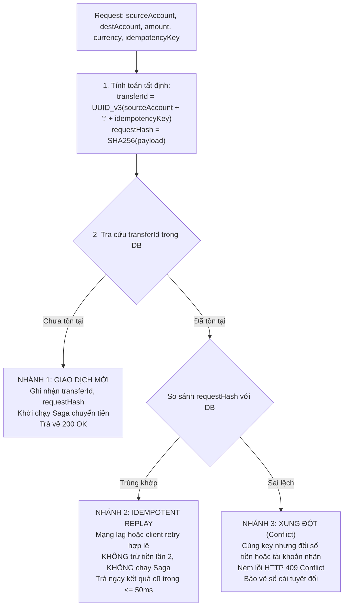
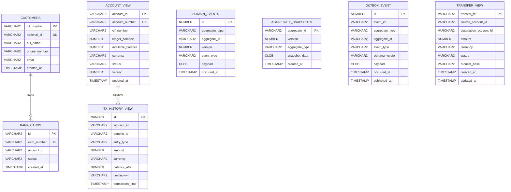

# High-Level Design (HLD) — Corebank Service
**Dự án:** Simulation Bank Platform  
**Phân hệ:** Sổ cái Ngân hàng Trung tâm (`corebank`)  
**Phiên bản:** 1.1.0  
**Ngày cập nhật:** 2026-10-10  
**Trạng thái:** Chính thức  
**Tham chiếu:** [`brd.md`](./brd.md) (v1.1.0), [`plan.md`](./plan.md) (v3), [`srd.md`](./srd.md).

---

## 1. Giới thiệu & Triết lý Thiết kế Kiến trúc

### 1.1. Mục đích Tài liệu
Tài liệu HLD (High-Level Design) này mô tả kiến trúc tổng thể của dịch vụ **Corebank** — trái tim sổ cái trung tâm (Single Source of Truth) trong hệ thống ngân hàng mô phỏng **Simulation Bank Platform**. Tài liệu làm cơ sở kỹ thuật chuẩn mực cho các kỹ sư phát triển, kiến trúc sư hệ thống, và đội ngũ DevOps/SRE hiểu rõ:
- Ranh giới nghiệp vụ (Bounded Contexts) và tính thuần khiết của Domain.
- Quy trình điều phối Saga và kiểm soát giao dịch phân tán.
- Cơ chế kiểm soát xử lý đồng thời (Concurrency Control) và Tự bảo vệ Sổ cái (Zero-Trust Idempotency).
- Mô hình phân tách vật lý CQRS trên hạ tầng Kubernetes.
- Các tiêu chuẩn tuân thủ an toàn dữ liệu ngân hàng (Nghị định 13/2023/NĐ-CP và Thông tư 13/2018/TT-NHNN).

### 1.2. Triết lý Thiết kế Cốt lõi
1. **Zero Data Loss & Sổ cái Kép Bất biến (Double-Entry General Ledger):**
   Mọi biến động số dư tài chính đều tuân thủ nguyên lý kế toán kép:
   $$\sum \text{Debit (Nợ)} = \sum \text{Credit (Có)}$$
   Dữ liệu sổ cái là chuỗi sự kiện bất biến (Append-Only), không bao giờ cập nhật ghi đè hay xóa bỏ.
2. **Domain-Driven Design (DDD) & Clean Architecture:**
   - Đặt nghiệp vụ tài chính làm trung tâm. Lớp `domain` giữ trạng thái thuần khiết 100%, độc lập hoàn toàn với Spring Framework, JPA/Hibernate, Jackson, hay các thư viện hạ tầng.
   - Phân định rạch ròi các Bounded Contexts. Giao tiếp liên-context chỉ qua Application Ports/APIs và Integration Events.
   - **Mỗi database transaction chỉ được phép cập nhật duy nhất 1 Aggregate Root.**
3. **Chiến lược Thẩm định Đa tầng (4-Level Validation Strategy):**
   Áp dụng mô hình thẩm định chiều sâu: *Value Object (In-Memory)* $\rightarrow$ *Use Case (Stateful/IO)* $\rightarrow$ *Aggregate Invariant (Business Rules)* $\rightarrow$ *Database Constraint (Concurrency Safety Net)*.
4. **Saga Orchestration & Nhất quán Cuối cùng (Eventual Consistency):**
   Chuyển tiền liên-aggregate thông qua điều phối Saga 2 pha có điểm bản lề (Pivot Transaction), tự động bù trừ (Compensating Transaction) và tự phục hồi sau sự cố (`SagaRecoveryJob`).
5. **Tự bảo vệ Sổ cái (Zero-Trust Idempotency):**
   Corebank không dựa dẫm vào tầng BFF (`money-bank`); tự chịu trách nhiệm phát hiện trùng lặp và xung đột thông qua mã giao dịch tất định $\text{UUID v3}$ và mã băm SHA-256 payload.
6. **CQRS Phân tách Vật lý trên K8s (Physical Infrastructure CQRS):**
   Phân tách hoàn toàn cụm Pod Ghi (`corebank-command`) kết nối Primary Write Master DB và cụm Pod Đọc (`corebank-query`) kết nối Read Replica DB, auto-scale độc lập qua HPA.
7. **Bảo vệ Dữ liệu Cá nhân Nhạy cảm (Privacy & Compliance):**
   Tuân thủ Nghị định 13/2023/NĐ-CP: Che mờ dữ liệu (Data Masking cho CCCD, số thẻ PAN), cấm lưu trữ plaintext và cấm phơi bày mã bí mật CVV/PIN, loại bỏ hoàn toàn việc in dữ liệu nhạy cảm ra log file/MDC.

---

## 2. Bức tranh Kiến trúc Tổng thể (System Architecture)



---

## 3. Các Mẫu Thiết kế Chủ đạo (Design Patterns Applied)

### 3.1. Domain-Driven Design & Ranh giới Bounded Contexts
Corebank được cấu trúc theo mô hình **Modular Monolith** chuẩn bị sẵn sàng cho việc tách Microservice:



- **Nguyên tắc ranh giới:**
  - Lớp `domain` của mọi Bounded Context không import bất kỳ class nào ngoài domain của chính nó và `shared.domain`.
  - Không import chéo Domain Entity của nhau. Giao tiếp liên-context bắt buộc thông qua **Application Port** của bên gọi (ví dụ: `transfer.application.port.AccountGateway` được hiện thực bởi `InProcessAccountGateway`).
  - Toàn bộ ranh giới này được kiểm chứng tự động bằng công cụ **ArchUnit** trong pipeline CI/CD.

---

### 3.2. Chiến lược Thẩm định Đa tầng (4-Level Validation Strategy)

Hệ thống áp dụng nghiêm ngặt triết lý kiến trúc thẩm định 4 cấp độ (Defense-in-Depth) theo tư tưởng của Khalil Stemmler nhằm giải quyết triệt để vấn đề rác dữ liệu, vi phạm invariant và Race Condition:

```
[Request từ UI / API / Client Service]
        │
        ▼
┌─────────────────────────────────────────────────────────────────┐
│ Cấp độ 1: VALUE OBJECT (Pure In-Memory Validation)              │
│ - Validate cấu trúc, định dạng, độ dài, regex, Luhn, null/empty │
│ - Thực thi nguyên tắc: "Make illegal states unrepresentable"    │
└────────────────────────────────┬────────────────────────────────┘
                                 │ (Hợp lệ)
                                 ▼
┌─────────────────────────────────────────────────────────────────┐
│ Cấp độ 2: USE CASE / APPLICATION SERVICE (Stateful Validation)  │
│ - Kiểm tra tồn tại qua Repository/Port (I/O)                    │
│ - Kiểm tra xung đột Idempotency & Hash payload (409 Conflict)   │
│ - Kiểm tra quyền hạn gọi dịch vụ (@CoreBankAuthorization)       │
└────────────────────────────────┬────────────────────────────────┘
                                 │ (Hợp lệ & Chưa xung đột)
                                 ▼
┌─────────────────────────────────────────────────────────────────┐
│ Cấp độ 3: AGGREGATE ROOT / ENTITY (Domain Invariants)           │
│ - Quy tắc nghiệp vụ giữa các thuộc tính bên trong Aggregate     │
│ - Tài khoản ACTIVE? availableBalance >= amount? Hold tồn tại?   │
│ - Idempotency nội tại Aggregate theo transferId (no-op an toàn) │
└────────────────────────────────┬────────────────────────────────┘
                                 │ (Thành công)
                                 ▼
┌─────────────────────────────────────────────────────────────────┐
│ Cấp độ 4: DATABASE CONSTRAINT (Chốt chặn Concurrency cuối cùng) │
│ - uk_customer_national_id: Chống Race Condition tạo trùng CCCD  │
│ - uk_domain_events_version: Chốt chặn Optimistic Locking retry  │
│ - uk_card_number: Đảm bảo số thẻ duy nhất toàn hệ thống         │
└─────────────────────────────────────────────────────────────────┘
```

---

### 3.3. CQRS & Phân tách Vật lý Hạ tầng K8s (Physical Infrastructure CQRS)
Hệ thống loại bỏ hoàn toàn cơ chế định tuyến mã nguồn phức tạp (`AbstractRoutingDataSource`), thay thế bằng chiến lược **Phân tách Vật lý trên Kubernetes**:

1. **Deployment `corebank-command` (Ghi):**
   - Chạy với biến môi trường `SPRING_PROFILES_ACTIVE=command`.
   - Kết nối trực tiếp vào **Primary Write Master DB**.
   - Chỉ nạp các `*CommandHandler`, `TransferSaga`, `EventStore`, `OutboxRecorder`.
   - Duy trì cố định 2–3 Pods nhằm kiểm soát và bảo toàn connection pool của Write Master DB.
2. **Deployment `corebank-query` (Đọc):**
   - Chạy với biến môi trường `SPRING_PROFILES_ACTIVE=query`.
   - Kết nối vào **Read Replica DB**.
   - Chỉ nạp các `*QueryHandler`, Projection Repositories (`account_view`, `transfer_view`, `transaction_history_view`).
   - Cấu hình Horizontal Pod Autoscaler (HPA) tự động co giãn từ 3 đến 20 Pods dựa trên CPU và lưu lượng truy vấn sao kê/số dư.
   - Tuyệt đối không nạp mã lệnh ghi vào Pod Đọc, loại trừ hoàn toàn nguy cơ ghi nhầm vào Replica hoặc trễ dữ liệu do replication lag.
3. **Quy ước Hằng số Profile:** Khai báo tập trung qua class `ProfileConstants` (`COMMAND`, `QUERY`, `ALL`), cấm sử dụng magic string.

---

### 3.4. Event Sourcing & Snapshot Store
Trạng thái của `Account` không được lưu dưới dạng một dòng dữ liệu duy nhất mà được tái tạo từ chuỗi sự kiện nghiệp vụ bất biến:

$$\text{CurrentState} = \text{Replay}(\text{Snapshot} + \sum \text{DomainEvents})$$

- **Bảng `domain_events` (Append-Only):**
  - Chứa chuỗi sự kiện: `AccountOpened`, `FundsReserved`, `FundsCredited`, `ReservationSettled`, `ReservationReleased`.
  - Khóa duy nhất: `CONSTRAINT uk_domain_events_version UNIQUE (aggregate_id, version)` vừa là định danh sự kiện, vừa là chốt chặn Optimistic Locking.
- **Snapshot Optimization:**
  - Aggregate định kỳ tạo `AggregateSnapshot` sau mỗi 50 sự kiện.
  - Bản snapshot lưu trữ **đầy đủ 100% trạng thái hoạt động** (bao gồm cả danh sách các khoản giữ tiền `holds` đang hiệu lực và `creditedTransfers`), đảm bảo khi khôi phục không bị thất thoát trạng thái nghiệp vụ ([NFR-CB-17](./brd.md#L233)).

---

### 3.5. Saga Orchestration: Quy trình Chuyển tiền & Độ bền

Chuyển tiền nội bộ được điều phối bởi `TransferSaga` theo mô hình Orchestration, tuân thủ nguyên tắc **1 transaction chỉ cập nhật 1 Aggregate**:



- **Điểm bản lề (Pivot Transaction):** Khi thao tác ghi có (`credit`) vào tài khoản đích thành công, giao dịch xem như đã qua điểm không thể quay đầu. Kể từ đây, Saga bắt buộc chỉ đi tiến (forward retry vô hạn bước `settle` tài khoản nguồn kèm cảnh báo), tuyệt đối không bù trừ ngược để tránh mất tiền ngân hàng.
- **Bù trừ tự động (Compensating Transaction):** Nếu thao tác ghi có bị từ chối trước điểm pivot, Saga tự động phát lệnh `release` giải phóng khoản tiền đang hold tại tài khoản nguồn.
- **Tự phục hồi sau sự cố (`SagaRecoveryJob`):** Worker nền định kỳ quét các giao dịch ở trạng thái non-terminal vượt quá ngưỡng thời gian $T_{\text{stuck}} = 30\text{s}$ bằng truy vấn `SELECT ... FOR UPDATE SKIP LOCKED` trên `transfer_view`. Tiếp tục kích hoạt bước kế tiếp an toàn nhờ tính idempotent của các lệnh Aggregate.

---

### 3.6. Transactional Outbox & Phân định Domain vs Integration Event

Nhằm ngăn chặn triệt để lỗi "Dual-Write Bug" (ghi DB thành công nhưng push Kafka thất bại):
1. **Phân định rạch ròi 2 loại Event:**
   - **Domain Event:** Lưu tại `domain_events` (nguồn chân lý), dùng nội bộ để khôi phục trạng thái Aggregate.
   - **Integration Event:** Lưu tại `outbox_event` để phát tán ra Kafka (`bank.transfers.events`). Tuân thủ hợp đồng dữ liệu ổn định, có `schemaVersion`, payload được map qua `IntegrationEventMapper`, tuyệt đối không rò rỉ cấu trúc Domain Event nội bộ ra ngoài.
2. **Cơ chế ghi nhận:**
   - Ghi bản ghi vào `outbox_event` trong cùng Database Transaction với Domain Event.
   - Worker Outbox Poller định kỳ đẩy message vào Kafka theo cơ chế At-Least-Once Delivery.

---

## 4. Kiểm soát Xử lý Đồng thời & Tự bảo vệ Sổ cái (Idempotency)

### 4.1. Concurrency Control mức Aggregate
- **Không dùng Pessimistic Row-Lock (`SELECT ... FOR UPDATE`) trên luồng chuyển tiền thường**: Thay thế bằng kiểm tra số dư khả dụng trên RAM của `AccountAggregate` kết hợp **Optimistic Locking** tại CSDL.
- Khi xảy ra xung đột version giữa các giao dịch đồng thời tác động lên cùng 1 tài khoản ([AC-CB-03](./brd.md#L275)), Database ném `DataIntegrityViolationException`. Hệ thống tự động nạp lại Aggregate mới nhất và retry với backoff an toàn (tối đa $N$ lần), đảm bảo tổng tiền bảo toàn và không bao giờ bị âm số dư.

### 4.2. Cơ chế Idempotency Độc lập tại Corebank (Zero-Trust Idempotency)
Corebank tự bảo vệ sổ cái trước nguy cơ retry từ client khi mạng chập chờn:



- **Idempotency cấp Aggregate:** Bên trong `AccountAggregate`, các lệnh `reserve`, `credit`, `settle`, `release` đều mang tính idempotent theo `transferId`:
  - `reserve(transferId)`: Nếu đã tồn tại `Hold` cùng `transferId` $\rightarrow$ no-op.
  - `credit(transferId)`: Nếu `creditedTransfers` đã chứa `transferId` $\rightarrow$ no-op.
  - `settle(transferId)`: Nếu `Hold` đã ở trạng thái `SETTLED` $\rightarrow$ no-op.

### 4.3. Bounded Latency & Asynchronous Fallback
- Endpoint `POST /transfers` duy trì cơ chế chờ đồng bộ tối đa $N$ giây (cấu hình qua `corebank.transfer.sync-timeout-seconds: 3`).
- Nếu giao dịch hoàn tất trong thời hạn $\rightarrow$ Trả về HTTP `200 OK` (Status = `COMPLETED`).
- Nếu quá thời hạn $N$ giây mà Saga chưa xong $\rightarrow$ Chuyển giao mềm dẻo bằng mã **HTTP `202 Accepted`** kèm `status=PENDING` và `transferId`, giải phóng connection thread cho client trong khi Saga tiếp tục hoàn tất ngầm trong nền ([AC-CB-09](./brd.md#L281)).

---

## 5. Thiết kế Mô hình Dữ liệu (Data Model Architecture)

Corebank chuẩn hóa cấu trúc dữ liệu loại bỏ hoàn toàn các bảng V1 legacy:



---

## 6. Thiết kế Bảo mật, Kiểm toán & Tuân thủ Pháp lý (Security & Compliance)

### 6.1. Phân tách Vùng mạng & Phân quyền Dịch vụ Chặt chẽ (RBAC)
- **Mạng Nội bộ Cách ly ([NFR-CB-06](./brd.md#L237)):** `corebank` chỉ tiếp nhận request từ dải mạng nội bộ (Internal K8s Service / Private VPC / Service Mesh), không cấp quyền truy cập từ Internet.
- **AOP Service Authorization ([NFR-CB-07](./brd.md#L239)):**
  - `@CoreBankAuthorization` kiểm tra quyền theo vai trò dịch vụ gọi đến:
    - `ROLE_SERVICE_MONEYBANK`: Gọi API Transfer, Query Balance, Transaction History.
    - `ROLE_SERVICE_CMS`: Gọi API Lock/Unlock Account, tra cứu kiểm toán.
    - `ROLE_SERVICE_PROFILE`: Gọi API Create Customer CIF.
    - `ROLE_SERVICE_PAYGATE`: Gọi API hạch toán thanh toán.

### 6.2. Tuân thủ Bảo vệ Dữ liệu Cá nhân Nhạy cảm (Nghị định 13/2023/NĐ-CP - NFR-CB-20)
1. **Che mờ Dữ liệu (Data Masking) khi trả về người dùng và API:**
   - Số CCCD/Hộ chiếu: Masking dạng `012345****01`.
   - Số thẻ ngân hàng (PAN): Masking dạng `4111-22XX-XXXX-3344` (BIN 6 số + 4 số cuối).
   - Tuyệt đối **KHÔNG lưu trữ dạng plain text và KHÔNG trả về mã bí mật CVV/PIN** trong bất kỳ DTO response nào.
2. **Tối thiểu hóa Dữ liệu (Data Minimization):**
   - API `POST /transfers` tuyệt đối không phơi bày số dư của tài khoản người nhận.
3. **Chống rò rỉ Dữ liệu trên Nhật ký (Zero Data Leakage in Logs):**
   - Cấm in plain text số thẻ đầy đủ, CVV, CCCD, mật khẩu/PIN, số dư chi tiết vào Log files, MDC context hay distributed tracing traces.
   - Sửa cấu hình `RequestLoggingConfig`: Tắt in body payload (`setIncludePayload(false)`).

### 6.3. Tuân thủ An toàn Hệ thống Sổ cái (Thông tư 13/2018/TT-NHNN - NFR-CB-21)
- **Kiểm soát Toàn vẹn Dữ liệu (Data Integrity):** Kiểm soát dữ liệu đầu vào (Input validation qua 4 cấp độ), xử lý kiểm toán kép và đối soát tự động.
- **An toàn Trao đổi Thông tin:** Toàn bộ dữ liệu trao đổi giữa Corebank và các service nội bộ được xác thực danh tính qua JWT Service Token và mã hóa đường truyền.
- **Sao lưu & Khôi phục (Disaster Recovery):** Cơ sở dữ liệu Event Store và Projection Views thiết lập cơ chế sao lưu tự động (Daily backup + WAL archiving).

---

## 7. Khả năng Giám sát, Vận hành & Vòng đời Ứng dụng (Observability & Ops)

### 7.1. Saga Observability & Metrics Chuyên biệt (NFR-CB-18)
Hệ thống xuất bản các số liệu đo lường chi tiết qua Micrometer/Prometheus:
- `corebank_saga_step_total{step, status}`: Đếm số lượng và trạng thái các bước thực thi saga.
- `corebank_saga_stuck_total`: Đếm số lượng giao dịch bị kẹt ở trạng thái non-terminal quá thời gian $T_{\text{stuck}}$.
- `corebank_concurrency_retries_total`: Đếm số lần retry do xung đột phiên bản Optimistic Lock.
- **Real-time Alerting:** Kích hoạt cảnh báo tức thì khi `corebank_saga_stuck_total > 0` hoặc khi bước quyết toán (`settle`) sau điểm pivot retry thất bại liên tục.

### 7.2. Graceful Shutdown & Vòng đời Container (NFR-CB-19)
- Tiếp nhận và xử lý tín hiệu `SIGTERM` từ Kubernetes orchestration:
  - Cấu hình Spring Boot: `server.shutdown: graceful` và `spring.lifecycle.timeout-per-shutdown-phase: 30s`.
  - Hoàn tất các transaction và saga step đang dở dang trước khi dừng container hoàn toàn.
  - Giải phóng an toàn các connection pool của HikariCP.
- **Tối ưu hóa JVM cho Container:**
  - Cấu hình qua biến môi trường Dockerfile: `JAVA_OPTS="-XX:+UseContainerSupport -XX:MaxRAMPercentage=75.0"`.
  - Entrypoint container sử dụng `ENTRYPOINT ["sh", "-c", "exec java $JAVA_OPTS -jar /app/app.jar"]` để bảo toàn chuyển tiếp tín hiệu POSIX `SIGTERM` cho tiến trình JVM.
