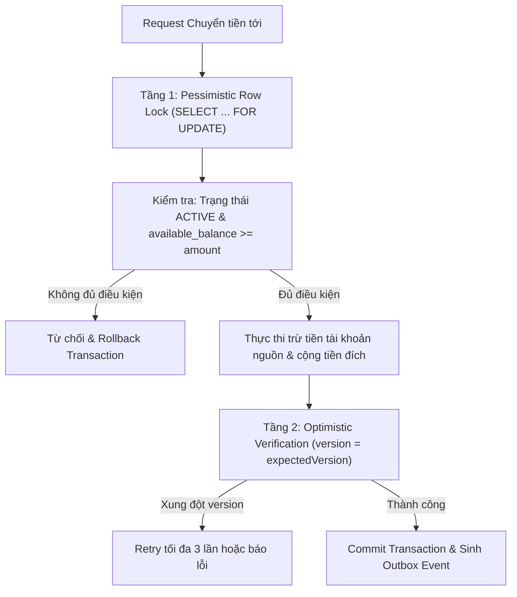

# High-Level Design (HLD) — Corebank Service
**Dự án:** Simulation Bank Platform  
**Phân hệ:** Sổ cái Ngân hàng Trung tâm (`corebank`)  
**Phiên bản:** 1.0.0  
**Ngày ban hành:** 2026-10-08  
**Trạng thái:** Chính thức  

---

## 1. Giới thiệu & Triết lý Thiết kế Kiến trúc

### 1.1. Mục đích Tài liệu
Tài liệu HLD (High-Level Design) này mô tả kiến trúc tổng thể của dịch vụ **Corebank** — sổ cái trung tâm của Simulation Bank Platform. Tài liệu làm cơ sở kỹ thuật để đội ngũ kỹ sư hiểu rõ các nguyên tắc thiết kế, ranh giới xử lý, cơ chế kiểm soát xử lý đồng thời, và các mẫu thiết kế (design patterns) được áp dụng.

### 1.2. Triết lý Thiết kế Cốt lõi
- **Zero Data Loss & Double-Entry Accounting:** Mọi chuyển động tiền tệ đều tuân thủ nguyên tắc kế toán kép: $\sum \text{Debit} = \sum \text{Credit}$. Dữ liệu sổ cái là bất biến (immutable).
- **Domain-Driven Design (DDD):** Lấy nghiệp vụ lõi làm trung tâm, đóng gói quy tắc toàn vẹn vào Aggregate Root (`AccountAggregate`).
- **CQRS (Command Query Responsibility Segregation):** Tách biệt rạch ròi luồng Ghi (Command) xử lý nghiệp vụ phức tạp với luồng Đọc (Query) tối ưu tốc độ.
- **Event Sourcing:** Toàn bộ trạng thái số dư được tái hiện từ chuỗi sự kiện nghiệp vụ (`domain_events`) kết hợp với điểm chụp nhanh (`aggregate_snapshots`).
- **Transactional Outbox:** Đảm bảo xuất sự kiện ra Apache Kafka mà không gây ra lỗi Dual-Write.

---

## 2. Bức tranh Kiến trúc Tổng thể (System Architecture)

```mermaid
flowchart TD
    subgraph Clients["Dịch vụ Vệ tinh Nội bộ"]
        MB["money-bank (BFF)"]
        CMS["cms-backend"]
        PG["paygate"]
    end

    subgraph Corebank["Corebank Service Architecture"]
        API["REST API Layer (api/impl)"]
        SecAspect["CoreBankAuthorizationAspect (AOP Security)"]

        subgraph CommandPipeline["Write / Command Pipeline (CQRS)"]
            CH["Command Handlers (handler/command)"]
            CS["Command Services (service/command)"]
            Agg["AccountAggregate (Domain Entity)"]
            ES["EventStore (eventsourcing/store)"]
            OutboxMgr["Transactional Outbox Recorder"]
        end

        subgraph QueryPipeline["Read / Query Pipeline (CQRS)"]
            QH["Query Handlers (handler/query)"]
            QS["Query Services (service/query)"]
            ProjRepo["Projection Repositories (JPA)"]
        end

        subgraph ProjectionEngine["Event Projector Engine"]
            AccountProj["AccountProjector"]
        end
    end

    subgraph DataTier["Data Tier (Oracle DB FREEPDB1)"]
        TblES[("domain_events (Append-only)")]
        TblSnap[("aggregate_snapshots")]
        TblOutbox[("outbox_events")]
        TblView[("account_view / tx_history_view")]
    end

    subgraph MessagingTier["Messaging Tier"]
        Kafka[("Apache Kafka: bank.transfer.events")]
    end

    Clients -->|HTTP Internal (mTLS / Service Token)| API
    API --> SecAspect
    SecAspect -->|State Changes| CH
    SecAspect -->|Read Only| QH

    CH --> CS --> Agg
    Agg --> ES --> TblES
    Agg -. State Snapshot .-> TblSnap
    CS --> OutboxMgr --> TblOutbox
    
    Agg -. Apply Events .-> AccountProj --> TblView
    QH --> QS --> ProjRepo --> TblView

    TblOutbox -.->|Outbox Dispatcher Daemon| Kafka
```

---

## 3. Các Mẫu Thiết kế Chủ đạo (Design Patterns Applied)

### 3.1. CQRS (Command Query Responsibility Segregation)
Trong hệ thống ngân hàng, tần suất tra cứu số dư và sao kê lịch sử (Query) cao gấp hàng chục lần so với số lần chuyển tiền thực tế (Command).
- **Luồng Command (Write):**
  - Tiếp nhận Request DTO $\rightarrow$ Validate ràng buộc $\rightarrow$ Khóa bản ghi (Locking) $\rightarrow$ Nạp Aggregate $\rightarrow$ Thực thi thay đổi nghiệp vụ $\rightarrow$ Ghi sự kiện vào Event Store và Outbox.
- **Luồng Query (Read):**
  - Bỏ qua các bước khóa và xử lý domain phức tạp $\rightarrow$ Truy vấn trực tiếp từ các bảng Projection (`account_view`, `transaction_history_view`) với tốc độ cao, hỗ trợ scale độc lập qua Read Replicas (ODS).

### 3.2. Event Sourcing Pattern
Thay vì chỉ lưu một con số số dư duy nhất (`balance = 500`), Corebank lưu giữ chuỗi các sự kiện đã dẫn đến số dư đó:
1. `AccountCreatedEvent` (Số dư ban đầu: 0 VND)
2. `FundsDepositedEvent` (Nạp: +1,000,000 VND)
3. `FundsReservedEvent` (Tạm giữ: -200,000 VND)
4. `TransferCompletedEvent` (Trừ tiền thành công: -200,000 VND)

- **Snapshot Optimization:** Để tránh việc phải phát lại (replay) hàng nghìn event mỗi khi nạp một tài khoản lâu năm, hệ thống định kỳ tạo `AggregateSnapshot` sau mỗi 100 sự kiện. Khi nạp Aggregate: chỉ nạp bản Snapshot gần nhất + các event phát sinh sau snapshot đó.

### 3.3. Transactional Outbox Pattern
Ngăn chặn triệt để lỗi "Dual-Write":
- Việc ghi nhận giao dịch vào sổ cái và việc đẩy event sang Kafka là 2 thao tác trên 2 hệ thống khác nhau.
- Corebank ghi bản ghi event vào bảng `outbox_events` **trong cùng Database Transaction** với sổ cái.
- Một Background Job / Debezium CDC quét bảng `outbox_events` và đẩy sang Kafka, cam kết At-Least-Once Delivery.

---

## 4. Chiến lược Xử lý Đồng thời & Chống Race Condition

### 4.1. Bài toán Race Condition trong Ngân hàng
Nếu khách hàng có số dư 1,000,000 VND và gửi đồng thời 2 lệnh chuyển tiền 1,000,000 VND tại cùng 1 mili-giây:
- Nếu đọc dữ liệu song song không khóa, cả 2 lệnh đều thấy số dư đủ 1,000,000 VND và cùng trừ tiền $\rightarrow$ Tài khoản bị âm tiền bất hợp pháp.

### 4.2. Giải pháp: Hybrid Concurrency Control
Corebank áp dụng cơ chế bảo vệ 2 tầng:



---

## 5. Thiết kế Mô hình Dữ liệu (Data Model Architecture)

Corebank phân tách dữ liệu thành 3 nhóm:
1. **Domain Event Store (Write Model):**
   - `domain_events`: Bảng Append-only chứa toàn bộ lịch sử biến động.
   - `aggregate_snapshots`: Chứa trạng thái nén của Aggregate tại từng mốc version.
2. **Transactional State (Master Ledger):**
   - `accounts`: Quản lý số dư chính thức và khóa dòng (`version`).
   - `bank_transactions`: Quản lý bút toán chuyển tiền và mã `idempotency_key`.
   - `customers`: Quản lý hồ sơ CIF.
   - `bank_cards`: Quản lý thẻ ngân hàng.
3. **Read Projections (Query Model):**
   - `account_view`: Bảng phẳng tối ưu cho API xem số dư.
   - `transaction_history_view`: Bảng phân trang tối ưu cho sao kê lịch sử giao dịch.

---

## 6. Thiết kế Bảo mật & Phân quyền (Security Architecture)

- **Phân tách Vùng mạng (Network Segregation):** Corebank nằm hoàn toàn trong Internal VPC/Kubernetes Service Mesh, không có Ingress hoặc Gateway route trỏ vào.
- **AOP Security Aspect (`@CoreBankAuthorization`):**
  - Mọi API Endpoint đều được kiểm soát bởi Aspect chặn trước.
  - Phân quyền theo vai trò dịch vụ (Service Role) và User context truyền qua JWT:
    - `ROLE_SERVICE_MONEYBANK`: Được phép gọi API Transfer và Query Balance.
    - `ROLE_SERVICE_CMS`: Được phép gọi API Lock/Unlock Account.
    - `ROLE_SERVICE_PROFILE`: Được phép gọi API Create Customer CIF.

---

## 7. Khả năng Giám sát & Vận hành (Observability & Ops)

- **Structured Logging:** Định dạng JSON với SLF4J/Logback, tích hợp MDC:
  - `traceId`, `spanId` từ OpenTelemetry.
  - `correlationId` xuyên suốt request.
  - `eventName` định danh sự kiện tài chính (`TRANSFER_COMMITTED`, `FUNDS_HELD`).
- **Distributed Tracing:** Tự động đính kèm W3C Trace Context, xuất traces qua OTLP sang OpenTelemetry Collector $\rightarrow$ Jaeger.
- **Prometheus Metrics:**
  - `corebank_transactions_processed_total{status="SUCCESS|FAILED"}`
  - `corebank_transaction_duration_seconds`
  - `corebank_concurrency_retries_total`
- **Kubernetes Resilience:**
  - Liveness Probe: Kiểm tra trạng thái ứng dụng.
  - Readiness Probe: Kiểm tra kết nối Oracle Database pool.
  - HPA (Horizontal Pod Autoscaler) dựa trên CPU và Throughput metrics.
