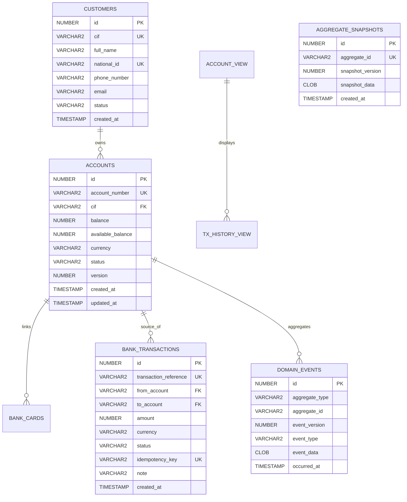

# System Requirements Document (SRD) — Corebank Service
**Dự án:** Simulation Bank Platform  
**Phân hệ:** Sổ cái Ngân hàng Trung tâm (`corebank`)  
**Phiên bản:** 1.0.0  
**Ngày ban hành:** 2026-10-08  
**Trạng thái:** Chính thức  
**Tham chiếu:** `corebank/docs/brd.md`, `corebank/docs/hld.md`

---

## 1. Tổng quan Kỹ thuật & Kiến trúc Hệ thống

### 1.1. Ranh giới & Trách nhiệm Dịch vụ
`corebank` là phân hệ sổ cái ngân hàng trung tâm (Core Ledger Service), chịu trách nhiệm duy nhất về số dư tài khoản, giao dịch nợ/có và tính toàn vẹn của sổ sách tài chính. Dịch vụ này hoạt động hoàn toàn trong mạng nội bộ (Internal-only) và không bao giờ expose cổng trực tiếp ra Internet.

### 1.2. Tech Stack Cốt lõi
- **Ngôn ngữ & Framework:** Java 21 LTS, Spring Boot 4.x / Spring Framework 7
- **Kiến trúc:** Domain-Driven Design (DDD), Clean Architecture, CQRS (Command Query Responsibility Segregation), Event Sourcing
- **Cơ sở dữ liệu:** Oracle Database 23c Free / 19c Enterprise (JDBC Thin, HikariCP Connection Pool)
- **Message Broker:** Apache Kafka 7.5+ kết hợp Transactional Outbox Pattern
- **Bảo mật:** Spring Security, OAuth2 Resource Server, AOP Custom Security (`@CoreBankAuthorization`)
- **Khả năng quan sát (Observability):** OpenTelemetry Java Agent / Micrometer Tracing, Prometheus, Grafana Loki

### 1.3. Cấu trúc Dự án Thực tế (Project Directory Layout)

```text
corebank/src/main/java/com/hieu/corebank/
├── api/                     # REST Controllers mapping HTTP requests to Handlers
│   ├── CustomerController.java
│   ├── AccountController.java
│   ├── TransferController.java
│   ├── CardController.java
│   └── impl/                # Controller implementations
├── config/                  # Spring configurations (Hikari, Security, Logging)
├── constant/                # Enums (AccountStatus, TransactionStatus, CardStatus)
├── domain/                  # JPA Entities (Customer, Account, BankCard, BankTransaction)
├── dto/                     # Request / Response DTOs
├── eventsourcing/           # Event Sourcing Engine
│   ├── aggregate/           # AccountAggregate (Aggregate Root)
│   ├── event/               # Domain Events (FundsReserved, TransferCompleted...)
│   ├── snapshot/            # AggregateSnapshot, SnapshotRepository
│   └── store/               # EventStore, DomainEventRecord, DomainEventRepository
├── exception/               # Custom Exceptions (BusinessException, NotFoundException)
├── handler/                 # CQRS Business Use Cases
│   ├── command/             # Command Handlers (Write operations, state changes)
│   └── query/               # Query Handlers (Read operations, fast projection queries)
├── projection/              # Read Model Projections (AccountView, TransactionHistoryView)
├── repository/              # Spring Data JPA Repositories
├── security/                # CoreBankAuthorization Aspect & PermissionCacheService
└── service/                 # Domain Services
    ├── command/             # Persistence & lock-handling services
    └── query/               # Read-only fetch services
```

---

## 2. Thiết kế Cơ sở Dữ liệu (Database Schema / ERD)

### 2.1. Sơ đồ Quan hệ Thực thể (ERD)



### 2.2. Đặc tả Bảng Chi tiết

#### Bảng `domain_events` (Event Store)
| Cột | Kiểu dữ liệu | Ràng buộc | Mô tả |
|---|---|---|---|
| `id` | `NUMBER(19)` | `GENERATED ALWAYS AS IDENTITY PK` | Định danh sự kiện tự tăng |
| `aggregate_type` | `VARCHAR2(50)` | `NOT NULL` | Ví dụ: `AccountAggregate` |
| `aggregate_id` | `VARCHAR2(64)` | `NOT NULL` | Số tài khoản (`account_number`) |
| `event_version` | `NUMBER(10)` | `NOT NULL` | Phiên bản sự kiện tăng dần (1, 2, 3...) |
| `event_type` | `VARCHAR2(100)` | `NOT NULL` | `AccountCreatedEvent`, `FundsReservedEvent`, `TransferCompletedEvent`, `FundsDepositedEvent` |
| `event_data` | `CLOB` / `JSON` | `NOT NULL` | Payload JSON chi tiết của sự kiện |
| `occurred_at` | `TIMESTAMP WITH TIME ZONE` | `DEFAULT SYSTIMESTAMP NOT NULL` | Thời điểm phát sinh sự kiện |

*Index bắt buộc:* `CREATE UNIQUE INDEX idx_agg_ver ON domain_events(aggregate_id, event_version);`

#### Bảng `accounts` (Master Ledger Table)
| Cột | Kiểu dữ liệu | Ràng buộc | Mô tả |
|---|---|---|---|
| `id` | `NUMBER(19)` | `PRIMARY KEY` | Khóa chính |
| `account_number` | `VARCHAR2(20)` | `UNIQUE NOT NULL` | Số tài khoản ngân hàng chuẩn |
| `cif` | `VARCHAR2(20)` | `NOT NULL` | Mã định danh khách hàng sở hữu |
| `balance` | `NUMBER(18,2)` | `DEFAULT 0 NOT NULL` | Số dư thực tế sổ cái (Ledger Balance) |
| `available_balance`| `NUMBER(18,2)` | `DEFAULT 0 NOT NULL` | Số dư khả dụng giao dịch |
| `currency` | `VARCHAR2(3)` | `DEFAULT 'VND' NOT NULL`| Mã tiền tệ ISO 4217 |
| `status` | `VARCHAR2(20)` | `NOT NULL` | `ACTIVE`, `LOCKED`, `CLOSED` |
| `version` | `NUMBER(10)` | `DEFAULT 0 NOT NULL` | Dùng cho Optimistic Locking |
| `created_at` | `TIMESTAMP` | `DEFAULT CURRENT_TIMESTAMP` | Thời điểm tạo |
| `updated_at` | `TIMESTAMP` | `DEFAULT CURRENT_TIMESTAMP` | Thời điểm cập nhật cuối |

#### Bảng `bank_transactions` (Lịch sử Bút toán Sổ cái)
| Cột | Kiểu dữ liệu | Ràng buộc | Mô tả |
|---|---|---|---|
| `id` | `NUMBER(19)` | `PRIMARY KEY` | Khóa chính |
| `transaction_reference`| `VARCHAR2(64)` | `UNIQUE NOT NULL` | Mã giao dịch toàn cục (UUID/Prefix) |
| `from_account` | `VARCHAR2(20)` | `NOT NULL` | Số tài khoản chuyển tiền |
| `to_account` | `VARCHAR2(20)` | `NOT NULL` | Số tài khoản nhận tiền |
| `amount` | `NUMBER(18,2)` | `NOT NULL` | Số tiền giao dịch (> 0) |
| `currency` | `VARCHAR2(3)` | `NOT NULL` | Loại tiền tệ |
| `status` | `VARCHAR2(20)` | `NOT NULL` | `PENDING`, `COMPLETED`, `FAILED` |
| `idempotency_key` | `VARCHAR2(128)`| `UNIQUE NOT NULL` | Chống gửi trùng request |
| `description` | `VARCHAR2(255)`| `NULL` | Nội dung giao dịch |
| `created_at` | `TIMESTAMP` | `DEFAULT CURRENT_TIMESTAMP` | Thời gian ghi nhận |

---

## 3. Đặc tả Giao tiếp API (Internal REST API Specifications)

Toàn bộ API đều chạy trên HTTP/1.1 và HTTP/2 trong mạng nội bộ (`http://corebank:8180`).
- **Base Path:** `/api/v1`
- **Standard Headers:**
  - `Content-Type: application/json`
  - `X-Correlation-Id: <UUID>` (Bắt buộc cho Distributed Tracing)
  - `Idempotency-Key: <UUID/Hash>` (Bắt buộc cho các API Command thay đổi trạng thái)

### 3.1. Nhóm Quản lý Khách hàng (`CustomerController`)

#### POST `/api/v1/customers`
Khởi tạo hồ sơ khách hàng mới và sinh mã CIF.
- **Request Body:**
  ```json
  {
    "fullName": "NGUYEN VAN A",
    "nationalId": "012345678901",
    "phoneNumber": "0987654321",
    "email": "nguyenvana@example.com"
  }
  ```
- **Response 201 Created:**
  ```json
  {
    "cif": "00012345",
    "fullName": "NGUYEN VAN A",
    "nationalId": "012345678901",
    "status": "ACTIVE",
    "createdAt": "2026-10-08T10:15:30Z"
  }
  ```

#### GET `/api/v1/customers/{cif}`
Tra cứu thông tin hồ sơ theo mã CIF.

---

### 3.2. Nhóm Quản lý Tài khoản (`AccountController`)

#### POST `/api/v1/accounts`
Mở tài khoản thanh toán mới.
- **Request Body:**
  ```json
  {
    "cif": "00012345",
    "currency": "VND",
    "initialDeposit": 1000000.00
  }
  ```
- **Response 201 Created:**
  ```json
  {
    "accountNumber": "100200300401",
    "cif": "00012345",
    "balance": 1000000.00,
    "availableBalance": 1000000.00,
    "currency": "VND",
    "status": "ACTIVE"
  }
  ```

#### GET `/api/v1/accounts/{accountNumber}/balance`
Truy vấn số dư tức thời.
- **Response 200 OK:**
  ```json
  {
    "accountNumber": "100200300401",
    "currency": "VND",
    "actualBalance": 1000000.00,
    "availableBalance": 1000000.00,
    "holdBalance": 0.00,
    "status": "ACTIVE"
  }
  ```

---

### 3.3. Nhóm Giao dịch Chuyển tiền (`TransferController`)

#### POST `/api/v1/transfers`
Thực hiện chuyển tiền nguyên tử giữa 2 tài khoản.
- **Request Body:**
  ```json
  {
    "fromAccount": "100200300401",
    "toAccount": "100200300402",
    "amount": 250000.00,
    "currency": "VND",
    "idempotencyKey": "9b1deb4d-3b7d-4bad-9bdd-2b0d7b3dcb6d",
    "description": "Chuyen tien tra tien an trua"
  }
  ```
- **Response 200 OK:**
  ```json
  {
    "transactionReference": "TX-20261008-00981",
    "fromAccount": "100200300401",
    "toAccount": "100200300402",
    "amount": 250000.00,
    "currency": "VND",
    "status": "COMPLETED",
    "senderRemainingBalance": 750000.00,
    "timestamp": "2026-10-08T10:16:00Z"
  }
  ```
- **Error Response 422 Unprocessable Entity:**
  ```json
  {
    "timestamp": "2026-10-08T10:16:00Z",
    "status": 422,
    "errorCode": "INSUFFICIENT_FUNDS",
    "message": "Số dư khả dụng không đủ để thực hiện giao dịch",
    "correlationId": "corr-8f3b-412e"
  }
  ```

---

## 4. Kiểm soát Đồng thời & Toàn vẹn Dữ liệu (Concurrency & Idempotency)

### 4.1. Concurrency Control: Hybrid Locking
Để ngăn chặn hoàn toàn Race Condition và Double Spending:
1. **Kiểm tra trạng thái & nạp Aggregate:** Đọc trạng thái từ `AccountAggregate` với `version`.
2. **Thực thi Bút toán (Transaction Scope):**
   ```sql
   -- Pessimistic Row Lock khi thực hiện ghi nợ tài khoản nguồn
   SELECT * FROM accounts WHERE account_number = :fromAccount FOR UPDATE;
   ```
3. **Optimistic Verification:**
   Kiểm tra `version` tại thời điểm update:
   ```sql
   UPDATE accounts 
   SET balance = :newBalance, available_balance = :newAvailableBalance, version = version + 1, updated_at = SYSTIMESTAMP
   WHERE account_number = :accountNumber AND version = :expectedVersion;
   ```
   Nếu số dòng cập nhật = 0 $\rightarrow$ Tung ra `OptimisticLockingFailureException` và retry an toàn tối đa 3 lần.

### 4.2. Cơ chế Idempotency
- Khóa duy nhất `idempotencyKey` được lưu trữ trực tiếp trên bảng `bank_transactions` với ràng buộc `UNIQUE`.
- Khi nhận request có cùng key:
  - Nếu bản ghi đã tồn tại với trạng thái `COMPLETED`: Trả về kết quả giao dịch đã lưu trong `bank_transactions`.
  - Nếu bản ghi đang xử lý (`PENDING`): Trả về HTTP `409 Conflict`.

---

## 5. Tích hợp Sự kiện & Outbox Pattern

Nhằm đảm bảo tính Nhất quán cuối cùng (Eventual Consistency) mà không bị rơi vào lỗi "Dual-Write Bug" (ghi DB thành công nhưng push Kafka thất bại), `corebank` sử dụng **Transactional Outbox Pattern**:

1. Trong cùng một Database Transaction:
   - Ghi dữ liệu vào `domain_events`
   - Cập nhật bảng `accounts`
   - Ghi bản ghi vào `outbox_events`
2. **Outbox Dispatcher Scheduler:**
   - Quét các sự kiện có `status = 'PENDING'` từ `outbox_events` theo batch (mỗi 500ms).
   - Đẩy message vào Kafka topic `bank.transfer.events` với key là `account_number` (để đảm bảo thứ tự partition).
   - Đánh dấu `status = 'SENT'` sau khi nhận Kafka ACK.

---

## 6. Khả năng Quan sát & Vận hành (Observability & Ops)

### 6.1. Logging Chuẩn hóa (MDC & OpenTelemetry)
- Sử dụng SLF4J với MDC chứa các trường chuẩn:
  - `traceId`, `spanId` (OpenTelemetry tự động chèn)
  - `correlationId`
  - `accountNumber`, `transactionReference`
  - `eventName` (ví dụ: `TRANSFER_EXECUTED`, `TRANSFER_FAILED`, `INSUFFICIENT_FUNDS`)

### 6.2. Health Check & Resource Limits (Kubernetes)
- **Liveness Probe:** `GET /actuator/health/liveness` (Fail $\rightarrow$ K8s restart pod)
- **Readiness Probe:** `GET /actuator/health/readiness` (Kiểm tra kết nối Oracle DB)
- **Tài nguyên Pod (K8s Recommended):**
  - Requests: CPU `500m`, Memory `1Gi`
  - Limits: CPU `2000m`, Memory `2Gi`
