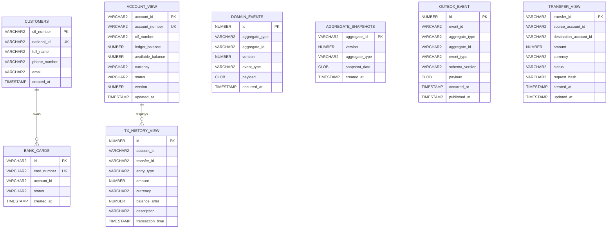
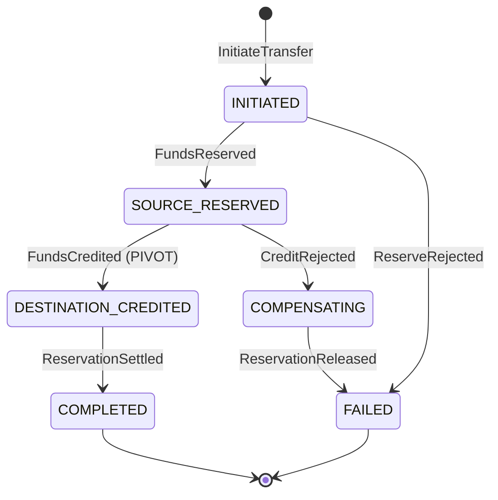
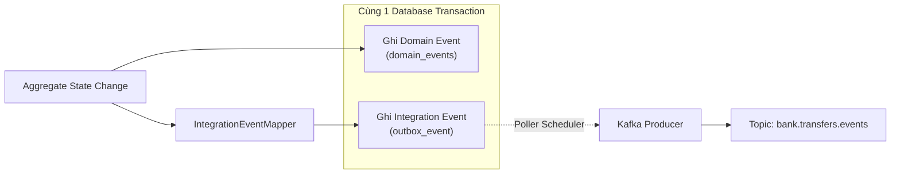

# System Requirements Document (SRD) — Corebank Service
**Dự án:** Simulation Bank Platform  
**Phân hệ:** Sổ cái Ngân hàng Trung tâm (`corebank`)  
**Phiên bản:** 1.1.0  
**Ngày cập nhật:** 2026-10-10  
**Trạng thái:** Chính thức  
**Tham chiếu:** [`brd.md`](./brd.md) (v1.1.0), [`hld.md`](./hld.md) (v1.1.0), [`plan.md`](./plan.md) (v3).

---

## 1. Tổng quan Kỹ thuật & Kiến trúc Hệ thống

### 1.1. Ranh giới & Trách nhiệm Dịch vụ
`corebank` là phân hệ sổ cái ngân hàng trung tâm (Core Ledger Service), là nguồn chân lý duy nhất (Single Source of Truth) lưu trữ số dư tài khoản, hạch toán giao dịch nợ/có và bảo toàn tính toàn vẹn của sổ sách tài chính. Dịch vụ hoạt động hoàn toàn trong dải mạng nội bộ (Internal K8s Service / Private VPC) và không mở cổng trực tiếp ra ngoài Internet.

### 1.2. Tech Stack Cốt lõi
- **Ngôn ngữ & Runtime:** Java 21 LTS, Spring Boot 4.1.0 / Spring Framework 7
- **Serialization:** Jackson 3 (`tools.jackson.*`) tương thích đồng bộ với Boot 4.1.0
- **Kiến trúc:** Domain-Driven Design (DDD), Clean Architecture, CQRS (Command Query Responsibility Segregation), Event Sourcing, Saga Orchestration
- **Cơ sở dữ liệu:** Oracle Database 23c Free / 19c Enterprise (JDBC Thin, HikariCP Connection Pool)
- **Message Broker:** Apache Kafka 7.5+ kết hợp Transactional Outbox Pattern
- **Bảo mật:** Spring Security, OAuth2 Resource Server, AOP Security (`@CoreBankAuthorization`), Tuân thủ Nghị định 13/2023/NĐ-CP
- **Kiểm thử Kiến trúc & Tự động:** ArchUnit 1.3.0, Testcontainers Oracle, JUnit 5, AssertJ
- **Khả năng quan sát (Observability):** OpenTelemetry Java Agent, Micrometer Metrics & Tracing, Prometheus, Grafana Loki

### 1.3. Cấu trúc Dự án Thực tế (Bounded Contexts Directory Layout)

```text
corebank/src/main/java/com/hieu/corebank/
├── CorebankApplication.java
├── shared/                          # Shared Kernel
│   ├── domain/                      # AggregateRoot, DomainEvent, DomainException, Money, Currency, NationalId, CardNumber
│   ├── application/                 # DomainEventPublisher (port), IntegrationEventPublisher (port)
│   ├── constant/                    # ProfileConstants (COMMAND, QUERY, ALL)
│   └── infrastructure/
│       ├── eventsourcing/           # EventStore<T>, SnapshotStore, EventSerializer, DomainEventRecord
│       ├── outbox/                  # OutboxRecorder adapter
│       └── web/                     # BaseController, ApiExceptionHandler, RequestLoggingConfig
├── account/                         # BC: account (Core Subdomain)
│   ├── domain/                      # Account (aggregate root), Hold (entity), AccountId, AccountNumber, AccountStatus
│   ├── application/
│   │   ├── command/                 # OpenAccount, ReserveFunds, CreditFunds, SettleReservation, ReleaseReservation
│   │   ├── query/                   # GetAccountById, GetAccountsByCif, GetAccountBalance, GetTransactionHistory
│   │   └── port/                    # CustomerDirectory
│   ├── infrastructure/
│   │   ├── persistence/             # EventSourcedAccountRepository, SequenceAccountNumberGenerator
│   │   ├── projection/              # AccountProjector, AccountView, TransactionHistoryView
│   │   └── customer/                # LocalCustomerDirectory (adapter)
│   └── api/                         # AccountController(+Impl), request/response DTOs, mappers
├── transfer/                        # BC: transfer (Core Subdomain)
│   ├── domain/                      # Transfer (aggregate root), TransferId, TransferStatus, TransferRepository (port)
│   ├── application/
│   │   ├── command/                 # InitiateTransferHandler (Idempotency & Hash Verification)
│   │   ├── saga/                    # TransferSaga (orchestrator), SagaRecoveryJob, SagaMetricsCollector
│   │   ├── query/                   # GetTransferById, GetTransferHistory
│   │   └── port/                    # AccountGateway
│   ├── infrastructure/
│   │   ├── persistence/             # EventSourcedTransferRepository
│   │   ├── projection/              # TransferView, TransferProjector
│   │   └── account/                 # InProcessAccountGateway (adapter gọi account.application)
│   └── api/                         # TransferController(+Impl), TransferRequestDTO, TransferResponseDTO
├── card/                            # BC: card (Supporting Subdomain)
│   ├── domain/                      # Card (aggregate root), CardId, CardNumber, CardStatus
│   ├── application/                 # IssueCardHandler, LockCardHandler
│   ├── infrastructure/              # JpaBankCard, CardRepository, CardMapper
│   └── api/                         # CardController(+Impl), DTOs (Zero CVV returned)
├── customer/                        # BC: customer (Supporting Subdomain)
│   ├── domain/                      # Customer, NationalId, SequenceCifGenerator
│   ├── application/                 # CreateCustomerHandler, GetCustomerHandler
│   ├── infrastructure/              # JpaCustomer, CustomerRepository
│   └── api/                         # CustomerController(+Impl), DTOs (Masked CCCD)
└── access/                          # BC: access (Generic Subdomain)
    ├── domain/                      # Role, Permission, User
    ├── infrastructure/              # RoleRepository, UserRepository
    └── security/                    # CoreBankAuthorizationAspect, PermissionCacheService
```

---

## 2. Thiết kế Cơ sở Dữ liệu (Database Schema / ERD)

### 2.1. Sơ đồ Quan hệ Thực thể (ERD Chuẩn hóa v1.1.0)

Hệ thống đã loại bỏ hoàn toàn các bảng legacy V1 (`accounts`, `bank_transactions`) để chuyển sang kiến trúc Event Sourcing kết hợp CQRS:



---

### 2.2. Đặc tả Bảng Chi tiết

#### Bảng `domain_events` (Master Event Store)
| Cột | Kiểu dữ liệu | Ràng buộc | Mô tả |
|---|---|---|---|
| `id` | `NUMBER GENERATED BY DEFAULT AS IDENTITY` | `PRIMARY KEY` | Khóa chính tự tăng kỹ thuật |
| `aggregate_type` | `VARCHAR2(64)` | `NOT NULL` | Định danh kiểu Aggregate: `Account`, `Transfer` |
| `aggregate_id` | `VARCHAR2(64)` | `NOT NULL` | ID Aggregate: `accountId`, `transferId` |
| `version` | `NUMBER(19)` | `NOT NULL` | Phiên bản sự kiện tuần tự tăng dần (1, 2, 3...) |
| `event_type` | `VARCHAR2(128)` | `NOT NULL` | Tên sự kiện: `AccountOpened`, `FundsReserved`, `FundsCredited`, `ReservationSettled`... |
| `payload` | `CLOB` | `NOT NULL` | Dữ liệu sự kiện JSON |
| `occurred_at` | `TIMESTAMP WITH TIME ZONE` | `NOT NULL` | Thời điểm phát sinh sự kiện |

*Index & Ràng buộc Bắt buộc:*
```sql
CONSTRAINT uk_domain_events_version UNIQUE (aggregate_id, version);
CREATE INDEX ix_domain_events_type_time ON domain_events (aggregate_type, occurred_at);
```

#### Bảng `aggregate_snapshots` (Snapshot Store)
| Cột | Kiểu dữ liệu | Ràng buộc | Mô tả |
|---|---|---|---|
| `aggregate_id` | `VARCHAR2(64)` | `PRIMARY KEY` | ID của Aggregate Root |
| `version` | `NUMBER(19)` | `NOT NULL` | Phiên bản Aggregate tại thời điểm chụp snapshot |
| `aggregate_type` | `VARCHAR2(64)` | `NOT NULL` | Kiểu Aggregate |
| `snapshot_data` | `CLOB` | `NOT NULL` | Trạng thái đầy đủ 100% của Aggregate (JSON) bao gồm cả `holds` |
| `created_at` | `TIMESTAMP WITH TIME ZONE` | `NOT NULL` | Thời điểm tạo snapshot |

#### Bảng `transfer_view` (Read Model & Saga Recovery View)
| Cột | Kiểu dữ liệu | Ràng buộc | Mô tả |
|---|---|---|---|
| `transfer_id` | `VARCHAR2(64)` | `PRIMARY KEY` | Sinh tất định: `UUID v3(sourceAccountId + ":" + idempotencyKey)` |
| `source_account_id` | `VARCHAR2(64)` | `NOT NULL` | ID tài khoản chuyển |
| `destination_account_id`| `VARCHAR2(64)` | `NOT NULL` | ID tài khoản nhận |
| `amount` | `NUMBER(18,2)` | `NOT NULL` | Số tiền giao dịch |
| `currency` | `VARCHAR2(3)` | `NOT NULL` | Loại tiền tệ ISO 4217 |
| `status` | `VARCHAR2(32)` | `NOT NULL` | `INITIATED`, `PENDING`, `COMPLETED`, `FAILED` |
| `request_hash` | `VARCHAR2(64)` | `NOT NULL` | Mã băm SHA-256 payload để phát hiện 409 Conflict |
| `created_at` | `TIMESTAMP WITH TIME ZONE` | `NOT NULL` | Thời điểm tạo lệnh |
| `updated_at` | `TIMESTAMP WITH TIME ZONE` | `NOT NULL` | Dùng cho `SagaRecoveryJob` quét timeout |

*Index Bắt buộc phục vụ Self-Healing Worker:*
```sql
CREATE INDEX ix_transfer_recovery ON transfer_view (status, updated_at);
```

#### Bảng `customers` (Customer Directory)
| Cột | Kiểu dữ liệu | Ràng buộc | Mô tả |
|---|---|---|---|
| `cif_number` | `VARCHAR2(20)` | `PRIMARY KEY` | Mã CIF chuẩn 8 chữ số (`00000001` - `99999999`) |
| `national_id` | `VARCHAR2(20)` | `NOT NULL, UNIQUE` | Số CCCD/Hộ chiếu (Chống trùng Cấp 4) |
| `full_name` | `VARCHAR2(100)` | `NOT NULL` | Họ và tên khách hàng |
| `phone_number` | `VARCHAR2(20)` | `NOT NULL` | Số điện thoại liên hệ |
| `email` | `VARCHAR2(100)` | `NOT NULL` | Email khách hàng |
| `created_at` | `TIMESTAMP WITH TIME ZONE` | `NOT NULL` | Thời điểm tạo hồ sơ |

*Index & Ràng buộc:*
```sql
CONSTRAINT uk_customer_national_id UNIQUE (national_id);
```

#### Bảng `bank_cards` (Card Registry)
| Cột | Kiểu dữ liệu | Ràng buộc | Mô tả |
|---|---|---|---|
| `id` | `VARCHAR2(36)` | `PRIMARY KEY` | UUID thẻ ngân hàng |
| `card_number` | `VARCHAR2(16)` | `NOT NULL, UNIQUE` | Số thẻ 16 chữ số chuẩn BIN + Luhn |
| `account_id` | `VARCHAR2(64)` | `NOT NULL` | Tham chiếu ID tài khoản thanh toán |
| `status` | `VARCHAR2(20)` | `NOT NULL` | `ACTIVE`, `BLOCKED`, `EXPIRED` |
| `created_at` | `TIMESTAMP WITH TIME ZONE` | `NOT NULL` | Thời điểm phát hành |

*Lưu ý bảo mật NĐ 13/2023:* Bảng `bank_cards` **tuyệt đối KHÔNG có cột `cvv` plaintext**. Corebank không lưu trữ mã CVV sau khi phát hành.

#### Bảng `outbox_event` (Transactional Outbox)
| Cột | Kiểu dữ liệu | Ràng buộc | Mô tả |
|---|---|---|---|
| `id` | `NUMBER GENERATED BY DEFAULT AS IDENTITY` | `PRIMARY KEY` | ID tự tăng |
| `event_id` | `VARCHAR2(64)` | `NOT NULL` | UUID của sự kiện |
| `aggregate_type` | `VARCHAR2(64)` | `NOT NULL` | Kiểu aggregate |
| `aggregate_id` | `VARCHAR2(64)` | `NOT NULL` | ID aggregate |
| `event_type` | `VARCHAR2(128)` | `NOT NULL` | Tên Integration Event (`TransferCompletedEventDTO`) |
| `schema_version` | `VARCHAR2(16)` | `NOT NULL` | Phiên bản hợp đồng event: `1.0` |
| `payload` | `CLOB` | `NOT NULL` | Payload chuẩn hóa JSON |
| `occurred_at` | `TIMESTAMP WITH TIME ZONE` | `NOT NULL` | Thời điểm phát sinh |
| `published_at` | `TIMESTAMP WITH TIME ZONE` | `NULL` | Thời điểm đã bắn sang Kafka |

---

## 3. Đặc tả Giao tiếp API (Internal REST API Specifications)

Toàn bộ API giao tiếp qua mạng nội bộ (`http://corebank-command:8180` hoặc `http://corebank-query:8180`).
- **Base Path:** `/api/v1`
- **Standard Headers:**
  - `Content-Type: application/json`
  - `X-Correlation-Id: <UUID>` (Distributed Tracing)
  - `Idempotency-Key: <String>` (Bắt buộc cho mọi lệnh Command ghi)

---

### 3.1. Nhóm Quản lý Khách hàng (`CustomerController`)

#### POST `/api/v1/customers`
Tạo hồ sơ khách hàng mới, sinh mã CIF 8 số tự động và kiểm tra tính duy nhất của CCCD.
- **Request Body:**
  ```json
  {
    "fullName": "NGUYEN VAN A",
    "nationalId": "012345678901",
    "phoneNumber": "0987654321",
    "email": "nguyenvana@example.com"
  }
  ```
- **Response 201 Created (Che mờ CCCD tuân thủ NĐ 13/2023):**
  ```json
  {
    "cifNumber": "00012345",
    "fullName": "NGUYEN VAN A",
    "maskedNationalId": "012345****01",
    "phoneNumber": "0987654321",
    "email": "nguyenvana@example.com",
    "createdAt": "2026-10-10T10:15:30Z"
  }
  ```
- **Error Response 409 Conflict (Trùng CCCD):**
  ```json
  {
    "status": 409,
    "errorCode": "CUSTOMER_ALREADY_EXISTS",
    "message": "Số CCCD/Hộ chiếu đã được đăng ký trong hệ thống",
    "timestamp": "2026-10-10T10:15:30Z"
  }
  ```

#### GET `/api/v1/customers/{cif}`
Tra cứu thông tin khách hàng qua CIF. Trả về thông tin kèm CCCD đã mask.

---

### 3.2. Nhóm Quản lý Tài khoản (`AccountController`)

#### POST `/api/v1/accounts`
Mở tài khoản thanh toán mới liên kết CIF.
- **Request Body:**
  ```json
  {
    "cifNumber": "00012345",
    "currency": "VND",
    "initialDeposit": 1000000
  }
  ```
- **Response 201 Created:**
  ```json
  {
    "accountId": "acc-7f8e-4a12",
    "accountNumber": "100200300401",
    "cifNumber": "00012345",
    "ledgerBalance": 1000000,
    "availableBalance": 1000000,
    "currency": "VND",
    "status": "ACTIVE",
    "createdAt": "2026-10-10T10:16:00Z"
  }
  ```

#### GET `/api/v1/accounts/{accountId}/balance`
Truy vấn số dư tức thời.
- **Response 200 OK:**
  ```json
  {
    "accountId": "acc-7f8e-4a12",
    "accountNumber": "100200300401",
    "currency": "VND",
    "actualBalance": 1000000,
    "availableBalance": 800000,
    "holdBalance": 200000,
    "status": "ACTIVE"
  }
  ```

---

### 3.3. Nhóm Quản lý Thẻ (`CardController`)

#### POST `/api/v1/cards`
Phát hành thẻ liên kết tài khoản thanh toán.
- **Request Body:**
  ```json
  {
    "accountId": "acc-7f8e-4a12"
  }
  ```
- **Response 201 Created (Che mờ PAN, tuyệt đối KHÔNG trả về CVV):**
  ```json
  {
    "cardId": "crd-9a1b-3c4d",
    "maskedCardNumber": "4111-22XX-XXXX-3344",
    "accountId": "acc-7f8e-4a12",
    "status": "ACTIVE",
    "createdAt": "2026-10-10T10:17:00Z"
  }
  ```

---

### 3.4. Nhóm Chuyển tiền & Sổ cái (`TransferController`)

#### POST `/api/v1/transfers`
Tiếp nhận lệnh chuyển tiền nội bộ qua Saga. Hỗ trợ Idempotency tất định và Bounded Latency.
- **Headers:**
  - `Idempotency-Key: 9b1deb4d-3b7d-4bad-9bdd-2b0d7b3dcb6d` (Bắt buộc)
- **Request Body:**
  ```json
  {
    "sourceAccountId": "acc-7f8e-4a12",
    "destinationAccountId": "acc-3b2a-9f81",
    "amount": 250000,
    "currency": "VND",
    "description": "Thanh toan tien an trua"
  }
  ```

- **Kịch bản 1: Hoàn tất trong thời hạn SLA ($\le 3\text{s}$) $\rightarrow$ Response 200 OK:**
  ```json
  {
    "transactionId": "d3b07384-d113-3920-a193-cc449be9d4a4",
    "status": "COMPLETED",
    "sourceAccountId": "acc-7f8e-4a12",
    "destinationAccountId": "acc-3b2a-9f81",
    "amount": 250000,
    "currency": "VND",
    "description": "Thanh toan tien an trua",
    "createdAt": "2026-10-10T10:18:00Z"
  }
  ```
  *(Lưu ý: Response tuyệt đối không phơi bày số dư người nhận để tuân thủ Data Minimization - [NFR-CB-20](./brd.md#L246)).*

- **Kịch bản 2: Quá thời hạn timeout $N$ giây $\rightarrow$ Response 202 Accepted (Async Fallback):**
  ```json
  {
    "transactionId": "d3b07384-d113-3920-a193-cc449be9d4a4",
    "status": "PENDING",
    "sourceAccountId": "acc-7f8e-4a12",
    "destinationAccountId": "acc-3b2a-9f81",
    "amount": 250000,
    "currency": "VND",
    "createdAt": "2026-10-10T10:18:00Z"
  }
  ```

- **Kịch bản 3: Gửi lại cùng `idempotencyKey` nhưng sai lệch payload $\rightarrow$ Response 409 Conflict:**
  ```json
  {
    "status": 409,
    "errorCode": "IDEMPOTENCY_CONFLICT",
    "message": "Idempotency key đã được sử dụng với thông tin giao dịch khác",
    "timestamp": "2026-10-10T10:18:01Z"
  }
  ```

- **Kịch bản 4: Thiếu số dư hoặc Tài khoản bị khóa $\rightarrow$ Response 422 Unprocessable Entity:**
  ```json
  {
    "status": 422,
    "errorCode": "INSUFFICIENT_FUNDS",
    "message": "Số dư khả dụng không đủ để thực hiện giao dịch",
    "timestamp": "2026-10-10T10:18:00Z"
  }
  ```

---

## 4. Kiểm soát Xử lý Đồng thời, Idempotency & Tự phục hồi Saga

### 4.1. Thực thi Chiến lược Thẩm định 4 Cấp độ trong Mã nguồn
1. **Cấp 1 (Value Object):**
   ```java
   Money amount = Money.of(request.getAmount(), Currency.of(request.getCurrency()));
   AccountId source = AccountId.of(request.getSourceAccountId());
   ```
   Nếu `amount <= 0` hoặc sai currency format $\rightarrow$ Ném `IllegalArgumentException` ngay lập tức trên RAM.
2. **Cấp 2 (Use Case / Application Service):**
   - Tính toán tất định:
     ```java
     String transferId = UUID.nameUUIDFromBytes((request.getSourceAccountId() + ":" + request.getIdempotencyKey()).getBytes(UTF_8)).toString();
     String requestHash = Sha256.hash(request.getSourceAccountId() + "|" + request.getDestinationAccountId() + "|" + request.getAmount() + "|" + request.getCurrency());
     ```
   - Tra cứu trong `transfer_view`:
     - Nếu đã có và khớp `requestHash` $\rightarrow$ Replay kết quả trong $\le 50\text{ ms}$.
     - Nếu đã có nhưng khác `requestHash` $\rightarrow$ Ném ngoại lệ HTTP `409 Conflict`.
     - Nếu chưa có $\rightarrow$ Lưu `transfer_view` ban đầu và kích hoạt Saga.
3. **Cấp 3 (Aggregate Root Invariant):**
   - `Account.reserve(transferId, amount)`: Kiểm tra `status == ACTIVE`, `availableBalance >= amount`. Nếu đã có `Hold` cùng `transferId` $\rightarrow$ no-op (idempotent).
   - `Account.credit(transferId, amount)`: Nếu `creditedTransfers` đã có `transferId` $\rightarrow$ no-op.
   - `Account.settle(transferId)`: Nếu `Hold` đã ở trạng thái `SETTLED` $\rightarrow$ no-op.
4. **Cấp 4 (Database Constraint):**
   - Khi có 50 request bắn đồng thời vào cùng một tài khoản ([AC-CB-03](./brd.md#L275)): `CONSTRAINT uk_domain_events_version UNIQUE (aggregate_id, version)` sẽ bảo đảm chỉ 1 transaction commit thành công. 49 transaction còn lại nhận `DataIntegrityViolationException` và được hệ thống retry với backoff an toàn.

---

### 4.2. Saga Orchestration & Cơ chế Tự phục hồi (`SagaRecoveryJob`)



- **Quy tắc Pivot:** Bước `FundsCredited` là Pivot Transaction. Sau bước này, hệ thống cấm tuyệt đối quay lui bù trừ. Bước `settle` tài khoản nguồn bắt buộc forward retry vô hạn cho đến khi thành công.
- **Tiến trình Self-Healing (`SagaRecoveryJob`):**
  - Chạy định kỳ mỗi 10 giây trên cụm `corebank-command`.
  - Quét các transaction bị treo quá 30 giây:
    ```sql
    SELECT * FROM transfer_view 
    WHERE status NOT IN ('COMPLETED', 'FAILED') 
      AND updated_at < SYSTIMESTAMP - INTERVAL '30' SECOND 
    FOR UPDATE SKIP LOCKED;
    ```
  - Từ trạng thái hiện tại trong `transfer_view`, Job phát lại bước tiếp theo tương ứng. Nhờ tính idempotent của các lệnh Aggregate, việc recovery luôn bảo đảm an toàn 100%, không bao giờ thất thoát tiền ([AC-CB-06](./brd.md#L278)).

---

## 5. Transactional Outbox & Tách biệt Domain vs Integration Events



- **Hợp đồng Integration Event (`bank.transfers.events`):**
  ```json
  {
    "eventId": "evt-8f2a-4c11",
    "eventType": "TransferCompletedEvent",
    "schemaVersion": "1.0",
    "occurredAt": "2026-10-10T10:18:00Z",
    "payload": {
      "transferId": "d3b07384-d113-3920-a193-cc449be9d4a4",
      "sourceAccountId": "acc-7f8e-4a12",
      "destinationAccountId": "acc-3b2a-9f81",
      "amount": 250000,
      "currency": "VND",
      "status": "COMPLETED"
    }
  }
  ```

---

## 6. Khả năng Quan sát, Vòng đời K8s & Triển khai CQRS

### 6.1. Saga Observability & Metrics (Micrometer / Prometheus)
Hệ thống xuất bản các số liệu đo lường chuyên biệt:
- `corebank_saga_step_total{step="RESERVE|CREDIT|SETTLE|RELEASE", status="SUCCESS|FAILED"}`: Đo lường lưu lượng và tỷ lệ thành công của từng bước Saga.
- `corebank_saga_stuck_total`: Số lượng giao dịch bị kẹt quá thời gian $T_{\text{stuck}}$.
- `corebank_concurrency_retries_total`: Số lần retry do xung đột version Optimistic Lock.
- **Alerting Rule:** Kích hoạt cảnh báo PagerDuty/Slack tức thì khi `corebank_saga_stuck_total > 0`.

### 6.2. Container Lifecycle & Graceful Shutdown
- Cấu hình trong `application.yaml`:
  ```yaml
  server:
    shutdown: graceful
  spring:
    lifecycle:
      timeout-per-shutdown-phase: 30s
  ```
- Khi nhận tín hiệu `SIGTERM` từ Kubernetes:
  1. Dừng tiếp nhận request mới tại HTTP Server.
  2. Cho phép các transaction và bước saga đang chạy dở dang hoàn tất trong tối đa 30 giây.
  3. Đóng và giải phóng HikariCP connection pool an toàn trước khi container bị dừng.
- Cấu hình JVM tối ưu container:
  ```dockerfile
  ENV SPRING_PROFILES_ACTIVE=all
  ENV JAVA_OPTS="-XX:+UseContainerSupport -XX:MaxRAMPercentage=75.0"
  ENTRYPOINT ["sh", "-c", "exec java $JAVA_OPTS -jar /app/app.jar"]
  ```

### 6.3. Mô hình Triển khai K8s Command / Query (CQRS)
- **Cụm `corebank-command`:**
  - Deployment 2 Pods cố định (bảo vệ connection pool của Primary Master DB).
  - Kết nối: `spring.datasource.url=${DB_WRITE_URL}`.
  - Profile: `SPRING_PROFILES_ACTIVE=command`.
- **Cụm `corebank-query`:**
  - Deployment tích hợp HPA (co giãn tự động từ 3 đến 20 Pods dựa trên CPU $\ge 70\%$).
  - Kết nối: `spring.datasource.url=${DB_READ_URL}`.
  - Profile: `SPRING_PROFILES_ACTIVE=query`.
  - Phục vụ tải đọc 5,000 QPS sao kê/số dư mà không ảnh hưởng tới P95 của luồng ghi ([AC-CB-08](./brd.md#L280)).
