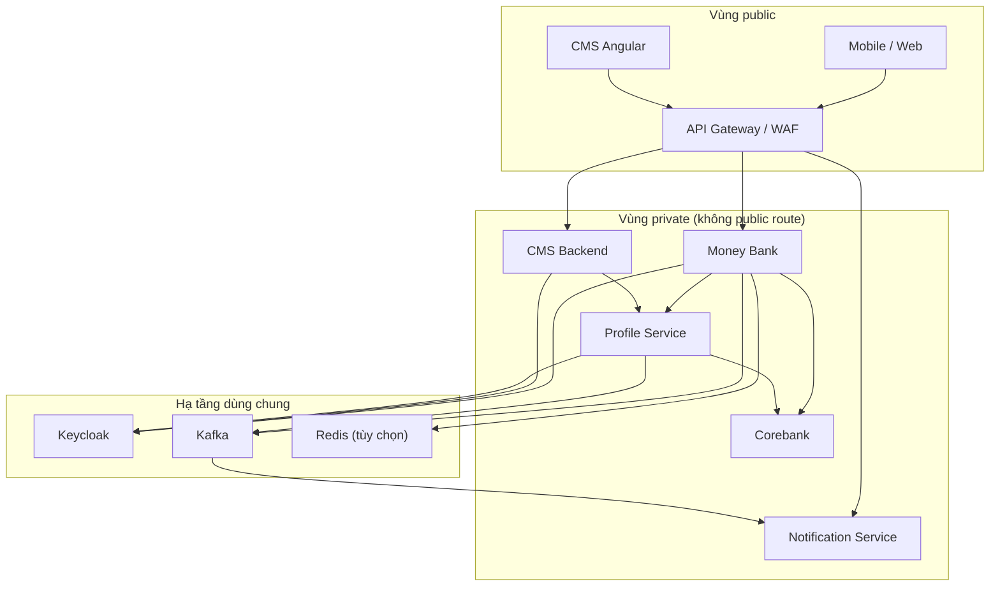
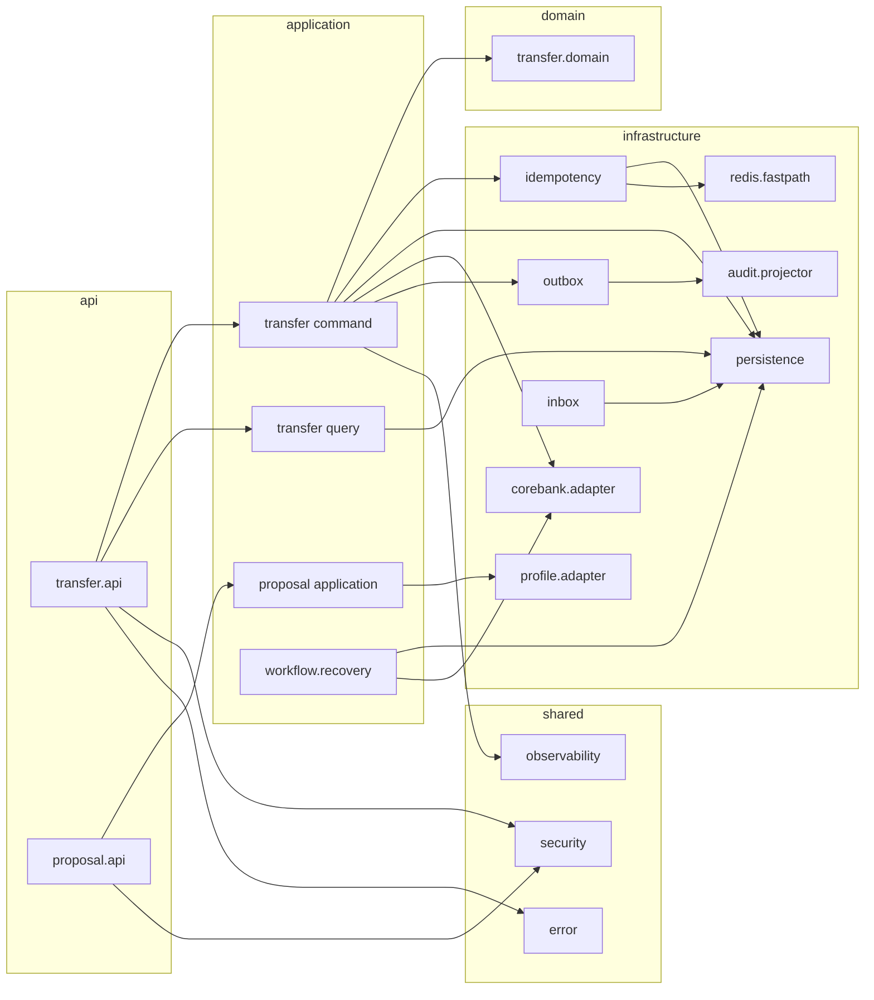

# Thiết kế component — MONEY-BANK

**Workstream:** 1 — Ranh giới container/component
**Trạng thái:** `FOR_REVIEW`
**Đầu vào:** BRD revision 1, SRD 0.3, `design-validation-report.md`
**Phạm vi:** Ranh giới logic, độc lập nền tảng triển khai (ADR-11, ADR-12)

## 1. Quy ước

- **Container:** đơn vị chạy độc lập, có thể deploy riêng và có process/lifecycle riêng.
- **Component:** khối logic bên trong một container, có trách nhiệm và interface rõ ràng.
- **Library:** artifact build-time, không có process riêng (`common-service`).
- Mũi tên dependency chỉ theo một chiều. Không có dependency vòng giữa container.
- Component chỉ được gọi component khác theo chiều `api → application → domain ← infrastructure`.

## 2. Container và quyền sở hữu

| Container | Loại | Owner nghiệp vụ | Database sở hữu | Public ingress |
|---|---|---|---|:---:|
| API Gateway/WAF | Edge | Platform | Không | Có |
| Money Bank | Service | MONEY-BANK | Money Bank DB (relational) + audit projection | Không |
| Profile Service | Service | Account domain | Profile DB | Không |
| CMS Backend | Service | Operations | Không sở hữu Proposal | Không |
| CMS Angular | Client | Operations | Không | Qua Gateway |
| Notification Service | Service | Notification domain | Notification DB | Không |
| Corebank | Hệ thống lõi | Corebank | Ledger/account (system of record) | Không |
| Keycloak | IAM | Security | Identity/session | Theo chính sách IAM |
| Kafka | Hạ tầng | Platform | Không (event có retention) | Không |
| Redis | Hạ tầng | Platform | Không (dữ liệu tạm) | Không |
| `common-service` | Library | Platform/Architecture | Không | Không |

Ghi chú phạm vi repo: workspace hiện tại chỉ chứa `money-bank`. Ranh giới của Profile Service, CMS Backend và Corebank được đặc tả ở mức contract để Money Bank không phụ thuộc chi tiết implementation của chúng.

## 3. Bản đồ dependency mức container

Quy tắc bắt buộc:

- Không có mũi tên nào từ `PS`/`CB` trở lại `GW` (không hairpin east-west).
- Không có mũi tên `CMSB → CB` và `NGX → PS` (BRD 2.4).
- Không có mũi tên `MB → PDB` hoặc `PS → MDB` (ADR-02).
- Notification không có mũi tên ngược vào transaction path (mục 12 SRD).

## 4. Component bên trong Money Bank

| # | Component | Trách nhiệm | Input | Output | Phụ thuộc |
|---:|---|---|---|---|---|
| C-01 | `transfer.api` | REST endpoint chuyển tiền, parse/validate transport, đọc `Idempotency-Key` | HTTP request | Command/Query object, error envelope | C-02, C-03, C-14 |
| C-02 | `transfer.application.command` | Use case `CreateTransfer`, `ReconcileTransfer`; điều phối claim → execute → settle | Command | Transaction state, response | C-04, C-05, C-06, C-08, C-09, C-11 |
| C-03 | `transfer.application.query` | `GetTransfer`, `ListTransactions`; read model, không thay đổi state | Query | Read DTO | C-06, C-08 |
| C-04 | `transfer.domain` | Invariant `TRF-INV-001..008`, state machine giao dịch, policy fee/limit theo version | Domain input đã hợp lệ hóa | Quyết định domain, transition | Không phụ thuộc hạ tầng |
| C-05 | `idempotency` | Claim durable, canonical request hash, duplicate/conflict semantics | customer, operation, key, payload | Claim result: `NEW`/`DUPLICATE`/`CONFLICT` | C-06, C-07 |
| C-06 | `persistence` | Repository, transaction boundary, optimistic locking | Domain/state object | Bản ghi bền vững | Money Bank DB |
| C-07 | `redis.fastpath` | Chặn burst duplicate, tùy chọn, degrade an toàn | key/hash/TTL | Cho phép/chặn nhanh | Redis |
| C-08 | `corebank.adapter` | Anti-corruption layer: account, balance, beneficiary, transfer, query-by-reference | Domain request | Domain result đã chuẩn hóa | Corebank |
| C-09 | `outbox` | Ghi event cùng transaction nghiệp vụ; publisher retry | State change | `outbox_event`, Kafka message | C-06, Kafka |
| C-10 | `inbox` | Chống consume event lặp bằng unique `(consumer, eventId)` | Kafka event | Business effect một lần | C-06, Kafka |
| C-11 | `workflow.recovery` | Job quét `UNKNOWN/RECONCILING`, lease, backoff, escalate `MANUAL_REVIEW` | Workflow record | Transition, alert | C-06, C-08 |
| C-12 | `proposal.api` + `proposal.application` | Facade public cho Proposal; truyền idempotency key và exchanged token sang Profile | HTTP request | Proposal response | C-13, C-14 |
| C-13 | `profile.adapter` | Client gọi private API của Profile Service | Proposal command/query | Proposal result | Profile Service |
| C-14 | `shared.security` | Identity context, authorization, token exchange client, fail-closed | Token/principal | Quyết định cho phép/từ chối | Keycloak |
| C-15 | `shared.observability` | Structured log, metric, trace, correlation propagation, masking | Telemetry hook | Log/metric/trace | OTel stack |
| C-16 | `shared.error` | Error catalog, HTTP mapping, sanitize | Exception/domain error | Error envelope | C-15 |
| C-17 | `audit.projector` | Consume outbox event → audit store append-only | Event | Audit record | C-10, audit store |

## 5. Sơ đồ component Money Bank

## 6. Chiều dependency được phép

| Từ | Tới | Cho phép | Lý do |
|---|---|:---:|---|
| `api` | `application` | Có | Controller chỉ điều phối transport |
| `api` | `domain` | Không | Tránh rò domain qua transport layer |
| `application` | `domain` | Có | Use case gọi domain policy |
| `application` | `infrastructure` | Có, qua port/interface | Hexagonal |
| `domain` | `infrastructure` | Không | Domain không biết DB/Corebank/Kafka |
| `domain` | `common-service` | Chỉ primitive ổn định | ADR-14 |
| `infrastructure` | `domain` | Có, chiều implement port | Adapter hiện thực port |
| bất kỳ | database của service khác | Không | ADR-02 |

## 7. Component chịu trách nhiệm cho từng yêu cầu

| Yêu cầu | Component chính | Component hỗ trợ |
|---|---|---|
| `TRF-INV-001..003` | C-04 | C-08 (xác minh tại Corebank), C-14 (ownership từ token) |
| `TRF-INV-004` | C-08 | C-04 (chuẩn bị lệnh), Corebank quyết định cuối |
| `TRF-INV-006` | C-05 | C-06 (unique constraint) |
| `TRF-INV-007..008` | C-02 | C-11, C-08 |
| `ACC-CMD-001..008` | Profile Service | C-12, C-13 (truyền key/token, không quyết định) |
| `REC-001..006` | C-11 | C-08, C-15 |
| `SEC-001..002` | C-14 | Gateway (kiểm tra thô), Profile (quyết định cuối) |
| `SEC-004` | C-15 | C-16 |
| `SEC-005` | C-09, C-17 | C-06 |
| `OPS-001..004` | C-15 | C-11 |

## 8. Điểm mở chuyển giai đoạn sau

| ID | Nội dung | Chuyển tới |
|---|---|---|
| AD-C-OPEN-01 | C-07 (Redis fast-path) có thuộc MVP hay không, phụ thuộc kết quả load test | Infrastructure/Test Design |
| AD-C-OPEN-02 | Audit store của C-17 là MongoDB hay append-only store khác | Data/Infrastructure Design |
| AD-C-OPEN-03 | C-11 chạy in-process hay tách container riêng khi volume tăng | Infrastructure Design |
| AD-C-OPEN-04 | Hợp đồng thực tế của Corebank cho C-08 (`OQ-P0-01..04`) | Chốt với Corebank owner |
