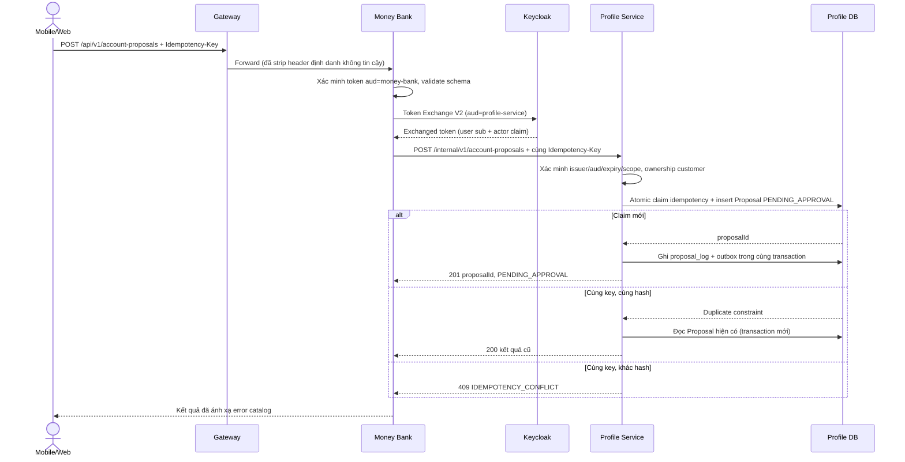
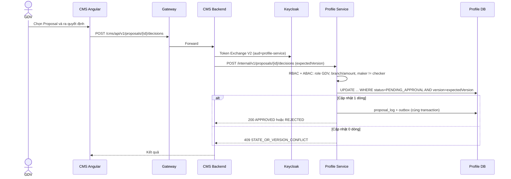
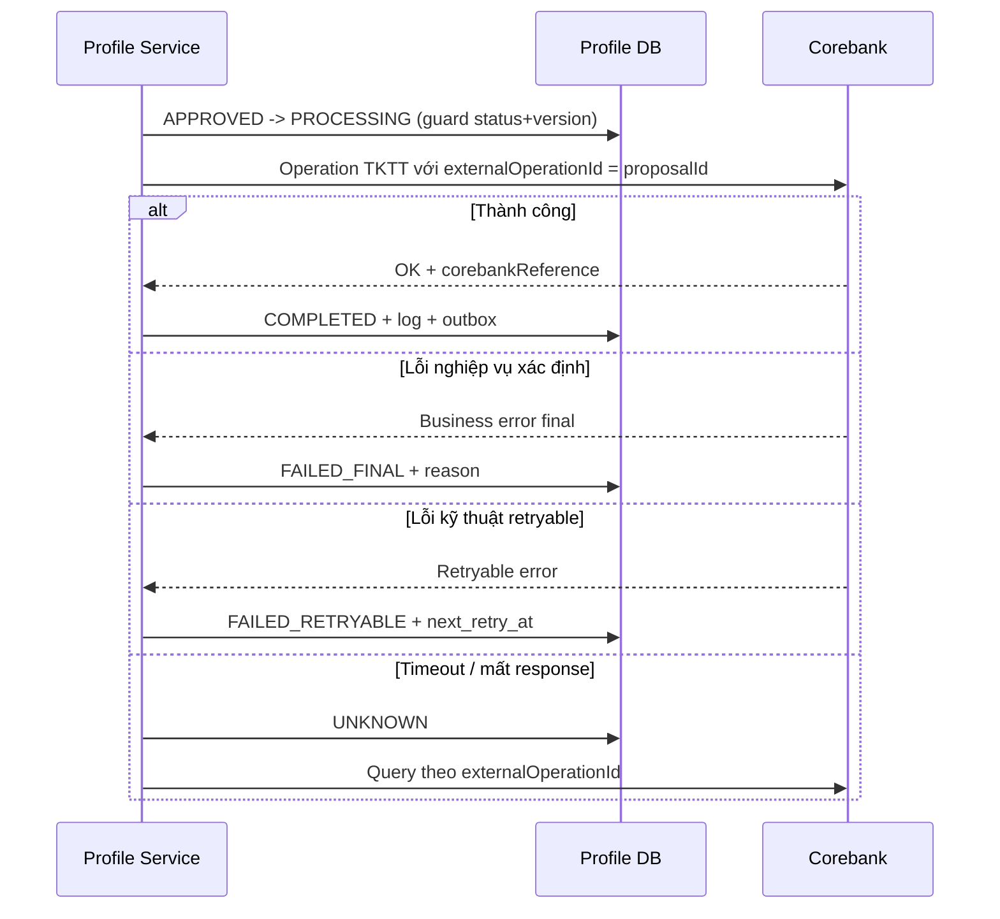
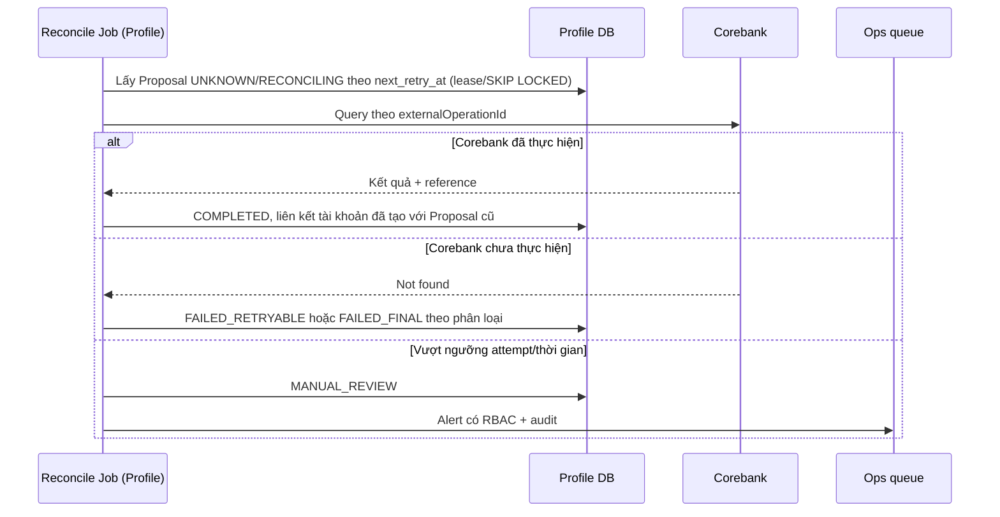

# Sequence luồng Proposal — MONEY-BANK

**Workstream:** 3 — Proposal create/approve/reconcile
**Trạng thái:** `FOR_REVIEW`
**Cơ sở:** BRD 3.1.1–3.1.6, SRD mục 5, DV-DEC-04, DV-DEC-08, DV-DEC-09

## 1. Phân định quyết định

| Quyết định | Chủ sở hữu |
|---|---|
| Nhận request kênh khách hàng, token exchange | Money Bank |
| Ownership, role, state/version, maker-checker | Profile Service |
| Durable idempotency của Proposal | Profile Service |
| Ghi `proposal_log` | Profile Service |
| Thực thi Corebank sau phê duyệt | Profile Service |
| Màn hình và thu nhận quyết định GDV | CMS Angular + CMS Backend |

## 2. Tạo Proposal



Ràng buộc:

- `AD-PR-R01`: Money Bank không sinh `Idempotency-Key` thay client và không biến đổi key khi forward.
- `AD-PR-R02`: Nếu Keycloak token exchange lỗi, Money Bank trả `503`/`401` theo phân loại và không fallback header user (SRD 9.2).
- `AD-PR-R03`: Profile claim bằng atomic insert, không `SELECT` rồi insert.
- `AD-PR-R04`: `proposal_log` và `outbox_event` ghi cùng local transaction với state change (`ACC-CMD-008`).

## 3. Phê duyệt/từ chối trên CMS



Ràng buộc:

- `AD-PR-R05`: Chỉ quyết định hợp lệ đầu tiên được ghi nhận (BRD 3.1.5); hai GDV đồng thời thì một bên nhận `409`.
- `AD-PR-R06`: Lý do là bắt buộc khi từ chối.
- `AD-PR-R07`: Maker không tự approve nếu chính sách maker-checker áp dụng (`ACC-CMD-005`); phạm vi chính sách chờ `OQ-P1-07`.
- `AD-PR-R08`: CMS Backend không gọi Corebank và không ghi Profile DB.

## 4. Thực thi Corebank sau phê duyệt



Ràng buộc:

- `AD-PR-R09`: `externalOperationId = proposalId`, không tạo operation mới khi retry (`ACC-CMD-006`, `ACC-CMD-007`).
- `AD-PR-R10`: Timeout chuyển `UNKNOWN`, không gửi lệnh create mới (SRD 5.4).
- `AD-PR-R11`: Chỉ lỗi được phân loại retryable mới được retry.

## 5. Reconcile Proposal `UNKNOWN`



## 6. Trạng thái và transition được phép

```text
PENDING_APPROVAL -> REJECTED | CANCELLED | APPROVED
APPROVED         -> PROCESSING
PROCESSING       -> COMPLETED | FAILED_RETRYABLE | FAILED_FINAL | UNKNOWN
FAILED_RETRYABLE -> PROCESSING | FAILED_FINAL
UNKNOWN          -> RECONCILING
RECONCILING      -> COMPLETED | FAILED_FINAL | MANUAL_REVIEW
```

- Terminal: `REJECTED`, `CANCELLED`, `COMPLETED`, `FAILED_FINAL`.
- Mọi transition kiểm tra `currentStatus + version`.
- Không xóa vật lý Proposal/log (BRD 3.1.3).
- `CANCELLED` chỉ tồn tại nếu nghiệp vụ cho phép hủy; chờ `OQ-P1-08`.

## 7. Ma trận lỗi phía Money Bank

| Tình huống Profile | Money Bank trả client | Ghi chú |
|---|---|---|
| `409` idempotency conflict | `409 MB-ACC-409-*` | Không tạo lại request |
| `409` state/version conflict | `409 MB-ACC-409-*` | Client refresh trạng thái |
| `403` không sở hữu | `403` hoặc `404` | Không lộ tồn tại dữ liệu người khác |
| `401` token sai audience | `500`/`503` nội bộ + alert | Lỗi cấu hình phía Money Bank, không phải lỗi client |
| Timeout Profile | `202` + hướng dẫn tra cứu `proposalId` nếu đã sinh, ngược lại `503` | Không tự tạo Proposal thứ hai |
| Profile unavailable | `503 MB-CMN-503-*` | Circuit breaker + bulkhead |

## 8. Điểm mở

| ID | Nội dung | Phụ thuộc |
|---|---|---|
| AD-PR-OPEN-01 | Cho phép khách hàng hủy Proposal hay không | `OQ-P1-08` |
| AD-PR-OPEN-02 | Phạm vi maker-checker và thẩm quyền GDV theo branch/amount | `OQ-P1-07` |
| AD-PR-OPEN-03 | Danh sách field create/update và điều kiện close | `OQ-P1-09` |
| AD-PR-OPEN-04 | Corebank có hỗ trợ query theo `externalOperationId` cho nghiệp vụ TKTT | `OQ-P0-02` |
