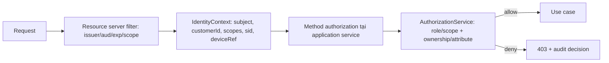

# Thiết kế IAM, token exchange và audit actor — MONEY-BANK

**Workstream:** 5 — IAM, token exchange và actor audit
**Trạng thái:** `FOR_REVIEW`
**Cơ sở:** SRD mục 9, 15; ADR-12, ADR-13; DV-DEC-05..07; DV-F-02, DV-F-03

## 1. Nguyên tắc

| ID | Nguyên tắc |
|---|---|
| AD-SEC-P01 | Mạng private chỉ giới hạn reachability, không phải authentication. |
| AD-SEC-P02 | Mỗi service tự xác minh issuer, audience, expiry, scope/type; deny-by-default. |
| AD-SEC-P03 | Gateway kiểm tra thô và không phải trust boundary duy nhất. |
| AD-SEC-P04 | Không service nào tin header định danh (`X-User-Id`) nếu không ràng buộc bằng token đã xác minh. |
| AD-SEC-P05 | IAM lỗi thì fail closed, không fallback header hoặc network trust. |
| AD-SEC-P06 | mTLS là target khi hạ tầng tự động hóa certificate; không thay thế authorization OAuth2. |

## 2. Client và audience trong Keycloak

| Client | Loại | Dùng để | Audience nhận được |
|---|---|---|---|
| `mobile-web` | Public/PKCE | Đăng nhập khách hàng | `money-bank` |
| `cms-angular` | Public/PKCE | Đăng nhập GDV | `cms` |
| `money-bank` | Confidential resource server + exchange client | Xác minh token kênh, thực hiện token exchange | Nhận `money-bank`, xin `profile-service`, `corebank` |
| `cms-backend` | Confidential resource server + exchange client | Xác minh token CMS, token exchange | Nhận `cms`, xin `profile-service` |
| `profile-service` | Confidential resource server | Xác minh token exchanged/client credentials | Nhận `profile-service` |
| `money-bank-jobs` | Confidential, client credentials | Reconciliation job không đại diện user | Nhận `money-bank`, xin `corebank` |

Không chia sẻ client secret giữa service. Không dùng một audience chung cho mọi service.

## 3. Scope theo use case

| Scope | Chủ thể được cấp | Dùng ở |
|---|---|---|
| `account:read` | Khách hàng | `GET /accounts`, `/balance`, `/beneficiaries/verify` |
| `transfer:create` | Khách hàng | `POST /transfers` |
| `transfer:read` | Khách hàng | `GET /transfers/{id}` |
| `account:proposal:create` | Khách hàng | `POST /account-proposals` |
| `account:proposal:read` | Khách hàng | `GET /account-proposals/{id}` |
| `proposal:read` | GDV | CMS query |
| `proposal:approve` | GDV có thẩm quyền | CMS decision |
| `proposal:reject` | GDV có thẩm quyền | CMS decision |
| `transfer:reconcile` | Service/operator | Job và internal API |

Scope là điều kiện cần. Điều kiện đủ gồm ownership, branch, amount threshold, maker-checker và state/version — do service sở hữu dữ liệu quyết định.

## 4. Token exchange cho lời gọi user-initiated

```mermaid
sequenceDiagram
  actor U as Khách hàng
  participant M as Money Bank
  participant KC as Keycloak
  participant P as Profile Service

  U->>M: Request + token (aud=money-bank, sub=user)
  M->>M: Xác minh issuer/aud/exp/scope; deny-by-default
  M->>KC: POST /token (grant_type=token-exchange, subject_token, audience=profile-service)
  KC-->>M: Access token (aud=profile-service, sub=user, act=money-bank)
  M->>P: Private API + exchanged token
  P->>P: Xác minh aud=profile-service, kiểm tra sub + act
  P->>P: Authorization cuối: ownership, role, state, version
  P-->>M: Kết quả
```

Yêu cầu kiểm chứng bắt buộc:

| ID | Yêu cầu |
|---|---|
| AD-SEC-TE01 | Token exchanged phải có `aud=profile-service`; Profile từ chối token có audience khác. |
| AD-SEC-TE02 | User `sub` phải được giữ nguyên qua exchange. |
| AD-SEC-TE03 | Calling service phải nhận diện được từ claim đã xác minh (`act`, `azp` hoặc claim tương đương do PoC xác nhận). |
| AD-SEC-TE04 | Không coi Standard Token Exchange là biểu diễn đầy đủ delegation chain trước khi PoC xác nhận claim thực tế (DV-F-03). |
| AD-SEC-TE05 | Token TTL ngắn; cache token theo `(subject, audience)` phải tôn trọng expiry và revocation. |
| AD-SEC-TE06 | Exchange thất bại thì fail closed; không gọi Profile bằng client credentials để "thay mặt" user. |

### 4.1. Tiêu chí PoC Standard Token Exchange V2

| # | Tiêu chí | Bằng chứng cần có |
|---:|---|---|
| 1 | Cấu hình client cho phép exchange đúng audience | Export cấu hình realm/client |
| 2 | Claim thực tế của token exchanged | Token decode trong môi trường test, đã ẩn giá trị bí mật |
| 3 | Phân biệt được user subject và service actor | Bảng mapping claim → field audit |
| 4 | Hành vi khi subject token hết hạn/bị revoke | Kết quả `401` từ Keycloak và fail closed tại Money Bank |
| 5 | Hành vi khi Keycloak unavailable | Money Bank trả `503`, không bypass |
| 6 | Chi phí latency của exchange trong luồng nóng | Số đo p95/p99 và quyết định cache |
| 7 | Client credentials cho job không mang `sub` user | Token decode và audit tương ứng |

PoC là điều kiện tiên quyết trước implementation IAM (điều kiện chuyển giai đoạn trong validation report).

## 5. Baseline bảo vệ east-west

| Lớp | Baseline phase 1 | Target |
|---|---|---|
| Reachability | Private DNS/service discovery, không public route/DNS/listener | Không đổi |
| Kênh truyền | TLS 1.2+ (ưu tiên 1.3) | mTLS/workload identity khi có certificate automation |
| Định danh caller | OAuth2 token đúng audience | mTLS + OAuth2 song song |
| Mạng | Allow-list theo workload; Kubernetes: `ClusterIP` + default-deny NetworkPolicy; VM: internal LB/firewall | Không đổi |
| Authorization | Quyết định tại service sở hữu dữ liệu | Không đổi |

Gateway phải strip header định danh không đáng tin cậy đến từ Internet.

## 6. Authorization bên trong Money Bank



Ràng buộc:

- `AD-SEC-A01`: Ưu tiên Spring Security method authorization/`AuthorizationManager`. `@MoneyBankAuthorize` chỉ là facade có contract test.
- `AD-SEC-A02`: Annotation đặt ở public method của application service; không dựa vào self-invocation.
- `AD-SEC-A03`: Không đưa logic số dư/hạn mức vào Aspect.
- `AD-SEC-A04`: Phải có integration test chứng minh proxy/aspect thực sự chạy, không chỉ unit test.
- `AD-SEC-A05`: `customerId` lấy từ identity context, không nhận từ body/query.

## 7. Single-device/session

| ID | Yêu cầu |
|---|---|
| AD-SEC-D01 | Định nghĩa phạm vi: một active session hay một trusted device — chờ `OQ-P1-01`. |
| AD-SEC-D02 | Hai login đồng thời phải được serialize theo user; chính sách `reject-new`/`revoke-old` áp dụng nguyên tử. |
| AD-SEC-D03 | Token chứa `sid` và device claim/reference. |
| AD-SEC-D04 | Access token ngắn + session-version denylist/cache, hoặc introspection cho API rủi ro cao. |
| AD-SEC-D05 | Logout, revoke, đổi mật khẩu, khóa user, login mới phát event invalidation; refresh token rotation + reuse detection bật. |
| AD-SEC-D06 | `deviceId` thuần không phải bằng chứng tin cậy; attestation là bước tăng cường. |

Giới hạn phải ghi rõ cho stakeholder: JWT đã phát vẫn sống tới hết hạn nếu chỉ kiểm tra offline.

## 8. Audit actor

Mỗi audit event bắt buộc có:

| Field | Nguồn | Ghi chú |
|---|---|---|
| `userSubject` | Token `sub` đã xác minh | Không nhận từ header |
| `serviceActor` | Claim actor/`azp` của token exchanged | Phân biệt với user |
| `channel` | `MOBILE`, `WEB`, `CMS`, `JOB` | Suy ra từ client/audience |
| `action` | Hằng số nghiệp vụ | Ví dụ `TRANSFER_CREATE`, `PROPOSAL_APPROVE` |
| `target` | `transactionId`/`proposalId`/`accountRef` đã mask | Không full account number |
| `beforeStatus`/`afterStatus` | State machine | Bắt buộc với transition |
| `result` | `ALLOW`/`DENY`/`SUCCESS`/`FAILED` | Gồm authorization decision |
| `reason` | Lý do an toàn | Bắt buộc khi từ chối |
| `correlationId`, `traceId`, `workflowId` | Observability | Truy vết chuỗi |
| `occurredAt` | UTC ISO 8601 | Không dùng giờ local |

Ràng buộc:

- `AD-SEC-AU01`: Audit là dữ liệu nghiệp vụ append-only, không phải application log (ADR-06).
- `AD-SEC-AU02`: Audit event sinh qua Outbox trong cùng transaction với state change.
- `AD-SEC-AU03`: Không ghi token, OTP, PIN, biometric, secret, full account number vào audit/log/metric/trace (`SEC-004`).
- `AD-SEC-AU04`: Application role không được update/delete audit record.

## 9. Kiểm chứng bắt buộc

| ID | Test |
|---|---|
| AD-SEC-T01 | Client ngoài private network không tiếp cận được internal API của Profile/Corebank |
| AD-SEC-T02 | Caller trong private network nhưng thiếu token hợp lệ vẫn nhận `401`/`403` |
| AD-SEC-T03 | Token sai issuer/audience/scope bị từ chối ở mọi service |
| AD-SEC-T04 | Header `X-User-Id` giả mạo không thay đổi được ownership |
| AD-SEC-T05 | Keycloak unavailable → fail closed, có alert |
| AD-SEC-T06 | Audit ghi đủ user subject + service actor cho approve/transfer/reconcile |
| AD-SEC-T07 | Authorization denied được audit theo reason category, không rò dữ liệu |
| AD-SEC-T08 | Aspect/method authorization thực sự chạy trong integration test |

## 10. Điểm mở

| ID | Nội dung | Phụ thuộc |
|---|---|---|
| AD-SEC-OPEN-01 | Claim chính xác biểu diễn service actor | PoC token exchange |
| AD-SEC-OPEN-02 | Access/refresh token TTL và hành vi khi IAM/Redis lỗi | `OQ-P1-02` |
| AD-SEC-OPEN-03 | Cơ chế transaction authentication (OTP/soft token/biometric) | `OQ-P0-06` |
| AD-SEC-OPEN-04 | Nền tảng triển khai để chốt mTLS/NetworkPolicy | `OQ-P1-12`, DV-F-08 |
| AD-SEC-OPEN-05 | Nguồn quy tắc baseline bảo mật của tổ chức | Security owner |
