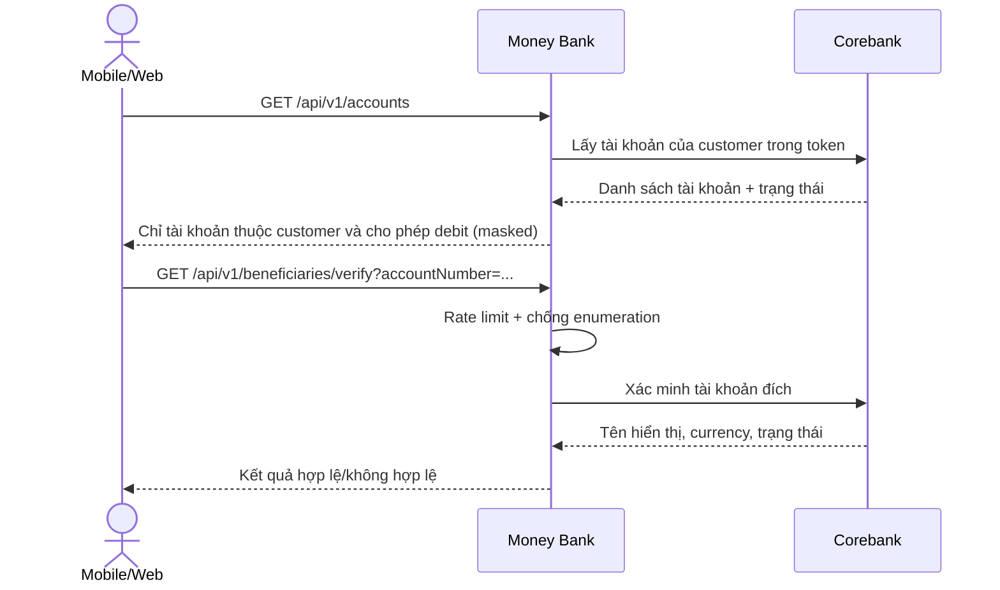
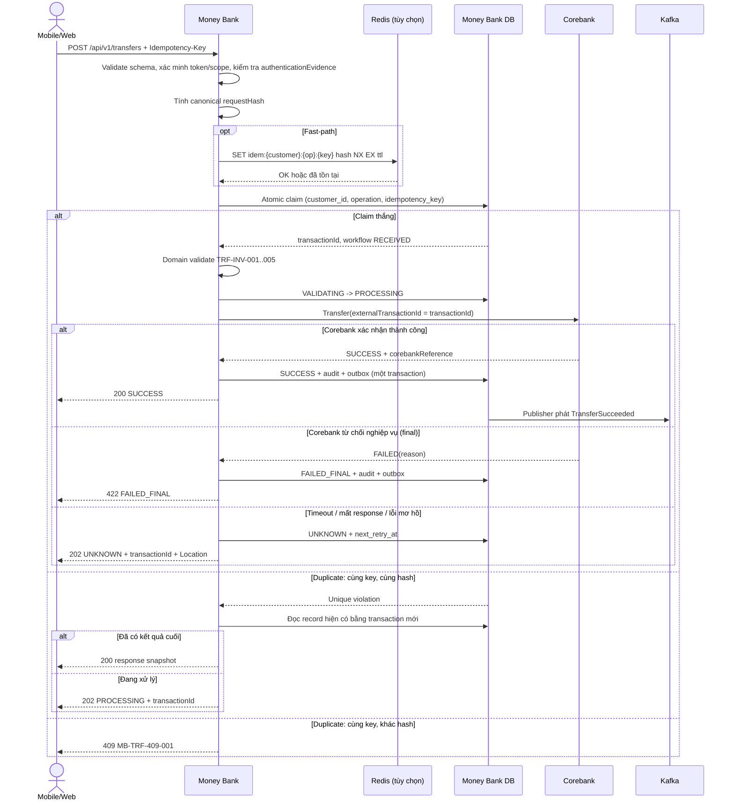
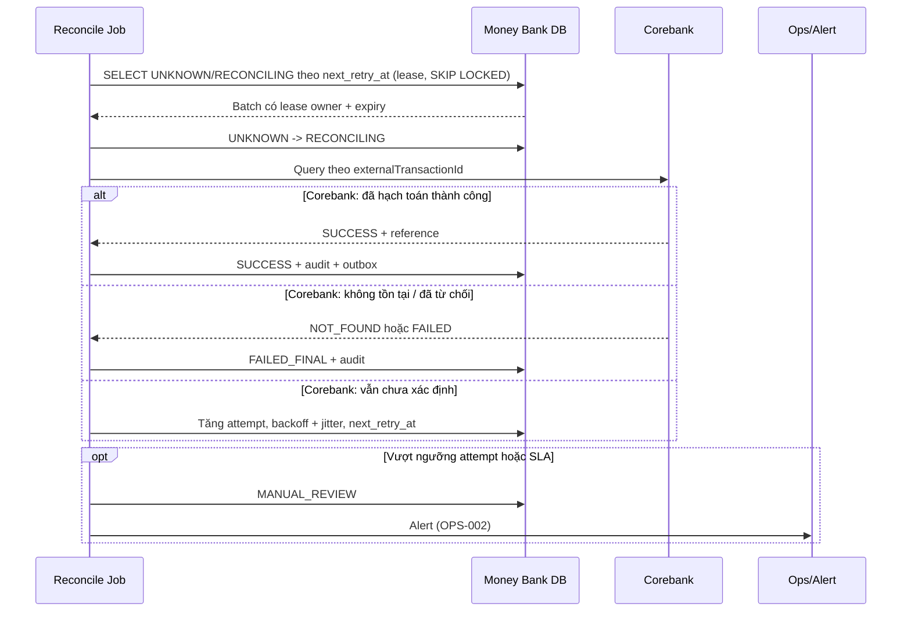

# Sequence luồng chuyển tiền — MONEY-BANK

**Workstream:** 4 — Transfer success/failure/unknown
**Trạng thái:** `FOR_REVIEW`
**Cơ sở:** BRD 3.2, SRD mục 6, ADR-03, ADR-05, Phụ lục B

## 1. Ba giai đoạn

| Giai đoạn | Mục tiêu | Bất biến |
|---|---|---|
| 1. Claim | Biến một ý định client thành đúng một transaction | Unique constraint là lớp quyết định |
| 2. Execute | Corebank hạch toán nguyên tử | Money Bank không tự giữ tiền |
| 3. Settle | Chốt kết quả hoặc chuyển reconciliation | Không suy diễn FAILED từ timeout |

Đây không phải 2PC. Không có distributed transaction giữa Money Bank và Corebank.

## 2. Pre-flight (query, không thay đổi state)

Ràng buộc:

- `AD-TR-R01`: Danh sách tài khoản lọc theo customer lấy từ identity context, không từ tham số client.
- `AD-TR-R02`: Số dư dùng để hiển thị/kiểm tra lấy từ Corebank; không dùng số dư cache làm căn cứ cuối (BRD 3.2.1).
- `AD-TR-R03`: Verify beneficiary phải rate-limit và không tiết lộ tài khoản thuộc khách hàng cụ thể.

## 3. Luồng chính: claim → execute → settle

Ràng buộc bắt buộc:

- `AD-TR-R04`: Claim bằng atomic insert dựa trên unique constraint. Không `findByIdempotencyKey` rồi insert (khắc phục DV-F-04).
- `AD-TR-R05`: Duplicate exception phải được xử lý ngoài transaction đã rollback; đọc lại bằng transaction mới. Không rò `ORA-00001` hay `500` cho client.
- `AD-TR-R06`: `transactionId` chỉ sinh sau khi claim thắng (ADR-04).
- `AD-TR-R07`: Redis down không được bỏ qua kiểm tra ở DB và không được tạo giao dịch trùng.
- `AD-TR-R08`: `SUCCESS` chỉ trả khi Corebank xác nhận trạng thái cuối (`TRF-INV-007`).
- `AD-TR-R09`: State change + `audit_event` intent + `outbox_event` ghi trong cùng local transaction; không dual-write sang audit store.

## 4. Luồng ambiguous và reconciliation

Ràng buộc:

- `AD-TR-R10`: Luôn query theo `externalTransactionId` trước mọi retry command (`REC-002`, ADR-05).
- `AD-TR-R11`: Không gửi lại lệnh transfer khi chưa biết kết quả lần gửi trước.
- `AD-TR-R12`: Một transaction chỉ được một worker xử lý tại một thời điểm nhờ DB lease/`SKIP LOCKED`.
- `AD-TR-R13`: Không chuyển `SUCCESS → FAILED`. Sửa sai phải là giao dịch reversal riêng liên kết giao dịch gốc (`OQ-P0-07`).

## 5. Ánh xạ phân loại lỗi Corebank

| Phân loại | Ví dụ | Transaction state | HTTP | Được retry |
|---|---|---|---|:---:|
| `BUSINESS_FINAL` | Không đủ số dư, account bị phong tỏa, vượt hạn mức | `FAILED_FINAL` | `422` | Không |
| `VALIDATION` | Sai schema/currency | `FAILED_FINAL` | `400`/`422` | Không |
| `TECHNICAL_RETRYABLE` | Lỗi trước khi lệnh được gửi, connect refused | `FAILED_RETRYABLE` | `503` | Có, có backoff |
| `AMBIGUOUS` | Timeout sau khi gửi, connection reset, response mất | `UNKNOWN` | `202` | Chỉ query, không resend |

Mặc định khi Corebank chưa xác nhận phân loại: timeout sau khi gửi là `AMBIGUOUS` (`OQ-P0-03`).

## 6. Số dư và chống overspend

Money Bank không hold tiền cục bộ (SRD 6.4). Thứ tự ưu tiên contract:

| Ưu tiên | Contract Corebank | Hệ quả thiết kế Money Bank |
|---:|---|---|
| 1 | Transfer nguyên tử kiểm tra số dư/hạn mức và debit-credit | Money Bank chỉ orchestrate, không cần state trung gian tài chính |
| 2 | `reserve/commit/release` idempotent có `reservationId` và expiry | Bổ sung state `RESERVED`, `COMMITTING`, `RELEASING` phản ánh Corebank |
| 3 | Không có cả hai | Không tự dựng debit/credit rời; đưa vào manual processing có kiểm soát |

Với phương án 2: timeout ở bước commit giữ `UNKNOWN`, query trước, không release cho tới khi biết chắc commit chưa xảy ra.

## 7. Timeout đối xứng

| Cặp | Nguyên tắc |
|---|---|
| Client → Money Bank | Client timeout không đồng nghĩa `FAILED`; client phải query theo `transactionId`/idempotency key trước khi tạo ý định mới |
| Money Bank → Corebank | Connect/read/write timeout riêng, nhỏ hơn timeout upstream |
| Money Bank → Profile | Circuit breaker + bulkhead riêng, không dùng chung pool với Corebank |

## 8. Test scenario bắt buộc phát sinh từ workstream này

| ID | Scenario | Kết quả mong đợi |
|---|---|---|
| AD-TR-T01 | 100 request đồng thời cùng key, cùng payload | Đúng một transaction, một Corebank operation, không `500` |
| AD-TR-T02 | Cùng key, khác payload | Luôn `409` |
| AD-TR-T03 | Redis down/restart giữa luồng | Không giao dịch trùng |
| AD-TR-T04 | Corebank timeout sau commit, mất response | `UNKNOWN` → reconcile ra `SUCCESS` |
| AD-TR-T05 | Process crash sau claim, trước gọi Corebank | Reconcile xác định chưa hạch toán, không tạo lệnh mới |
| AD-TR-T06 | Crash sau khi Corebank commit, trước khi lưu SUCCESS | Reconcile chốt `SUCCESS`, outbox phát đúng một lần hiệu ứng |
| AD-TR-T07 | Hai transfer đồng thời cùng source account | Không overspend, invariant do Corebank bảo vệ |
| AD-TR-T08 | Event redelivery cùng `eventId` | Inbox chặn, notification không gửi trùng |
| AD-TR-T09 | Token sai audience/scope, session revoked | `401`/`403`, fail closed |
| AD-TR-T10 | Log/metric/trace trong mọi nhánh trên | Không rò token/OTP/full account number |

## 9. Điểm mở

| ID | Nội dung | Phụ thuộc |
|---|---|---|
| AD-TR-OPEN-01 | Corebank có transfer nguyên tử không | `OQ-P0-01` |
| AD-TR-OPEN-02 | Query theo reference và retention của reference | `OQ-P0-02` |
| AD-TR-OPEN-03 | Danh mục lỗi final/retryable/ambiguous của Corebank | `OQ-P0-03` |
| AD-TR-OPEN-04 | Hạn mức/phí enforce ở đâu | `OQ-P0-05` |
| AD-TR-OPEN-05 | Ngưỡng attempt/SLA trước `MANUAL_REVIEW` | `OQ-P1-04` |
