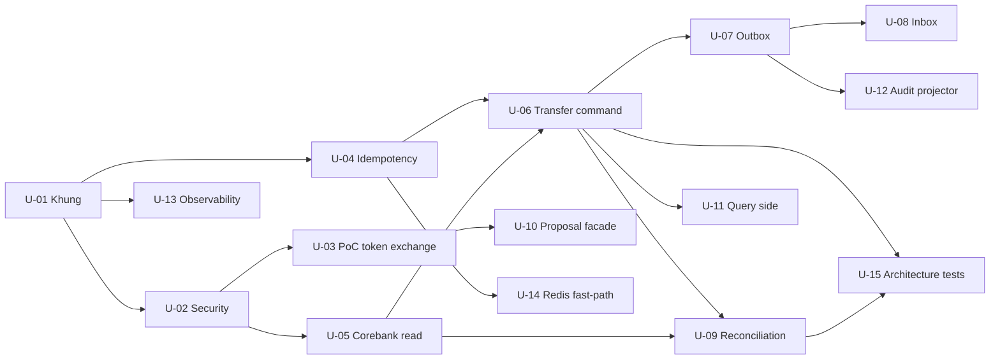

# Tổng hợp dependency và unit candidate — MONEY-BANK

**Workstream:** 8 — Đầu vào cho Units Generation
**Trạng thái:** `FOR_REVIEW`
**Cơ sở:** 7 workstream Application Design trước đó

## 1. Mục đích

Xác định các unit of work có thể lập kế hoạch độc lập, thứ tự phụ thuộc và điều kiện đầu vào. Đây **chưa** phải lệnh triển khai code; Units Generation chỉ bắt đầu sau khi Application Design được review.

## 2. Unit candidate

| Unit | Nội dung | Phụ thuộc | Blocker ngoài tầm |
|---|---|---|---|
| U-01 | Khung project: package theo hexagonal/CQRS, structured logging, error envelope, architecture test chiều dependency | Không | Không |
| U-02 | Security foundation: resource server, xác minh issuer/aud/exp/scope, `IdentityContext`, authorization deny-by-default | U-01 | Cấu hình Keycloak realm |
| U-03 | PoC Standard Token Exchange V2 và audit actor mapping | U-02 | Keycloak môi trường test |
| U-04 | Idempotency core: canonical hash, claim-first, duplicate/conflict semantics, unique constraint | U-01 | Chốt `description` trong hash |
| U-05 | Corebank adapter read-only: account, balance, verify beneficiary + error mapping | U-01, U-02 | Tài liệu API Corebank |
| U-06 | Transfer command: domain invariant, state machine, transaction boundary | U-02, U-04, U-05 | `OQ-P0-01`, `OQ-P0-03`, `OQ-P0-06` |
| U-07 | Outbox + publisher | U-01, U-06 | Chuẩn Kafka của tổ chức |
| U-08 | Inbox cho consumer | U-01, U-07 | Danh sách topic consume |
| U-09 | Workflow recovery/reconciliation job: lease, backoff, `MANUAL_REVIEW` | U-06, U-05 | `OQ-P0-02`, `OQ-P1-04` |
| U-10 | Proposal facade: forward idempotency key + exchanged token, error mapping | U-02, U-03 | Private API contract của Profile |
| U-11 | Query side: `GET /transfers/{id}`, `GET /accounts`, phân trang, masking | U-05, U-06 | `OQ-P1-10` |
| U-12 | Audit projector append-only | U-07 | AD-C-OPEN-02 (audit store) |
| U-13 | Observability: metric bắt buộc, health liveness/readiness, alert baseline | U-01 | `OQ-P1-03`, `OQ-P1-04` |
| U-14 | Redis fast-path (tùy chọn) | U-04 | Bằng chứng load test |
| U-15 | Test suite kiến trúc: concurrency, ambiguous outcome, security negative test | U-04, U-06, U-09 | Không |

## 3. Thứ tự phụ thuộc

## 4. Nhóm theo khả năng triển khai song song

| Nhóm | Unit | Ghi chú |
|---|---|---|
| Nền tảng | U-01, U-13 | Làm trước, mở đường cho mọi unit khác |
| IAM | U-02, U-03 | U-03 là PoC, phải xong trước khi implement IAM production |
| Nhất quán | U-04, U-07, U-08 | Không phụ thuộc contract Corebank |
| Tích hợp Corebank | U-05, U-06, U-09 | Bị chặn bởi P0 của Corebank |
| Kênh | U-10, U-11 | Song song sau IAM |
| Bổ trợ | U-12, U-14 | Có điều kiện |
| Kiểm chứng | U-15 | Chạy xuyên suốt, không dồn về cuối |

## 5. Unit bị chặn bởi quyết định ngoài tầm dự án

| Unit | Bị chặn bởi | Hệ quả nếu chưa chốt |
|---|---|---|
| U-06 | `OQ-P0-01` transfer nguyên tử | Không thể chốt có cần state `RESERVED/COMMITTING` |
| U-06 | `OQ-P0-06` transaction authentication | Contract `authenticationEvidence` chưa đóng |
| U-09 | `OQ-P0-02` query theo reference | Không thể auto recovery, phải manual reconciliation |
| U-05, U-06 | `OQ-P0-03` phân loại lỗi | Ánh xạ final/retryable/ambiguous còn là giả định |
| U-10 | Contract private API của Profile | Chỉ dựng được stub |
| U-12 | Audit store | Contract audit cố định, implementation chưa chốt |
| U-13 | `OQ-P1-03`, `OQ-P1-04` | SLO là baseline thảo luận, chưa phải cam kết |

Nguyên tắc: unit bị chặn vẫn có thể chuẩn bị interface/port và test contract với stub, nhưng không được chốt hành vi tài chính dựa trên giả định.

## 6. Điều kiện chấp nhận theo unit

| Unit | Điều kiện chấp nhận cốt lõi |
|---|---|
| U-01 | Architecture test chặn dependency sai chiều; log có đủ field bắt buộc |
| U-02 | Token sai issuer/aud/scope bị từ chối; thiếu principal fail closed |
| U-03 | Có bằng chứng claim thực tế và mapping audit actor |
| U-04 | AD-DC-T01..T04 đạt |
| U-05 | Error mapping có test; không rò raw Corebank error |
| U-06 | AD-TR-T01..T07 đạt; không có đường trả `SUCCESS` khi chưa có xác nhận Corebank |
| U-07 | Crash test cho thấy đúng một hiệu ứng nghiệp vụ được phát |
| U-08 | AD-DC-T08 đạt |
| U-09 | Query trước mọi retry; lease chống hai worker; escalate đúng ngưỡng |
| U-10 | Key truyền nguyên vẹn; IAM lỗi fail closed |
| U-11 | Ownership lọc theo identity context; masking đúng chính sách |
| U-12 | Append-only, unique `event_id`, không update/delete bằng application role |
| U-13 | Metric không dùng ID cardinality cao làm label; readiness có timeout hữu hạn |
| U-14 | Redis down không tạo giao dịch trùng |
| U-15 | Toàn bộ test ID trong 4 workstream sequence/data được phủ |

## 7. Cổng trước Units Generation

| # | Điều kiện | Trạng thái |
|---:|---|---|
| 1 | Application Design được người dùng review | `PENDING` |
| 2 | Mọi component có owner, input/output, chiều dependency | `DONE` (`components.md`) |
| 3 | Mọi command có identity, authorization, idempotency, transaction boundary | `DONE` (`api-boundaries.md`, `security-design.md`, `data-and-consistency-design.md`) |
| 4 | Mọi timeout sau side effect có state/reconciliation path | `DONE` (`transfer-sequences.md`, `proposal-sequences.md`) |
| 5 | IAM PoC criteria được ghi rõ | `DONE` (`security-design.md` mục 4.1) |
| 6 | Open infrastructure assumption được ghi rõ | `DONE` (mục "Điểm mở" của từng artifact) |
| 7 | P0 của Corebank được chốt | `BLOCKED` — ngoài tầm quyết định của nhóm thiết kế |
