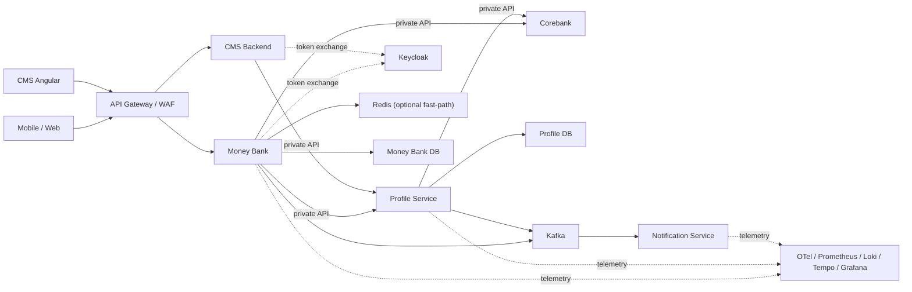
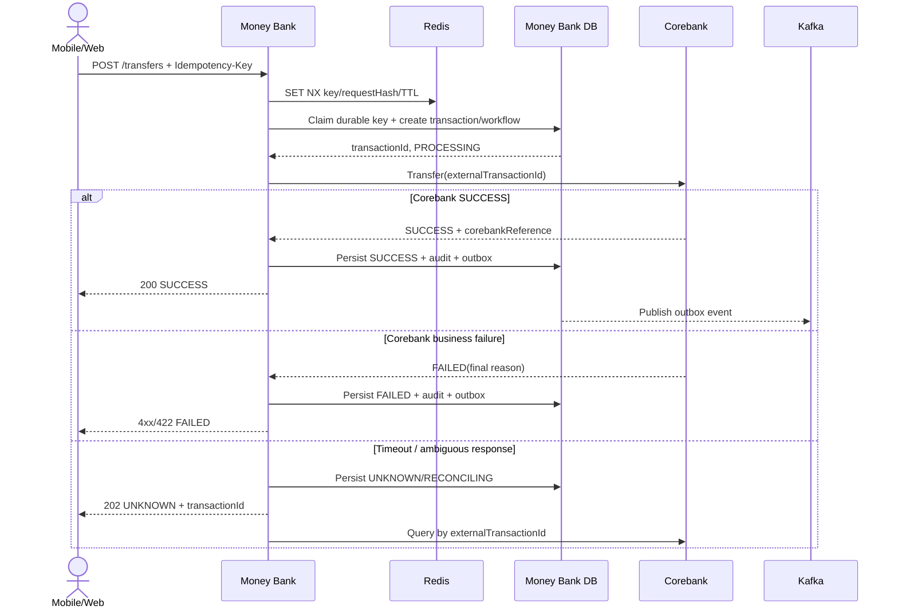

# SOFTWARE REQUIREMENTS & SOLUTION DESIGN (SRD)

**Dự án:** MONEY-BANK  
**Phiên bản:** 0.3  
**Trạng thái:** Dự thảo phục vụ review kiến trúc/nghiệp vụ  
**Nguồn đầu vào:** `docs/brd.md` revision 1  
**Phạm vi:** Phase 1 — quản lý yêu cầu tài khoản thanh toán và chuyển tiền nội bộ

| Thuộc tính quản trị | Giá trị |
|---|---|
| Chủ sở hữu tài liệu | Solution Architecture / MONEY-BANK |
| Người phê duyệt | Business Owner, Corebank Owner, Security, Operations |
| Mức phân loại | Internal — có thể chứa thiết kế hệ thống, không chứa dữ liệu khách hàng thật |
| Trạng thái quyết định | Các mục ghi “đề xuất”, “tạm thời” hoặc `TBD` chưa phải cam kết triển khai |
| Điều kiện baseline | Tất cả điểm P0 được chốt; P1 có owner và thời hạn xử lý |

## 1. Mục tiêu tài liệu

Tài liệu chuyển hóa BRD thành yêu cầu hệ thống và định hướng thiết kế đủ để các nhóm nghiệp vụ, kiến trúc, phát triển, kiểm thử, an toàn thông tin và vận hành cùng review trước khi thiết kế chi tiết.

SRD này:

- Xác định ranh giới và quyền sở hữu dữ liệu của từng hệ thống.
- Đặc tả luồng, trạng thái, tính nhất quán và xử lý lỗi.
- Đề xuất kiến trúc bảo mật, CQRS, idempotency, audit và observability.
- Ghi rõ quyết định kiến trúc tạm thời, giả định và câu hỏi cần nghiệp vụ/Corebank xác nhận.

SRD không thay thế tài liệu API contract, physical data model/DDL, threat model, deployment design, runbook hay test plan. Các tài liệu này được tạo sau khi các điểm P0/P1 tại mục 17 được chốt.

### 1.1. Quy ước yêu cầu và giả định

- `ACC-*`, `TRF-*`, `REC-*`, `SEC-*`, `OPS-*` là yêu cầu có thể truy vết và phải có test hoặc bằng chứng kiểm chứng.
- `ADR-*` là quyết định thiết kế; thay đổi phải được review và ghi lại lý do.
- `OQ-*` là câu hỏi mở. Quyết định tạm thời không được biến thành business rule chính thức nếu chưa có người có thẩm quyền xác nhận.
- Từ “phải” biểu thị yêu cầu bắt buộc; “nên/đề xuất” biểu thị lựa chọn cần review.
- Thời gian lưu và trao đổi dùng UTC theo ISO 8601; UI chuyển sang múi giờ người dùng. Giả định này cần Operations xác nhận.
- Hệ thống hiện là brownfield skeleton Spring Boot; dependency trong `pom.xml` chỉ là tín hiệu kỹ thuật ban đầu, không mặc nhiên là kiến trúc production đã phê duyệt.

## 2. Nguyên tắc và quyết định kiến trúc

| Mã | Quyết định                                                                                                                                                                 | Lý do |
|---|----------------------------------------------------------------------------------------------------------------------------------------------------------------------------|---|
| ADR-01 | Corebank là system of record cho tài khoản, số dư, hold và bút toán                                                                                                        | Không tạo hai nguồn sự thật tài chính |
| ADR-02 | Mỗi service sở hữu database riêng; không đọc/ghi chéo database                                                                                                             | Giảm coupling và tránh phá vỡ invariant |
| ADR-03 | Chuyển tiền chống trùng bằng DB durable tại Money Bank và unique external reference tại Corebank; Redis chỉ là fast-path tùy chọn                                              | Correctness không được phụ thuộc Redis/distributed lock |
| ADR-04 | `workflowId` định danh toàn bộ workflow; `transactionId` định danh giao dịch; `idempotencyKey` định danh ý định của client                                                 | Không dùng một khóa cho nhiều mục đích |
| ADR-05 | Không retry mù lệnh chuyển tiền sau timeout                                                                                                                                | Timeout không đồng nghĩa giao dịch thất bại |
| ADR-06 | Audit tài chính là dữ liệu nghiệp vụ append-only; application log không phải audit trail                                                                                   | Bảo đảm truy vết, retention và kiểm soát truy cập |
| ADR-07 | CQRS ở mức ứng dụng; chưa tách hai database ngay từ phase 1                                                                                                                | Giữ rõ command/query nhưng tránh tăng độ phức tạp sớm |
| ADR-08 | Giao tiếp đồng bộ cho thao tác cần phản hồi tức thời; Kafka + Outbox cho sự kiện hậu xử lý                                                                                 | Tránh dual-write và tách notification/analytics khỏi giao dịch lõi |
| ADR-09 | Keycloak chịu trách nhiệm danh tính/token; cơ chế một thiết bị cần thêm device registry và session policy                                                                  | Keycloak mặc định không bảo đảm đầy đủ invariant một thiết bị trong mọi race condition |
| ADR-10 | Notification Service sở hữu thông báo; Corebank sở hữu lịch sử giao dịch tài chính; Money Bank chỉ lưu workflow/idempotency tối thiểu và audit projection tại MongoDB, khi tra lịch sử phải gọi Corebank | Không tạo thêm system of record cho lịch sử tài chính |
| ADR-11 | API Gateway chỉ xử lý traffic north-south; lời gọi east-west dùng private service endpoint                                                                                   | Tránh hairpin, giảm coupling và không public API nội bộ |
| ADR-12 | Private network không phải authentication; service đích vẫn xác minh TLS/token/audience/authorization                                                                         | Chống bypass Gateway, spoof header và lateral movement |
| ADR-13 | User-initiated call Money Bank/CMS → Profile dùng Standard Token Exchange V2; system job dùng client credentials                                                              | Token đúng audience và phân biệt user subject với service actor |
| ADR-14 | `common-service` là shared library tối thiểu, không có runtime/database và không chứa domain rule riêng                                                                        | Tránh distributed monolith do shared code coupling |

## 3. Phạm vi và kiến trúc ngữ cảnh

### 3.1. Thành phần

| Thành phần | Trách nhiệm | Dữ liệu sở hữu |
|---|---|---|
| Mobile/Web | Kênh khách hàng, sinh và tái sử dụng idempotency key khi retry cùng một ý định | Trạng thái UI tạm thời |
| API Gateway/WAF | TLS termination, rate limit, request size, routing, coarse authentication | Không sở hữu dữ liệu nghiệp vụ |
| Money Bank | API khách hàng; chuyển tiền; query tài khoản/giao dịch; transaction workflow và reconciliation | Transaction, idempotency record, workflow, audit liên quan chuyển tiền, outbox |
| Profile Service | Proposal tài khoản và approval workflow | Proposal, proposal log, outbox |
| CMS Angular + CMS Backend | Kênh GDV/vận hành; backend điều phối request từ CMS tới Profile | Không sở hữu Proposal |
| Notification Service | Inbox, push/SMS/email, template, preference, campaign/promotion delivery | Notification, delivery status, template, campaign read model |
| Keycloak | Identity, realm/client/role, user session, token issuance/revocation | Identity và session IAM |
| Corebank | Tài khoản, số dư, hold/reservation, ledger, transfer reference | Dữ liệu tài chính chính thức |
| Kafka | Truyền domain/integration event | Event theo retention, không phải system of record |
| Redis | Idempotency fast-path, distributed coordination ngắn hạn, cache | Dữ liệu tạm thời, có thể mất |
| Observability stack | Thu thập metric/log/trace và cảnh báo | Telemetry, không chứa bí mật/audit gốc |
| `common-service` | Thư viện chứa versioned API/event contract và shared primitive ổn định | Không có runtime/database; không sở hữu nghiệp vụ |



### 3.2. Ranh giới traffic và trust

| Luồng | Đường đi | Yêu cầu |
|---|---|---|
| Mobile/Web Proposal | Client → Gateway → Money Bank → Profile | Gateway/MB kiểm tra theo lớp; Profile authorization cuối và sở hữu dữ liệu |
| CMS approval | CMS Angular → Gateway → CMS Backend → Profile | Profile kiểm tra GDV role/scope, maker-checker, Proposal state/version |
| Money Bank/Profile → Corebank | Private service endpoint | Chỉ service identity được phép; Corebank không public cho client |
| Kafka consumer | Broker → consumer nội bộ | Consumer Inbox unique và authorization/ACL theo topic |

Quy tắc:

- Chỉ Gateway có public ingress cho API kênh. Profile Service và Corebank không có public route, public listener hoặc DNS public.
- East-west traffic không vòng qua external Gateway. Dùng private DNS/service discovery và internal load balancing.
- Private IP/`ClusterIP` chỉ giới hạn khả năng tiếp cận, không xác thực caller. Service đích phải tự xác minh token và authorization.
- Baseline độc lập nền tảng: private endpoint + TLS + OAuth2 token đúng audience + network allow-list. Nếu dùng Kubernetes, triển khai `ClusterIP`, default-deny NetworkPolicy và allow-list theo workload; nếu dùng VM, dùng internal LB/firewall tương đương.
- mTLS/workload identity là target khi nền tảng hỗ trợ cấp phát và xoay certificate tự động; không thay thế OAuth2 authorization.
- Gateway loại bỏ header định danh không đáng tin cậy từ Internet; service không tin `X-User-Id` hoặc header actor nếu không được ràng buộc bằng credential/token đã xác minh.

### 3.3. Ngoài phạm vi phase 1

- Chuyển tiền liên ngân hàng/quốc tế.
- Thẻ, khoản vay, tiền gửi kỳ hạn.
- Event sourcing toàn phần và active-active multi-region.
- Data warehouse/BI hoàn chỉnh.
- Thiết kế UI chi tiết.

## 4. Mô hình định danh và correlation

| Trường | Nguồn tạo | Phạm vi/ý nghĩa | Quy tắc |
|---|---|---|---|
| `idempotencyKey` | Client | Một ý định command của một user | UUID/ULID, unique theo `customerId + operation`; retry phải dùng lại |
| `requestHash` | Money Bank | Hash canonical payload | Cùng key khác hash trả `409 IDEMPOTENCY_CONFLICT` |
| `transactionId` | Money Bank | Định danh giao dịch bất biến | Sinh một lần sau khi claim idempotency thành công |
| `workflowId` | Money Bank/Profile | Một workflow xử lý/recovery | Truyền xuyên service/event/job; không dùng làm idempotency key |
| `correlationId` | Gateway hoặc service đầu tiên | Liên kết log/trace của request chain | Chấp nhận từ trusted gateway; nếu thiếu thì sinh mới |
| `traceId`/`spanId` | OpenTelemetry | Distributed tracing | Theo W3C Trace Context |
| `corebankReference` | Corebank | Mã tham chiếu hạch toán | Unique nếu Corebank cam kết; dùng reconciliation |
| `eventId` | Event producer | Chống consume event lặp | Consumer Inbox unique theo `consumer + eventId` |

Không ghi raw access token, OTP, PIN, CVV, biometric data, secret, full account number hay payload nhạy cảm vào log.

## 5. Yêu cầu chức năng quản lý TKTT

### 5.1. Command

| ID | Yêu cầu |
|---|---|
| ACC-CMD-001 | Tạo/sửa/đóng TKTT phải tạo Proposal duy nhất và trả `proposalId`. |
| ACC-CMD-002 | Mọi command phải có idempotency key và durable unique constraint; Redis chỉ tối ưu fast-path. |
| ACC-CMD-003 | Profile Service phải lưu snapshot trước/sau hoặc patch có thể tái dựng thay đổi. |
| ACC-CMD-004 | GDV chỉ quyết định Proposal ở `PENDING_APPROVAL`; optimistic locking/version ngăn hai quyết định đồng thời. |
| ACC-CMD-005 | Maker không được tự approve yêu cầu của chính mình nếu chính sách maker-checker áp dụng. |
| ACC-CMD-006 | Sau approve, Corebank chỉ được gọi với operation reference duy nhất và có khả năng query status. |
| ACC-CMD-007 | Retry chỉ áp dụng lỗi được phân loại retryable và không được tạo thêm Corebank operation. |
| ACC-CMD-008 | Mỗi chuyển trạng thái phải ghi audit và outbox trong cùng local DB transaction. |

### 5.2. Query

| ID | Yêu cầu |
|---|---|
| ACC-QRY-001 | Khách hàng chỉ xem Proposal của chính mình. |
| ACC-QRY-002 | CMS tra cứu theo quyền, đơn vị/phạm vi nghiệp vụ, trạng thái, thời gian và assignee. |
| ACC-QRY-003 | Danh sách phân trang cursor hoặc page có sort ổn định; giới hạn page size. |
| ACC-QRY-004 | Trạng thái trả cho client phải gồm `status`, `updatedAt`, lý do an toàn và reference phù hợp. |

### 5.3. State machine Proposal

```text
DRAFT (nếu nghiệp vụ cần)
  -> PENDING_APPROVAL
      -> REJECTED [terminal]
      -> CANCELLED [terminal, nếu cho phép hủy]
      -> APPROVED -> PROCESSING
                        -> COMPLETED [terminal]
                        -> FAILED_RETRYABLE -> PROCESSING
                        -> FAILED_FINAL [terminal]
                        -> UNKNOWN -> RECONCILING -> COMPLETED | FAILED_FINAL | MANUAL_REVIEW
```

Mọi transition phải kiểm tra `currentStatus + version`; không cho phép cập nhật trạng thái tùy ý.

### 5.4. Tính nhất quán khi tạo tài khoản

- `proposalId` và idempotency record có unique constraint.
- Nếu nghiệp vụ cấm nhiều yêu cầu mở tài khoản cùng loại/tiền tệ đang active, Profile DB cần unique/locking theo `customerId + accountProduct + currency + activeState` hoặc serialize command theo customer.
- Corebank phải nhận `externalOperationId = proposalId` và chống tạo tài khoản lặp.
- Timeout khi gọi Corebank chuyển Proposal sang `UNKNOWN`, sau đó query bằng `externalOperationId`; không gửi create mới.
- Khi Corebank đã tạo nhưng response mất, reconciliation phải liên kết tài khoản đã tạo với Proposal cũ.

## 6. Chuyển tiền nội bộ

### 6.1. Invariant bắt buộc

| ID | Invariant |
|---|---|
| TRF-INV-001 | Source account thuộc customer trong token và đang cho phép debit. |
| TRF-INV-002 | Destination hợp lệ và cho phép credit. |
| TRF-INV-003 | `amount > 0`, currency/scale đúng, không dùng floating point. |
| TRF-INV-004 | Available balance sau khi tính hold và fee đủ tại thời điểm commit ở Corebank. |
| TRF-INV-005 | Hạn mức theo giao dịch/ngày/tháng được kiểm tra nhất quán. |
| TRF-INV-006 | Một ý định chỉ tạo tối đa một giao dịch tài chính. |
| TRF-INV-007 | SUCCESS chỉ được trả khi Corebank xác nhận trạng thái cuối thành công. |
| TRF-INV-008 | Timeout/connection reset sau khi gửi lệnh phải là `UNKNOWN/RECONCILING`, không phải `FAILED`. |

### 6.2. Các lớp idempotency

**Lớp 1 — Redis fast-path tùy chọn**

- Atomic `SET idem:{customerId}:{operation}:{key} <requestHash> NX EX <ttl>`.
- Mục tiêu: chặn double click và burst retry nhanh; không phải nguồn bằng chứng cuối.
- TTL đề xuất ban đầu 24 giờ, phải lớn hơn cửa sổ retry của client và được chốt theo nghiệp vụ.
- Redis down: hệ thống vẫn an toàn nhờ DB; có thể giảm hiệu năng nhưng không bỏ kiểm tra.
- MVP có thể chưa triển khai Redis; chỉ thêm khi load test chứng minh cần chặn duplicate burst trước DB.

**Lớp 2 — durable idempotency trong Money Bank DB**

- Unique constraint `(customer_id, operation, idempotency_key)`.
- Lưu `request_hash`, `transaction_id`, `workflow_id`, trạng thái, response code/body đã sanitize, timestamps và expiry/retention.
- Không dùng `SELECT`/check-then-act làm thao tác quyết định. Claim bằng atomic insert dựa trên unique constraint; request thắng tạo idempotency/workflow record trong transaction phù hợp.
- Với Oracle/JPA, không sao chép MySQL `INSERT IGNORE`. Có thể `saveAndFlush`/native claim để constraint được kiểm tra sớm; duplicate phải được xử lý ngoài transaction đã rollback rồi đọc record hiện có bằng transaction mới.
- Cùng key/cùng hash: trả kết quả hiện tại hoặc response đã lưu; đang chạy trả `202 PROCESSING`.
- Cùng key/khác hash: trả `409 IDEMPOTENCY_CONFLICT`.
- Record tài chính không xóa theo Redis TTL; retention theo quy định tra soát.

**Lớp 3 — Corebank operation id**

- Gửi `externalTransactionId = transactionId` do Money Bank sinh; không chuyển raw client idempotency key thành định danh Corebank nếu không có contract rõ ràng.
- Corebank phải unique hóa reference và cung cấp API query theo reference.
- Nếu Corebank không hỗ trợ hai khả năng này, phase 1 chưa đủ điều kiện an toàn để tự động retry sau ambiguous failure; phải dùng manual reconciliation.

**Lớp Kafka consumer — Inbox bắt buộc khi có consumer**

- Kafka producer `enable.idempotence` không bảo vệ consumer hoặc database khỏi event lặp.
- Consumer phải atomic insert Inbox với unique `(consumer, event_id)` trong cùng local transaction với business state mà nó thay đổi.
- Duplicate event đã xử lý phải được acknowledge mà không lặp business effect.
- Side effect ngoài database như push/SMS cần provider idempotency key hoặc outbox/task riêng; Inbox một mình không tạo exactly-once cho external call.

### 6.3. Luồng xử lý ba giai đoạn



Ba giai đoạn ở đây là: (1) tiếp nhận và claim duy nhất, (2) thực thi nguyên tử tại Corebank, (3) chốt kết quả hoặc reconciliation. Đây không phải distributed transaction 2PC.

### 6.4. Hold tiền và chống overspend

**Quyết định:** Money Bank không tự hold tiền bằng Redis/Mongo/DB riêng. Một local hold không ngăn kênh khác sử dụng số dư và có thể lệch Corebank.

Thứ tự ưu tiên contract Corebank:

1. Tốt nhất: Corebank cung cấp transfer API nguyên tử, trong một transaction kiểm tra available balance/hạn mức và debit-credit.
2. Nếu giao dịch nhiều bước: Corebank cung cấp `reserve/hold` có `reservationId`, số tiền gồm fee, expiry, idempotency; sau đó `commit` hoặc `release` idempotent.
3. Nếu Corebank không có atomic transfer hoặc hold: không triển khai workflow debit/credit rời ở Money Bank. Cần Corebank bổ sung contract hoặc đưa giao dịch vào manual processing có kiểm soát.

Với mô hình reserve/commit:

- `availableBalance = ledgerBalance - activeHolds` do Corebank tính.
- Tạo hold và kiểm tra số dư phải nguyên tử/serialized trên source account.
- Commit thành công đóng hold và tạo ledger entries nguyên tử.
- Lỗi xác định trước commit thì release idempotent.
- Timeout commit: giữ trạng thái `UNKNOWN`; query trước, không release cho tới khi biết commit chưa xảy ra.
- Hold hết hạn chỉ do Corebank/job có kiểm soát xử lý; mọi expiry/release phải audit.

### 6.5. State machine giao dịch

```text
RECEIVED -> VALIDATING -> PROCESSING
  -> SUCCESS [terminal]
  -> FAILED_FINAL [terminal]
  -> UNKNOWN -> RECONCILING
                  -> SUCCESS
                  -> FAILED_FINAL
                  -> MANUAL_REVIEW
```

Nếu dùng hold có thể bổ sung `RESERVED`, `COMMITTING`, `RELEASING`, nhưng chỉ phản ánh trạng thái Corebank. Không cho phép chuyển từ `SUCCESS` sang `FAILED`; correction/reversal phải là giao dịch riêng liên kết giao dịch gốc.

### 6.6. Reconciliation và workflow recovery

| ID | Yêu cầu |
|---|---|
| REC-001 | Job tìm transaction `UNKNOWN/RECONCILING` theo `next_retry_at`, dùng DB lease/`SKIP LOCKED` để một worker xử lý. |
| REC-002 | Query Corebank bằng `externalTransactionId` trước mọi retry command. |
| REC-003 | Exponential backoff + jitter, giới hạn attempt/thời gian; sau ngưỡng chuyển `MANUAL_REVIEW`. |
| REC-004 | Đối soát theo transactionId, corebankReference, amount, currency, source/destination và time window. |
| REC-005 | Cảnh báo nếu UNKNOWN vượt SLA hoặc dữ liệu hai bên lệch. |
| REC-006 | Operator action phải có RBAC, maker-checker cho hành động nhạy cảm và audit đầy đủ. |

`workflowId` là partition/search key thuận tiện cho workflow log, nhưng database vẫn cần primary key kỹ thuật và index riêng; không nên dùng `workflowId` làm partition key duy nhất nếu gây hotspot hoặc giới hạn query.

## 7. CQRS và tổ chức mã nguồn

Áp dụng CQRS nhẹ trong từng bounded context:

- Command thay đổi trạng thái, đi qua validation, authorization, aggregate/domain policy và transaction boundary.
- Query không làm thay đổi trạng thái, có DTO/read model và quyền lọc dữ liệu riêng.
- Ban đầu command/query dùng cùng relational database nhưng repository/model tách logic. Chỉ tách read database khi có bằng chứng tải hoặc nhu cầu truy vấn khác biệt.
- Eventual consistency chỉ dùng cho inbox notification, promotion, reporting và search; không dùng để quyết định số dư/chấp nhận chuyển tiền.

Gợi ý package:

```text
transfer/
  api/
  application/command/{CreateTransfer,ReconcileTransfer}/
  application/query/{GetTransfer,ListTransactions}/
  domain/{Transfer,TransferPolicy,TransferStatus}/
  infrastructure/{corebank,persistence,messaging,redis}/
shared/{security,observability,error,idempotency}/
```

Handler không được đồng nghĩa với controller. Controller chỉ parse/validate transport; command/query handler điều phối use case; domain bảo vệ invariant.

### 7.1. Ranh giới `common-service`

`common-service` được build/publish như Java/Maven library có version, không phải Spring Boot runtime service.

Được phép chứa:

- Versioned public/internal API DTO và integration event DTO được nhiều producer/consumer cùng dùng.
- Error envelope, pagination contract, correlation/trace metadata và primitive ổn định như money/currency.
- Serialization convention, validation annotation và tiện ích kỹ thuật không thuộc riêng một bounded context.

Không được chứa:

- JPA entity, repository, database migration hoặc persistence model của service.
- State machine, workflow, authorization policy, fee/limit rule hoặc domain service riêng.
- Adapter DTO nội bộ không phải integration contract.

Breaking contract phải tăng major version, có consumer/provider contract test và kế hoạch rollout tương thích. Service không được buộc nâng `common-service` đồng thời chỉ vì thay đổi implementation của service khác.

## 8. Pattern áp dụng và giới hạn

| Pattern | Dùng cho | Lưu ý |
|---|---|---|
| Hexagonal/Clean Architecture | Tách domain khỏi Corebank, DB, Kafka | Không tạo abstraction hình thức không có giá trị |
| CQRS | Tách command/query model | Chưa cần tách DB phase 1 |
| State Machine | Proposal và Transfer | Transition tập trung, có version/guard |
| Transactional Outbox | DB state + event | Publisher retry; consumer phải idempotent |
| Consumer Inbox | Kafka at-least-once | Atomic claim bằng unique `consumer,eventId` trong cùng local transaction với business effect |
| Saga orchestration | Workflow nhiều bước/recovery | Không dùng để giả lập atomic ledger ngoài Corebank |
| Adapter/Anti-corruption Layer | Chuẩn hóa Corebank API/error/model | Không để DTO Corebank lan vào domain |
| Strategy | Fee, limit, authentication policy | Chính sách có version/effective date |
| Circuit Breaker | Lỗi tích hợp liên tiếp | Không thay timeout; không retry command mù |
| Bulkhead | Tách resource pool Corebank/notification | Tránh sự cố phụ làm nghẽn transfer |
| Optimistic Locking | Approval/state update | Unique constraint vẫn bắt buộc |

## 9. Xác thực, một thiết bị và phân quyền

| ID | Yêu cầu bảo mật có thể kiểm chứng |
|---|---|
| SEC-001 | Mọi public/internal API phải xác thực issuer, audience, expiry và credential/token type đúng với trust boundary. |
| SEC-002 | Authorization phải deny-by-default và kiểm tra cả role/scope lẫn ownership/thuộc tính nghiệp vụ cần thiết. |
| SEC-003 | Chứng cứ xác thực giao dịch phải bind với source, destination, amount, currency, nonce/reference và expiry. |
| SEC-004 | Secret, token, OTP, raw biometric và full account number không được xuất hiện trong application log, metric hoặc trace. |
| SEC-005 | Hành động phê duyệt, transfer, reconciliation và quản trị session phải tạo audit event có actor, action, target, result và thời gian. |
| SEC-006 | Mọi kết nối qua trust boundary phải dùng TLS; service identity và mTLS áp dụng theo chuẩn hạ tầng được phê duyệt. |

### 9.1. Keycloak và single-device login

Yêu cầu “chỉ một thiết bị đăng nhập” cần định nghĩa là một **active user session** hay một **registered trusted device**. Thiết kế đề xuất cho một active device/session:

1. Client gửi `deviceId` được tạo và lưu trong secure storage; device attestation là bước tăng cường, không coi deviceId thuần là bằng chứng tin cậy.
2. Tại đăng nhập, dùng distributed lock theo user để serialize hai login đồng thời.
3. Keycloak authentication flow/custom authenticator hoặc IAM Session Service kiểm tra device registry.
4. Chính sách `reject-new` hoặc `revoke-old` được áp dụng nguyên tử; đề xuất UX là `revoke-old` và thông báo thiết bị cũ.
5. Token/session chứa `sid` và device claim/reference. Resource server kiểm tra chữ ký, issuer, audience, expiry và khi cần kiểm tra session/device version từ cache.
6. Logout, revoke, đổi mật khẩu, khóa user và login mới phát event invalidation; refresh token rotation/reuse detection được bật.

Giới hạn: JWT access token đã phát vẫn có thể sống tới hết hạn nếu service chỉ kiểm tra offline. Để thu hồi gần tức thời, dùng access token ngắn (đề xuất khởi điểm 5 phút) cộng session-version denylist/cache hoặc introspection cho API rủi ro cao. Thông số cuối phải qua security review và performance test.

Các trường hợp phải test: hai login đồng thời, mất mạng khi revoke, refresh token race, reinstall app, deviceId giả mạo, logout-all, Keycloak/Redis unavailable và clock skew.

### 9.2. Service-to-service authorization

- Gateway kiểm tra coarse authentication/rate limit nhưng không phải trust boundary duy nhất. Money Bank, CMS Backend, Profile và Corebank phải tự xác minh credential/token dành cho chính mình.
- Mỗi service đăng ký một confidential client/resource server riêng; không chia sẻ client secret. Token phải có issuer, audience, expiry, scope/type đúng service đích và TTL ngắn.
- User-initiated Proposal: token kênh có `aud=money-bank` hoặc `aud=cms`; backend dùng Keycloak Standard Token Exchange V2 để lấy token mới có `aud=profile-service`, giữ user `sub` và ràng buộc calling client/service theo claim đã được PoC xác nhận.
- Standard Token Exchange không được mặc định là biểu diễn đầy đủ delegation chain. Trước implementation phải PoC token thực tế; Profile audit riêng user subject, service actor/client, channel, action, result, correlation và trace.
- System/background job không đại diện người dùng dùng Client Credentials với scope service riêng; không giả user bằng `X-User-Id`.
- Profile fail closed nếu token exchange/IAM không khả dụng; không fallback sang header user hoặc private-network trust.
- mTLS giữa workload là target khi nền tảng hỗ trợ certificate automation; OAuth token vẫn quyết định quyền ứng dụng/người dùng. NetworkPolicy/firewall chỉ giới hạn reachability.
- CMS scopes ví dụ: `proposal:read`, `proposal:approve`, `proposal:reject`; Money Bank: `account:read`, `transfer:create`, `transfer:read`; reconciliation: `transfer:reconcile`.
- Gateway kiểm tra thô; Money Bank/CMS Backend kiểm tra quyền use case; Profile thực thi quyết định cuối bằng RBAC + thuộc tính (customer ownership, branch, amount threshold, maker-checker, Proposal state/version).

### 9.3. `@MoneyBankAuthor` và AOP

Annotation có thể dùng cho authorization policy chung, ví dụ `@MoneyBankAuthorize(action="TRANSFER_CREATE", resource="#command.sourceAccount")`. Aspect lấy authenticated principal và gọi `AuthorizationService`.

Ràng buộc:

- Đặt ở application-service public method, không dựa vào self-invocation proxy.
- Deny-by-default; thiếu principal/policy phải fail closed.
- Không nhét nghiệp vụ số dư/hạn mức vào Aspect.
- Ưu tiên Spring Security method authorization/custom `AuthorizationManager`; custom annotation chỉ là facade có test contract.
- Audit authorization decision không được chứa token/dữ liệu nhạy cảm.
- Bắt buộc có integration test chứng minh proxy/aspect thực sự chạy.

## 10. Dữ liệu, audit và logging

### 10.1. Lưu dữ liệu giao dịch

Corebank là system of record và nguồn lịch sử giao dịch tài chính. Money Bank không tạo một bản sao lịch sử tài chính đầy đủ; relational DB của Money Bank chỉ lưu trạng thái kỹ thuật tối thiểu cần cho idempotency, workflow, reconciliation và Outbox.

Relational DB (Oracle theo dependency hiện tại hoặc DB được tổ chức phê duyệt) là lựa chọn mặc định cho trạng thái kỹ thuật này vì cần unique constraint, transaction, locking và query tra soát.

Các entity logic tối thiểu:

- `transfer_transaction` (workflow/reference tối thiểu, không phải ledger/history chính thức)
- `idempotency_record`
- `workflow_execution` / `workflow_step`
- `outbox_event`
- `inbox_event`

Audit projection của Money Bank có thể lưu tại MongoDB theo ADR-10, nhưng phải được tạo từ Outbox đã ghi cùng local transaction với state change; không dual-write trực tiếp relational DB + MongoDB trong use case.

Mọi bảng có `created_at`, `updated_at` theo UTC, version khi cần optimistic locking và index cho truy vấn vận hành. Amount dùng decimal/number scale xác định; currency theo ISO 4217.

### 10.2. Mô hình dữ liệu logic Money Bank

| Entity | Khóa và quan hệ chính | Dữ liệu tối thiểu | Ràng buộc quan trọng |
|---|---|---|---|
| `transfer_transaction` | PK `transaction_id`; liên kết `workflow_id` | customer, source/destination token hoặc masked reference, amount, currency, description đã sanitize, status, Corebank reference, timestamps | Unique `transaction_id`; amount dùng fixed decimal; không lưu raw authentication data |
| `idempotency_record` | PK kỹ thuật; FK/unique reference tới transaction | customer, operation, idempotency key, request hash, response snapshot đã sanitize, expiry | Unique `(customer_id, operation, idempotency_key)`; immutable key/hash sau claim |
| `workflow_execution` | PK `workflow_id`; FK transaction | current step/status, attempt, next retry, lease owner/expiry, last safe error code | Index `(status, next_retry_at)`; optimistic version |
| `audit_event` (MongoDB projection) | Unique `event_id`; reference transaction/workflow | actor/subject, service actor, action, before/after status, reason, correlation/trace, occurred at | Append-only; idempotent consume từ Outbox; không update/delete qua application role |
| `outbox_event` | PK `event_id`; aggregate reference | type, schema version, payload tối thiểu, occurred/published at, attempt | Ghi cùng transaction nghiệp vụ; index unpublished records |
| `inbox_event` | PK kỹ thuật | consumer, event ID, processed at, result | Unique `(consumer, event_id)` |

Quy tắc dữ liệu:

- Số tài khoản đầy đủ chỉ lưu khi thật sự cần cho integration/reconciliation và phải mã hóa ở cấp ứng dụng hoặc cột; log/read model chỉ dùng masked value hoặc token/reference.
- `customer_id`, account reference và transaction reference phải có index theo use case đã duyệt; không index payload JSON tùy tiện.
- Event/audit payload có `schema_version`; migration phải backward-compatible trong cửa sổ retention/consumer rollout.
- Không dùng cascade delete cho transaction, audit, idempotency và outbox tài chính. Purge/archive phải theo retention policy, có phê duyệt và audit.
- Physical DDL, partition strategy và tablespace chỉ chốt sau khi có volume, retention, Oracle standard và kế hoạch archive.

### 10.3. Audit projection tại MongoDB

- Application log: stdout dạng JSON → agent/collector → Loki; không ghi application log trực tiếp từ code vào MongoDB.
- Money Bank audit: Outbox được ghi cùng relational transaction với state change; audit projector consume idempotent và ghi collection MongoDB append-only bằng unique `event_id`.
- MongoDB audit không phải lịch sử tài chính/ledger; lịch sử chính thức vẫn lấy từ Corebank.
- Collection phải có schema version, encryption at rest, role đọc/ghi tách biệt, retention/index strategy, backup/restore test và kiểm soát chống update/delete.
- Nếu audit projector lỗi, Outbox phải giữ event để retry; không rollback giao dịch tài chính đã được Corebank xác nhận.
- Cần chốt ở Data/Infrastructure Design liệu MongoDB là yêu cầu bắt buộc hay chỉ lựa chọn triển khai. Nếu không có Mongo platform, có thể dùng append-only audit store khác nhưng contract audit không đổi.

Loki không thay thế audit store; Loki phục vụ tìm kiếm log vận hành và có thể sampling/retention khác.

### 10.4. Chuẩn structured log

Trường tối thiểu: `timestamp`, `level`, `service`, `environment`, `version`, `eventName`, `message`, `traceId`, `spanId`, `correlationId`, `workflowId`, `transactionId`, `proposalId`, `errorCode`, `durationMs`; identifier không liên quan để trống, không tạo giá trị giả.

Mask/hash customer/account theo chính sách. Không log request/response body toàn cục. Stack trace chỉ ở log nội bộ và không trả client.

## 11. Observability và sức khỏe hệ thống

| ID | Yêu cầu vận hành có thể kiểm chứng |
|---|---|
| OPS-001 | Mọi request/workflow xuyên hệ thống phải truy vết được bằng trace/correlation và business reference đã mask phù hợp. |
| OPS-002 | Hệ thống phải phát hiện và cảnh báo transaction `UNKNOWN`, reconciliation quá SLA, outbox lag và Corebank timeout tăng bất thường. |
| OPS-003 | Liveness không phụ thuộc downstream; readiness chỉ phản ánh khả năng nhận traffic với timeout kiểm tra hữu hạn. |
| OPS-004 | Metric không dùng customer, account, transaction hoặc correlation ID làm label để tránh cardinality cao và rò dữ liệu. |
| OPS-005 | Backup/restore và DR phải được diễn tập; sau failover phải chạy reconciliation trước khi đóng sự cố. |

### 11.1. Stack đề xuất

| Thành phần | Vai trò |
|---|---|
| OpenTelemetry SDK/Collector | Chuẩn hóa trace, metric và log correlation |
| Prometheus | Scrape/store time-series metrics |
| Loki | Tập trung structured application logs |
| Tempo/Jaeger | Distributed tracing (cần bổ sung; Grafana/Loki không tự cung cấp full trace store) |
| Grafana | Dashboard, explore và alert visualization |
| Alertmanager/Grafana Alerting | Route cảnh báo theo severity/on-call |

### 11.2. Health endpoint

- `/actuator/health/liveness`: chỉ phản ánh process có sống; không phụ thuộc Corebank/DB.
- `/actuator/health/readiness`: phản ánh có thể nhận traffic; kiểm tra dependency thiết yếu với timeout ngắn.
- `/actuator/prometheus`: chỉ mở trong management network và có authentication/network policy.
- Không đưa secret, URL nội bộ nhạy cảm, stack trace hoặc thông tin tài khoản vào health response.

### 11.3. Metric bắt buộc

Theo RED và USE, tránh label cardinality cao:

- API request rate, error rate, latency p50/p95/p99 theo route/status class.
- JVM heap/GC/thread, CPU, memory, connection pool, executor queue.
- Corebank latency/error/timeout/circuit state theo operation (không label transaction/customer ID).
- Transfer count/value theo status và currency; idempotency duplicate/conflict count.
- UNKNOWN age/count, reconciliation lag/attempt/manual-review count.
- Kafka consumer lag, outbox oldest age/publish failure, DLQ count.
- Redis hit/error/latency; DB latency/lock wait/pool saturation.
- Login/revoke conflict và authorization denied theo reason category.

### 11.4. SLI/SLO khởi điểm cần phê duyệt

| SLI | Mục tiêu đề xuất ban đầu |
|---|---|
| API availability (không tính lỗi client) | 99.9%/tháng |
| Read API latency | p95 ≤ 500 ms, không gồm phụ thuộc ngoài SLA đã thống nhất |
| Transfer acceptance response | p95 ≤ 2 s khi Corebank bình thường |
| UNKNOWN resolution | 99% ≤ 5 phút; phần còn lại cảnh báo/manual review |
| Outbox publish lag | p99 ≤ 30 giây |

Đây là baseline để thảo luận, chưa phải cam kết cho tới khi có volume, Corebank SLA và capacity test.

### 11.5. Alert và dashboard

- Dashboard Executive: availability, volume/value, success/failure/UNKNOWN.
- Dashboard Service: RED, JVM, DB/Redis/Kafka, deployment version.
- Dashboard Corebank Integration: latency, timeout, error mapping, circuit breaker.
- Dashboard Reconciliation: oldest UNKNOWN, attempts, mismatch, manual queue.
- Alert theo symptom/SLO trước cause: error budget burn, UNKNOWN vượt ngưỡng, outbox lag, Corebank timeout spike, DB pool saturation, consumer lag.
- Log alert có dedup/grouping; không page on-call vì một lỗi đơn lẻ.

## 12. Notification, khuyến mại và lịch sử giao dịch

| Dữ liệu/chức năng | Service sở hữu | Cách cung cấp |
|---|---|---|
| Lịch sử giao dịch tài chính | Corebank | Money Bank adapter gọi Corebank và trả dữ liệu được phép; không duy trì bản sao history tại Money Bank |
| Chi tiết ledger chính thức | Corebank | Money Bank adapter trả dữ liệu được phép |
| Inbox thông báo, trạng thái đã đọc | Notification Service | Mobile gọi Notification API qua gateway/BFF |
| Push/SMS/email delivery | Notification Service | Consume event từ Kafka, retry/DLQ độc lập |
| Campaign/promotion/template/targeting | Notification/Marketing domain | API/read model riêng, cache/CDN nếu phù hợp |

Money Bank phát sự kiện `TransferSucceeded`, `TransferFailedFinal`, `ProposalStatusChanged` bằng Outbox. Notification Service consume idempotent và quyết định template/channel. Lỗi Notification không rollback giao dịch tiền.

Nếu mobile cần một trang tổng hợp, dùng API Gateway/BFF composition; không chuyển quyền sở hữu notification/promotion hoặc lịch sử tài chính vào Money Bank. Không đưa dữ liệu quảng cáo vào workflow database.

## 13. API và error contract mức hệ thống

### 13.1. API dự kiến

| Method/API | Loại | Ghi chú |
|---|---|---|
| `POST /api/v1/transfers` | Command | Bắt buộc `Idempotency-Key`; trả 200/201 final hoặc 202 non-final |
| `GET /api/v1/transfers/{transactionId}` | Query | Trạng thái workflow/reconciliation của Money Bank; ledger/history chính thức ở Corebank |
| `GET /api/v1/accounts` | Query | Dữ liệu Corebank, cache chỉ nếu chính sách cho phép |
| `GET /api/v1/accounts/{id}/balance` | Query | Không dùng cache cũ làm quyết định transfer |
| `GET /api/v1/beneficiaries/verify?...` | Query | Rate limit, chống enumeration |
| `POST /api/v1/account-proposals` | Public command tại Money Bank | Gateway → Money Bank → private Profile API; truyền idempotency key và exchanged token |
| `GET /api/v1/account-proposals/{id}` | Public query tại Money Bank | Gateway → Money Bank → private Profile API; ownership check cuối tại Profile |
| `POST /cms/api/v1/proposals/{id}/decisions` | CMS command | Gateway → CMS Backend → private Profile API; idempotent + optimistic lock |
| `POST /internal/v1/account-proposals` | Private Profile command | Chỉ Money Bank identity/token đúng audience; không expose qua public Gateway |
| `POST /internal/v1/proposals/{id}/decisions` | Private Profile command | Chỉ CMS Backend identity/token đúng audience; Profile kiểm tra GDV/state/version |

Quy ước contract:

- Command nhận `Idempotency-Key`; mọi request nhận hoặc sinh `X-Correlation-Id` tại trusted edge. `traceparent` tuân W3C Trace Context.
- Public Gateway không route `/internal/**`. Internal API dùng private DNS/service discovery và network allow-list.
- Gateway validation không thay validation ở resource server; Money Bank/CMS Backend/Profile/Corebank đều fail closed nếu issuer/audience/expiry/scope không hợp lệ.
- Client không được truyền `customerId` để quyết định ownership; service lấy subject/customer mapping từ identity context đáng tin cậy.
- API version nằm trong path; thay đổi breaking phải tạo version mới hoặc qua quy trình compatibility đã phê duyệt.
- Timestamp trả về theo ISO 8601 UTC; amount truyền dạng JSON number với scale đã chốt hoặc string decimal nếu contract/toolchain yêu cầu, tuyệt đối không dùng binary floating point trong domain.
- `202 Accepted` phải kèm `transactionId`, trạng thái non-terminal và cách/đường dẫn polling. `Location` nên trỏ tới query resource.
- Danh sách có sort ổn định và phân trang; filter/sort field phải allow-list. API verify beneficiary phải rate-limit và không làm lộ việc một tài khoản thuộc khách hàng cụ thể.

### 13.2. Ánh xạ trạng thái HTTP

| HTTP | Khi sử dụng | Ví dụ mã lỗi/trạng thái |
|---:|---|---|
| `200/201` | Command đã có kết quả cuối hoặc resource được tạo | `SUCCESS` |
| `202` | Đã nhận nhưng kết quả tài chính chưa cuối | `PROCESSING`, `UNKNOWN`, `RECONCILING` |
| `400` | Request sai schema/format | `MB-CMN-400-*` |
| `401` | Thiếu/sai/hết hạn authentication | `MB-AUT-401-*` |
| `403` | Đã xác thực nhưng không có quyền/ownership | `MB-AUT-403-*` |
| `404` | Resource không tồn tại hoặc cần che giấu tồn tại | `MB-CMN-404-*` |
| `409` | Idempotency conflict hoặc version/state conflict | `MB-TRF-409-*`, `MB-ACC-409-*` |
| `422` | Business rule từ chối xác định | không đủ số dư, vượt hạn mức, account state không hợp lệ |
| `429` | Rate limit | `MB-CMN-429-*` |
| `500/502/503` | Lỗi kỹ thuật xác định chưa nhận hoặc dependency unavailable | Không dùng nếu Corebank outcome còn ambiguous |

HTTP status chỉ mô tả kết quả request hiện tại; trạng thái giao dịch trong response mới là lifecycle nghiệp vụ. Client timeout không được hiểu là `FAILED`.

### 13.3. Response lỗi chuẩn

```json
{
  "code": "MB-TRF-409-001",
  "message": "Yêu cầu đã được sử dụng với dữ liệu khác",
  "correlationId": "...",
  "details": []
}
```

- Không lộ internal exception/Corebank raw error.
- Error catalog phân loại `VALIDATION`, `AUTHENTICATION`, `AUTHORIZATION`, `BUSINESS_FINAL`, `TECHNICAL_RETRYABLE`, `AMBIGUOUS`.
- HTTP timeout từ Money Bank tới Corebank và client timeout tới Money Bank là hai tình huống khác nhau; client phải query bằng transaction/idempotency key trước khi tạo ý định mới.

## 14. Resilience và vận hành

- Timeout riêng cho connect/read/write, nhỏ hơn timeout upstream; không để mặc định vô hạn.
- Retry read/query an toàn với backoff+jitter. Command chỉ retry khi downstream contract xác nhận idempotent.
- Circuit breaker theo operation/dependency; bulkhead riêng cho Corebank, notification, reconciliation.
- Graceful shutdown: ngừng nhận request, hoàn thành/đánh dấu work đang chạy, không làm mất outbox.
- Deploy rolling/canary; database migration backward-compatible theo expand-migrate-contract.
- Kafka schema có version và compatibility policy; không chứa full account/PII nếu không cần.
- Backup phải restore-test định kỳ; DR drill và reconciliation sau failover.

## 15. Security và compliance

- TLS 1.2+ (ưu tiên 1.3), mTLS nội bộ theo chuẩn tổ chức; encryption at rest bằng KMS/HSM.
- Secret không nằm trong source/config map/log; rotation có runbook.
- OWASP API controls: schema validation, rate limit, replay protection, object-level authorization, enumeration protection.
- OTP/transaction signing phải bind với source, destination, amount, currency và expiry; thay đổi dữ liệu phải xác thực lại.
- PII classification, masking, purpose limitation, retention/deletion phải được Data/Security phê duyệt.
- Audit append-only, quyền đọc riêng, phát hiện sửa/xóa; cân nhắc WORM/hash chaining nếu quy định yêu cầu.
- Pen-test, SAST/SCA/secret scan, image scan và SBOM trước production.

## 16. Kiểm thử và tiêu chí chấp nhận kiến trúc

### 16.1. Test bắt buộc

- Double click và 100 request đồng thời cùng key/cùng payload chỉ tạo một transaction/Corebank operation.
- Mọi request cùng key/cùng hash nhận cùng `transactionId` hoặc trạng thái `PROCESSING`; duplicate race không được rò `ORA-00001`/`500`.
- Cùng key khác payload luôn conflict.
- Canonical request hash thay đổi khi bất kỳ trường nghiệp vụ có ý nghĩa nào thay đổi, gồm description nếu thuộc contract.
- Redis restart/down không tạo giao dịch trùng.
- DB fail trước/sau commit; process crash ở từng điểm; outbox vẫn eventual publish đúng một hiệu ứng nghiệp vụ.
- Corebank timeout trước gửi, sau nhận, sau commit nhưng mất response.
- Reconciliation tìm đúng SUCCESS/FAILED và không resend mù.
- Hai transfer đồng thời trên cùng source không overspend; invariant được Corebank bảo vệ.
- Hai GDV approve/reject đồng thời chỉ một quyết định thắng.
- Hai login đồng thời từ hai device tuân thủ policy đã chọn.
- Token sai issuer/audience/scope, session revoked, device mismatch bị từ chối.
- Postman/client ngoài private network không tiếp cận được Profile/Corebank internal API; caller trong network nhưng thiếu token/mTLS hợp lệ vẫn nhận `401/403`.
- Token exchange tạo đúng `aud=profile-service`, giữ user subject theo contract và cho phép audit calling service; IAM lỗi phải fail closed.
- Notification consumer nhận event lặp không gửi trùng ngoài chính sách.
- Kafka consumer nhận cùng `eventId` đồng thời/redelivery chỉ commit một business effect nhờ Inbox unique; producer idempotence không được dùng thay test này.
- Log/metric/trace không rò PII/secret và có thể truy từ transactionId đến dependency span.

### 16.2. Quality gate

- Contract test với Corebank/Profile/Keycloak/Kafka.
- Load, soak và chaos test theo volume/SLO đã chốt.
- Restore test đáp ứng RPO/RTO.
- Runbook cho UNKNOWN, mismatch, Corebank outage, Redis outage, Kafka lag, Keycloak outage.
- Security sign-off và threat model cho transfer/login/approval.

## 17. Các điểm cần làm rõ và quyết định trước thiết kế chi tiết

### 17.1. P0 — chặn thiết kế/triển khai chuyển tiền

| ID | Câu hỏi cần xác nhận | Chủ trì | Quyết định tạm thời trong SRD |
|---|---|---|---|
| OQ-P0-01 | Corebank transfer có nguyên tử debit-credit và chống overspend không? | Corebank/Architecture | Bắt buộc có |
| OQ-P0-02 | Corebank hỗ trợ external idempotency reference và query status theo reference không? Retention bao lâu? | Corebank | Bắt buộc cho auto recovery |
| OQ-P0-03 | Corebank trả timeout/error nào là final, retryable, ambiguous? | Corebank | Mặc định timeout sau send là ambiguous |
| OQ-P0-04 | Có hold/reserve/commit/release không? TTL và fee được hold thế nào? | Corebank/Business | Ưu tiên atomic transfer; hold chỉ ở Corebank |
| OQ-P0-05 | Hạn mức/phí được quyết định ở Corebank hay Money Bank? Làm sao đồng bộ nhiều kênh? | Business/Corebank | Corebank là enforcement cuối |
| OQ-P0-06 | Cơ chế transaction authentication/signing là OTP, soft token hay biometric? | Security/Business | Phải bind dữ liệu giao dịch |
| OQ-P0-07 | Định nghĩa SUCCESS và quy trình reversal/correction? | Operations/Corebank | Chỉ Corebank confirmation là SUCCESS |

### 17.2. P1 — cần chốt trước production design

| ID | Câu hỏi cần xác nhận |
|---|---|
| OQ-P1-01 | Chính sách một thiết bị là reject-new hay revoke-old; có web+mobile đồng thời không; trusted device khác active session thế nào? |
| OQ-P1-02 | Access/refresh token TTL, offline grace, logout-all và behavior khi Keycloak/Redis lỗi? |
| OQ-P1-03 | Volume TPS trung bình/đỉnh, concurrent users, growth, batch windows và Corebank SLA? |
| OQ-P1-04 | SLO availability/latency và SLA xử lý UNKNOWN/manual review? |
| OQ-P1-05 | RPO/RTO, topology DC/DR, failover authority và reconciliation sau DR? |
| OQ-P1-06 | Retention cho transaction, audit, application log, trace, notification và PII? |
| OQ-P1-07 | Quyền GDV theo branch/amount/product; maker-checker; assignment/escalation/SLA? |
| OQ-P1-08 | Danh sách trạng thái/transition Proposal, cancel/rework/retry/manual action? |
| OQ-P1-09 | Loại TKTT, currency, field create/update và điều kiện close? |
| OQ-P1-10 | Lịch sử giao dịch lấy trực tiếp Corebank hay Money Bank projection; độ trễ/retention/export? |
| OQ-P1-11 | Promotion do hệ thống nào quản lý, targeting/consent/frequency cap và API composition? |
| OQ-P1-12 | Oracle là lựa chọn tổ chức hay chỉ dependency demo; có tiêu chuẩn Kafka/Redis/observability sẵn có không? |

### 17.3. P2 — tối ưu sau baseline

- Có cần tách CQRS read store/search index sau khi đo tải không?
- Có cần workflow engine (Temporal/Camunda) khi workflow tăng độ dài/độ phức tạp không?
- Có cần WORM/hash chain cho audit theo quy định cụ thể không?
- Cache tài khoản/thụ hưởng với TTL nào và cơ chế invalidation nào?
- Promotion có cần CDN/feature flag/experimentation platform không?

## 18. Kế hoạch tài liệu tiếp theo

1. Review và chốt P0/P1 với Business, Corebank, Security, Operations.
2. Lập C4 container/component, deployment topology và trust boundary.
3. Viết OpenAPI/error catalog và Corebank integration contract.
4. Thiết kế state machine, sequence cho happy/error/recovery và data model vật lý.
5. Viết threat model, IAM matrix và data classification/retention matrix.
6. Chốt SLO/capacity, observability specification, alert/runbook và DR design.
7. Tạo architecture test scenarios và traceability matrix BRD → SRD → API → test.

## Phụ lục A — Ma trận truy vết BRD/SRD mức cao

| Nguồn BRD | Yêu cầu/thiết kế SRD | Bằng chứng kiểm chứng dự kiến |
|---|---|---|
| 3.1.1–3.1.3 Tạo/sửa/đóng TKTT | `ACC-CMD-001..008`, mục 5.3–5.4 | API/contract test, state-transition test, Corebank stub test |
| 3.1.4 Proposal và log | `ACC-CMD-003`, `ACC-CMD-008`, mục 10.2 | Persistence test, audit immutability/access test |
| 3.1.5 Phê duyệt CMS | `ACC-CMD-004..005`, `ACC-QRY-002`, mục 9.2 | Concurrency, RBAC/ABAC, maker-checker test |
| 3.2.1 Tài khoản và số dư | `TRF-INV-001`, `TRF-INV-004`, mục 13.1 | Corebank contract, ownership and stale-cache test |
| 3.2.2 Xác minh thụ hưởng | `TRF-INV-002`, mục 13.1 | Enumeration/rate-limit, account-state contract test |
| 3.2.3–3.2.5 Chuyển tiền/trạng thái | `TRF-INV-001..008`, mục 6.2–6.5 | Idempotency, concurrency, timeout and state-machine test |
| 3.2.6 Xử lý lỗi | mục 6.6, 13.2–13.3 | Error mapping, ambiguous outcome and reconciliation test |
| 4.1 Hiệu năng | mục 11.4, 14, 16.2 | Load/soak test và SLO dashboard |
| 4.2 Bảo mật | `SEC-*` trong mục 9 và 15 | Threat model, authorization test, SAST/SCA/pen-test |
| 4.3–4.4 Vận hành/tra soát | `REC-001..006`, `OPS-*` trong mục 10–11, 14 | Restore/DR drill, alert and runbook exercise |
| 4.5 Giao tiếp | mục 3, 12–13 | OpenAPI, event schema và consumer/provider contract test |
| 5 Nội dung làm rõ | `OQ-P0-*`, `OQ-P1-*`, `OQ-P2-*` | Decision log và biên bản phê duyệt |

Ghi chú: threat model và NFR specification sẽ phân rã thêm `SEC-*`/`OPS-*`; các ID trong mục 9 và 11 là baseline truy vết của SRD.

## Phụ lục B — Những điều không được làm

- Không coi Redis lock/key là bằng chứng duy nhất chống giao dịch trùng.
- Không giữ tiền chỉ trong Money Bank DB/Redis/MongoDB.
- Không tự retry transfer sau timeout khi chưa query Corebank.
- Không dùng Kafka exactly-once marketing claim để thay unique constraint/idempotent consumer.
- Không dùng Loki/application log thay cho audit trail.
- Không để Notification failure rollback giao dịch tài chính.
- Không chia sẻ database hoặc client credential giữa các service.
- Không dùng AOP để ẩn business transaction/state transition khó quan sát.
- Không trả SUCCESS chỉ vì Money Bank đã nhận request.
